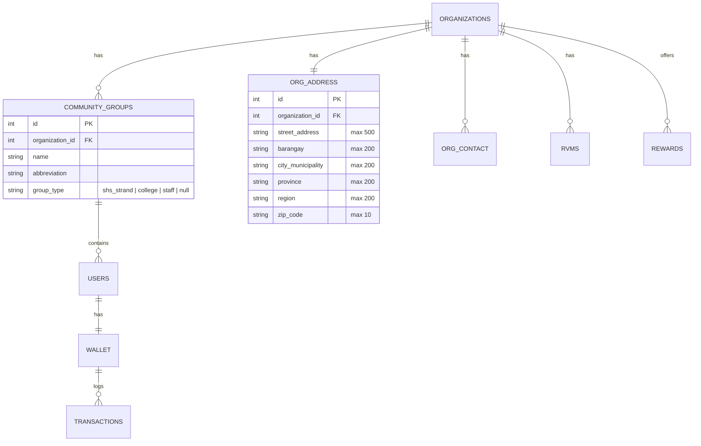

# Design Document — Admin Dashboard Alignment

## Overview

This design implements the eight requirements defined in `requirements.md` to align the admin dashboard with the refactored multi-tenant architecture. The work has three layers: **build fix** (remove dead imports), **data alignment** (replace static arrays with live API calls), and **UI normalization** (canonical field names, validation, empty states). A scripted smoke test suite validates the full surface.

## Architecture Context

The platform hardening program restructured the backend into domain-specific controllers with per-endpoint RBAC. The data model moved from a single-tenant, hardcoded setup to:



### Data Flow: Old vs New

| Component | Old (mockData) | New (Live API) |
|---|---|---|
| Departments/Strands | `DEPARTMENTS[]`, `SHS_STRANDS[]` hardcoded in `mockData.js` | `GET /api/web/groups?location_id=X` → `{ groups: [...] }` filtered by `groupType` |
| Cities | `CITIES[]` hardcoded array with `{ id, name }` | Free-text `city_municipality` on `OrgAddress` model — no lookup table |
| User type labels | Inline switch statements | Same — already aligned |
| Department names | `getDepartmentName(id)` from static map | Direct `user.department` string from API (= `CommunityGroup.name`) |

---

## Component Design

### 1. Build Fix — mockData Removal

**Files affected:** 3 files with broken imports.

| File | Old Import | Replacement Strategy |
|---|---|---|
| `leaderboards/page.js` L8-11 | `DEPARTMENTS`, `getDepartmentName` | Use `user.department` string directly from API |
| `locations/page.js` L8 | `CITIES` | Replace city dropdown with text input |
| `AddRegularUserModal.jsx` L6 | `SHS_STRANDS`, `COLLEGE_DEPARTMENTS` | Fetch from `GET /api/web/groups` on modal open |

### 2. Leaderboards — Department Filter Redesign

**Current behavior:** `availableDepartments` memo does `DEPARTMENTS.find(dep => dep.id === d)` to map department IDs to display names.

**New behavior:** The leaderboard API returns `department` as the group's display name (string). No ID mapping needed.

```javascript
// OLD: ID-based lookup
const availableDepartments = useMemo(() => {
    const depts = [...new Set(allUsers.filter(u => u.department).map(u => u.department))];
    return depts.map(d => {
        const dept = DEPARTMENTS.find(dep => dep.id === d);
        return { value: d, label: dept?.abbreviation || d };
    });
}, [allUsers]);

// NEW: Direct string usage
const availableDepartments = useMemo(() => {
    const depts = [...new Set(allUsers.filter(u => u.department).map(u => u.department))];
    return depts.map(d => ({ value: d, label: d }));
}, [allUsers]);
```

`getUserDeptDisplay()` and search filter simplified to use `user.department || '—'` directly.

### 3. Locations — City Field Migration

**Current behavior:** `CITIES` static array populates a `<CustomDropdown>` with `{ value: id, label: name }`. Forms track `cityId`. The backend receives `cityId` and (in theory) maps it back.

**New behavior:** City is a free-text input matching `OrgAddress.city_municipality` (String, max 200). Province and region are added as optional inputs matching the model.

```javascript
// Form state change
// OLD
const [formData, setFormData] = useState({ ..., cityId: '', ... });
// NEW
const [formData, setFormData] = useState({ ..., cityMunicipality: '', province: '', region: '', ... });
```

Validation: `cityMunicipality` required, max 200 chars. Province/region optional, max 200 chars.

### 4. AddRegularUserModal — Dynamic Group Loading

**Current behavior:** Static `SHS_STRANDS` and `COLLEGE_DEPARTMENTS` arrays populate dropdowns based on user type selection.

**New behavior:** Groups fetched live from API, filtered by `groupType`.

```javascript
// On modal open
useEffect(() => {
    if (isOpen && locationId) {
        groupsApi.getAll(locationId)
            .then(groups => setAvailableGroups(groups))
            .catch(err => console.error('Failed to load groups:', err));
    }
}, [isOpen, locationId]);

// Filter by user type selection
const filteredGroups = useMemo(() => {
    if (!userType) return [];
    const typeMap = { 'student': ['shs_strand', 'college'], 'faculty': ['college'], 'staff': ['staff'] };
    const allowedTypes = typeMap[userType] || [];
    return availableGroups.filter(g => allowedTypes.includes(g.groupType));
}, [availableGroups, userType]);
```

The form sends `communityGroupId` (group's integer ID) instead of a department name string.

### 5. Field Label Normalization

All client-side field aliasing eliminated. Table column headers updated:

| Location | Old Label / Code | New Label / Code | Rationale |
|---|---|---|---|
| Users table | `user.points` | `user.pointsBalance` | Canonical key from `_serialize_user` |
| Users table | `user.joinDate` | `user.createdAt` | Canonical key; `joinDate` was a client alias |
| Users table | `Department` header | `Group` header | Reflects `CommunityGroup` model, not just academic departments |
| Locations card | `loc.joinDate` | `loc.createdAt` | Canonical key from `_serialize_organization` |
| Rewards table | `reward.points` | `reward.pointsRequired` | Canonical key from `_serialize_reward` |
| Rewards table | `reward.stock` | `reward.stockQuantity` | Canonical key |
| Rewards table | `reward.image` | `reward.imageUrl` | Canonical key |
| Reward logs | `log.pointsCost` | `log.pointsSpent` | Canonical key from `_serialize_reward_log` |
| Profile | `profile.joinDate` | Format `createdAt` directly | Canonical key from `/api/web/auth/me` |

### 6. Input Validation Rules

Derived from model column definitions in `models.py`:

```javascript
const VALIDATION_RULES = {
    user: {
        firstName:  { required: true, maxLength: 200, label: 'First Name' },
        lastName:   { required: true, maxLength: 200, label: 'Last Name' },
        middleName: { required: false, maxLength: 200, label: 'Middle Name' },
        email:      { required: false, maxLength: 200, pattern: /^[^\s@]+@[^\s@]+\.[^\s@]+$/, label: 'Email' },
        phone:      { required: false, maxLength: 50, label: 'Phone' },
        username:   { required: false, maxLength: 100, label: 'Username' },
    },
    location: {
        name:             { required: true, maxLength: 200, label: 'Display Name' },
        fullName:         { required: true, maxLength: 500, label: 'Full Name' },
        streetAddress:    { required: true, maxLength: 500, label: 'Street Address' },
        barangay:         { required: false, maxLength: 200, label: 'Barangay' },
        cityMunicipality: { required: true, maxLength: 200, label: 'City/Municipality' },
        province:         { required: false, maxLength: 200, label: 'Province' },
        region:           { required: false, maxLength: 200, label: 'Region' },
        zipCode:          { required: false, maxLength: 10, label: 'ZIP Code' },
    },
    machine: {
        name:         { required: true, maxLength: 200, label: 'Machine Name' },
        machineUuid:  { required: true, maxLength: 100, label: 'Machine UUID' },
        locationName: { required: false, maxLength: 200, label: 'Location/Area' },
    },
    reward: {
        name:           { required: true, maxLength: 200, label: 'Reward Name' },
        description:    { required: false, label: 'Description' },
        category:       { required: false, maxLength: 100, label: 'Category' },
        pointsRequired: { required: true, min: 1, type: 'integer', label: 'Points Required' },
        imageUrl:       { required: false, maxLength: 500, label: 'Image URL' },
    },
};
```

A shared `validateField(rules, fieldName, value)` utility is created in `client/src/lib/validateField.js` and used across all modals.

### 7. Empty-State Standardization

All table cells use the existing `formatField()` utility from `client/src/lib/formatField.js`:

```javascript
// formatField already handles null/undefined → '—'
// Ensure ALL table cells wrap values: {formatField(row.fieldName)}
// Date cells: {formatField(row.createdAt, 'date')}
// Badge cells: handle null with a gray "Unknown" badge
```

### 8. Smoke Test Architecture

Two test layers — no DOM testing, pure API + build verification:

#### 8a. Backend API Smoke Test (`server/tests/smoke/test_admin_smoke.py`)

```python
# pytest-based, using the Flask test client
# Tests authenticate as each admin role and hit every endpoint

class TestAdminSmoke:
    """Smoke test every GET /api/web/* endpoint for response shape."""

    ENDPOINTS = [
        ('GET', '/api/web/dashboard', ['totalUsers', 'totalPoints', ...]),
        ('GET', '/api/web/users', ['users', 'pagination']),
        ('GET', '/api/web/locations', ['locations']),
        ('GET', '/api/web/machines', ['machines', 'pagination']),
        ('GET', '/api/web/rewards', ['rewards', 'pagination']),
        ('GET', '/api/web/leaderboard', ['topUsers', 'topGroups']),
        ('GET', '/api/web/groups', ['groups']),
        ('GET', '/api/web/analytics', ['analytics']),
        ('GET', '/api/web/logs/access', ['logs']),
        ('GET', '/api/web/logs/bottles', ['logs']),
        ('GET', '/api/web/logs/machines', ['logs']),
        ('GET', '/api/web/logs/rewards', ['logs']),
        ('GET', '/api/web/logs/transactions', ['logs']),
        ('GET', '/api/web/sessions/bulk', ['sessions']),
        ('GET', '/api/web/settings/notifications', ['settings']),
        ('GET', '/api/web/settings/points', ['config']),
        ('GET', '/api/web/settings/security', ['config']),
    ]

    def test_all_get_endpoints_return_200(self, admin_client):
        for method, path, expected_keys in self.ENDPOINTS:
            resp = admin_client.get(path)
            assert resp.status_code == 200, f"{path} returned {resp.status_code}"
            data = resp.get_json()
            assert data['success'] is True, f"{path} success=false"
            for key in expected_keys:
                assert key in data, f"{path} missing key '{key}'"

    def test_user_serialization_shape(self, admin_client):
        """Validate every user record has canonical keys."""
        resp = admin_client.get('/api/web/users')
        for user in resp.get_json()['users']:
            for key in ['id', 'displayId', 'name', 'firstName', 'lastName',
                        'email', 'role', 'userType', 'isActive', 'pointsBalance',
                        'groupName', 'locationId', 'locationName', 'createdAt']:
                assert key in user, f"User {user.get('id')} missing '{key}'"

    def test_mutating_endpoints(self, admin_client):
        """Test POST/PUT/DELETE with valid payloads."""
        # Create a group
        resp = admin_client.post('/api/web/groups', json={
            'name': 'Smoke Test Group',
            'abbreviation': 'STG',
            'groupType': 'college',
        })
        assert resp.status_code in (200, 201)
        group_id = resp.get_json()['group']['id']

        # Update it
        resp = admin_client.put(f'/api/web/groups/{group_id}', json={
            'name': 'Smoke Test Group Updated',
        })
        assert resp.status_code == 200

        # Delete it
        resp = admin_client.delete(f'/api/web/groups/{group_id}')
        assert resp.status_code == 200
```

#### 8b. Frontend Build Verification (`client/tests/smoke/smoke_build.ps1`)

```powershell
# PowerShell script for Windows
Write-Host "=== EcoPoints Admin Dashboard Smoke Test ===" -ForegroundColor Cyan

# 1. Check for broken imports
$mockDataRefs = Get-ChildItem -Path "client" -Recurse -Include "*.js","*.jsx" |
    Select-String -Pattern "mockData" -SimpleMatch
if ($mockDataRefs) {
    Write-Host "FAIL: mockData references found:" -ForegroundColor Red
    $mockDataRefs | ForEach-Object { Write-Host "  $_" }
    exit 1
}
Write-Host "PASS: No mockData references" -ForegroundColor Green

# 2. Run Next.js build
npm run build --prefix client
if ($LASTEXITCODE -ne 0) {
    Write-Host "FAIL: Build failed with exit code $LASTEXITCODE" -ForegroundColor Red
    exit 1
}
Write-Host "PASS: Build succeeded" -ForegroundColor Green
```

---

## File Change Summary

| Component | Files Modified | Files Created |
|---|---|---|
| Build fix | `leaderboards/page.js`, `locations/page.js`, `AddRegularUserModal.jsx` | — |
| Field normalization | `users/page.js`, `rewards/page.js`, `logs/rewards/page.js`, `profile/page.js` | — |
| Validation | All modal components | `client/src/lib/validateField.js` |
| Empty states | All admin page files | — |
| Smoke tests | — | `server/tests/smoke/test_admin_smoke.py`, `server/tests/smoke/conftest.py`, `client/tests/smoke/smoke_build.ps1` |
