# Design Document — Login Modal Redesign

## Overview

This feature replaces the existing `ElasticInput` component used in the EcoPoints login (sign-in) form with a new `FloatingInputField` component. The redesign elevates the visual quality of the login modal by introducing:

- A **peer-driven floating label** pattern using Tailwind's `peer` / `peer-focus` / `peer-[:not(:placeholder-shown)]` modifier classes — no JavaScript state required for label position.
- **Left-aligned Lucide icons** (`Mail`, `Lock`) with three distinct color states (default, filled, focused) and a rose-500 error override.
- A **dynamic vertical separator** between the icon and the input area that fades in/out based on focus and value state.
- A **password visibility toggle** (`Eye` / `EyeOff`) with correct `aria-label` management.
- A comprehensive **error state** (`rose-500` theme) that overrides every sub-element simultaneously.
- Full **accessibility**: `htmlFor`/`id` association, `pointer-events-none` on the label, keyboard activation of the toggle, and a focus ring.

The `FloatingInputField` is a drop-in replacement for `ElasticInput` inside `LogIn.jsx`. The `ElasticInput` definition stays in the file but is no longer rendered. No other part of the modal (sign-up form, forgot-password flow, dropdowns) is affected.

---

## Architecture

```mermaid
graph TD
    subgraph LogIn.jsx
        LF["LoginForm\n(handleLogin, error state)"]
        FIF1["FloatingInputField\n(id=login-credential)\nicon=Mail, type=text"]
        FIF2["FloatingInputField\n(id=login-password)\nicon=Lock, type=password"]
        EA["ElasticInput\n(defined, not rendered)"]
    end

    subgraph FloatingInputField.jsx
        Container["Field Container\nborder / error border"]
        IconWrap["Icon Wrapper\n(LeftIcon, color states)"]
        Sep["Separator\nw-px h-6, opacity transitions"]
        Label["FloatingLabel\n(peer-focus / peer-[:not(:placeholder-shown)])"]
        Input["<input>\npeer, placeholder=' '"]
        Toggle["PasswordToggle\n(Eye/EyeOff, aria-label)"]
    end

    LF --> FIF1
    LF --> FIF2
    LF -.-> EA
    FIF1 --> Container
    FIF2 --> Container
    Container --> IconWrap
    Container --> Sep
    Container --> Label
    Container --> Input
    Container --> Toggle
```



The `FloatingInputField` is a **self-contained, stateful React component** responsible only for:
1. Managing `showPassword` state (for password toggle).
2. Exposing a clean props interface that mirrors the existing `ElasticInput` signature, plus `error` and `onFocus`/`onBlur` forwarding.

All form-level state (`loginCredential`, `loginPassword`, `error`) remains in `LogIn.jsx` as today.

---

## Components and Interfaces

### `FloatingInputField` (new component)

**File:** `client/src/components/pages/LogIn.jsx` (defined at the top, alongside `ElasticInput`)

#### Props interface

```typescript
interface FloatingInputFieldProps {
  id: string;                         // Passed to input[id] and label[htmlFor]
  type: "text" | "email" | "password";
  label: string;                      // Floating label text
  icon?: React.ReactNode;             // Lucide icon element (18x18)
  value: string;                      // Controlled value
  onChange: React.ChangeEventHandler<HTMLInputElement>;
  required?: boolean;                 // Default false
  error?: boolean;                    // Activates rose-500 error state; default false
  onFocus?: React.FocusEventHandler<HTMLInputElement>;
  onBlur?: React.FocusEventHandler<HTMLInputElement>;
}
```

#### Internal state

```typescript
const [showPassword, setShowPassword] = useState(false);
// No isFocused state — label position is driven entirely by Tailwind peer classes.
```

#### Derived values

```typescript
const isPassword = type === "password";
const inputType = isPassword ? (showPassword ? "text" : "password") : type;
const hasIcon = Boolean(icon);
```

#### Structure (simplified JSX layout)

```jsx
<div className={/* container — border, rounded, relative, flex */}>

  {/* LeftIcon */}
  {hasIcon && (
    <div className={/* icon wrapper — color states via peer + error prop */}>
      {icon}
    </div>
  )}

  {/* Separator */}
  {hasIcon && (
    <div className={/* w-px h-6 — opacity + color states */} />
  )}

  {/* Input + Floating Label wrapper (relative, flex-1) */}
  <div className="relative flex-1 h-full">
    <input
      id={id}
      type={inputType}
      value={value}
      onChange={onChange}
      onFocus={onFocus}
      onBlur={onBlur}
      required={required}
      placeholder=" "      {/* single space — enables :not(:placeholder-shown) */}
      className="peer ..."
    />
    <label
      htmlFor={id}
      className={/* resting + peer-focus + peer-[:not(:placeholder-shown)] float classes */}
    >
      {label}
    </label>
  </div>

  {/* PasswordToggle */}
  {isPassword && (
    <button
      type="button"
      aria-label={showPassword ? "Hide password" : "Show password"}
      onClick={() => setShowPassword(p => !p)}
      className="..."
    >
      {showPassword ? <EyeOff size={18} /> : <Eye size={18} />}
    </button>
  )}

</div>
```

### Modified: `LoginForm` inside `LogIn.jsx`

Replace both `ElasticInput` usages in `<form onSubmit={handleLogin}>`:

```jsx
{/* Before */}
<ElasticInput
  id="login-credential"
  type="text"
  label="Username or Email"
  icon={<Mail size={18} />}
  value={loginCredential}
  onChange={(e) => setLoginCredential(e.target.value)}
  required
/>

{/* After */}
<FloatingInputField
  id="login-credential"
  type="text"
  label="Username or Email"
  icon={<Mail size={18} />}
  value={loginCredential}
  onChange={(e) => setLoginCredential(e.target.value)}
  required
  error={Boolean(error)}
/>
```

```jsx
{/* Before */}
<ElasticInput
  id="login-password"
  type="password"
  label="Password"
  icon={<Lock size={18} />}
  value={loginPassword}
  onChange={(e) => setLoginPassword(e.target.value)}
  required
  showToggle
/>

{/* After */}
<FloatingInputField
  id="login-password"
  type="password"
  label="Password"
  icon={<Lock size={18} />}
  value={loginPassword}
  onChange={(e) => setLoginPassword(e.target.value)}
  required
  error={Boolean(error)}
/>
```

The `ElasticInput` component definition block stays intact but receives no render call.

---

## Data Models

There are no new data models or API changes. All state is local to `LogIn.jsx` and `FloatingInputField`. Relevant pieces:

| Variable | Location | Type | Purpose |
|---|---|---|---|
| `loginCredential` | `LogIn.jsx` | `string` | Credential input value |
| `loginPassword` | `LogIn.jsx` | `string` | Password input value |
| `error` | `LogIn.jsx` | `string` | Auth error message; truthy → `error` prop on both fields |
| `showPassword` | `FloatingInputField` | `boolean` | Password visibility toggle state |

### Tailwind class mapping

The following table documents how each prop/state combination maps to Tailwind classes. This is the authoritative source for the implementation.

#### Container border

| Condition | Class |
|---|---|
| `error=true` | `border-rose-500` |
| default / focused | `border-slate-200` with `focus-within:border-emerald-500` |

#### Label (peer-driven)

| Condition | Class |
|---|---|
| Resting (empty + unfocused) | `top-1/2 -translate-y-1/2 text-sm font-normal text-slate-400` |
| Floated (focused or non-empty) | `peer-focus:top-0 peer-focus:-translate-y-1/2 peer-focus:text-[11px] peer-focus:font-bold` + same for `peer-[:not(:placeholder-shown)]:` |
| Error | `text-rose-500` (applied conditionally via JSX ternary, overrides both label color states) |
| Active (no error) | `peer-focus:text-emerald-500` |
| Filled (no error) | `peer-[:not(:placeholder-shown)]:text-emerald-600` |
| Transition | `transition-all duration-200` |

#### Icon wrapper

| Condition | Class |
|---|---|
| Default (empty + unfocused + no error) | `text-slate-400` |
| Focused (no error) | `peer-focus:text-emerald-500` — requires icon to be a sibling/peer-aware descendant; use JS-derived class or CSS group trick (see implementation notes below) |
| Filled, unfocused (no error) | `text-emerald-400` when `value.length > 0 && !error` |
| Error | `text-rose-500` |
| Transition | `transition-colors duration-300` |

> **Implementation note for icon focus color:** Tailwind peer utilities only apply to elements that are _siblings after_ the `peer` element in the DOM. Since the icon comes _before_ the `<input>` in the DOM, it cannot use `peer-focus:` on its own. Two valid approaches:
>
> 1. **CSS `:focus-within` via Tailwind `group`**: Wrap the entire container in a `group`, give the icon `group-focus-within:text-emerald-500`. This is the recommended approach — it is pure CSS and matches Tailwind conventions.
> 2. **JS-driven class**: Track `isFocused` in state (via `onFocus`/`onBlur` on the `<input>`) and apply the class conditionally. This is the fallback if the group approach has specificity conflicts.
>
> The recommended implementation uses **approach 1** (`group` / `group-focus-within`) for the icon and separator, while still using `peer` / `peer-focus` / `peer-[:not(:placeholder-shown)]` for the label (which is a sibling _after_ the peer `<input>`).

#### Separator

| Condition | Class |
|---|---|
| Default (empty + unfocused) | `opacity-0` |
| Focused (group-focus-within) | `group-focus-within:opacity-100` |
| Non-empty, unfocused | `opacity-100` when `value.length > 0` (JS-derived) |
| Error color | `bg-rose-200` |
| Default color | `bg-slate-300` |
| Transition | `transition-opacity duration-200` |

> Separator visibility for the "non-empty, unfocused" state requires knowing the value length, so it is driven by a JS-derived class: `value.length > 0 ? 'opacity-100' : 'opacity-0 group-focus-within:opacity-100'`.

---

## Correctness Properties

*A property is a characteristic or behavior that should hold true across all valid executions of a system — essentially, a formal statement about what the system should do. Properties serve as the bridge between human-readable specifications and machine-verifiable correctness guarantees.*

---

### Property 1: Filled-state styles applied for any non-empty value

*For any* non-empty string passed as the `value` prop to `FloatingInputField`, when the input is rendered unfocused and `error` is `false`, the component SHALL apply all filled-state styles simultaneously: the `FloatingLabel` shall have floated-position classes (`text-[11px]`, `font-bold`), the `LeftIcon` wrapper shall have `text-emerald-400`, and the `Separator` shall have `opacity-100`.

**Validates: Requirements 1.3, 2.4, 3.4**

---

### Property 2: Error prop overrides all visual elements for any input state

*For any* combination of `value` string (empty or non-empty) and focus state, when `error` is `true`, the component SHALL apply the error theme to every sub-element simultaneously: the container border shall include `border-rose-500`, the `FloatingLabel` shall include `text-rose-500`, the `LeftIcon` wrapper shall include `text-rose-500`, and the `Separator` shall include `bg-rose-200`.

**Validates: Requirements 5.2, 5.3, 5.4, 5.5**

---

### Property 3: Error clearance restores context-appropriate styles

*For any* combination of `value` string and focus state, when `error` transitions from `true` to `false`, the component SHALL restore each element to the style appropriate for the current `(value, isFocused)` state — specifically: if the value is empty and unfocused, all elements return to their default/resting styles; if focused, all elements use the focused (emerald) styles; if non-empty and unfocused, all elements use the filled styles.

**Validates: Requirements 5.6**

---

## Error Handling

### Authentication errors (`handleLogin` catch block)

The existing error message flow in `LogIn.jsx` is preserved. When `handleLogin` catches an error, it sets:

```js
setError("Invalid credentials. Please try again.");
```

Since `FloatingInputField` receives `error={Boolean(error)}`, a non-empty `error` string activates the rose-500 error state on both fields. When the user starts typing again (onChange fires), `setError("")` should be called to clear the error. This keeps error state tied to the controlled value, which is the current project convention.

> If `setError("")` is not already called on change, add it to the `onChange` handlers in `LoginForm` to ensure the error clears on user input.

### Missing / unsupported prop values

- If `icon` prop is `undefined`, the `Separator` is not rendered and the input/label container fills the full width.
- If `type` is not `"password"`, the `PasswordToggle` is not rendered.
- If `error` is `undefined`, it defaults to `false` (no error state).

### Toggle `type` attribute during form submission

The `PasswordToggle` button has `type="button"`. Without this, pressing Enter in the form would trigger the button's click handler before form submission, causing unexpected type toggles.

---

## Testing Strategy

The project uses **Vitest** with **@testing-library/react** and **fast-check** (already in `devDependencies`). Tests live in `client/src/` alongside the component files.

### Unit tests (example-based)

These cover specific state transitions, structural requirements, and edge cases that are not suited to property-based testing.

**Rendering structure:**
- Renders with and without `icon` prop — verifies separator presence/absence.
- Renders `type="password"` — verifies toggle button present.
- Renders `type="email"` / `type="text"` — verifies no toggle button.
- Verifies `label[htmlFor]` === `input[id]`.
- Verifies label has `pointer-events-none` class.
- Verifies input has `placeholder=" "` (single space).
- Verifies toggle button has `type="button"`.

**State transitions:**
- Label resting state (empty, unfocused): correct CSS classes applied.
- Label floated state (focused, empty): correct CSS classes applied.
- Label stays floated when value non-empty and unfocused.
- Icon default color (`text-slate-400`) when empty and unfocused.
- Icon focused color (`text-emerald-500` via `group-focus-within`) when focused.
- Separator opacity-0 when empty and unfocused; opacity-100 when focused.
- Toggle: click → `type="text"`, EyeOff icon shown; click again → `type="password"`, Eye restored.
- Toggle aria-label: "Show password" when hidden, "Hide password" when visible.
- Toggle keyboard: Enter and Space keydown activate toggle.
- Error border class present when `error=true`.
- Error clears when `error` prop becomes `false`.

**Integration (LoginForm context):**
- Both `FloatingInputField` instances render in the sign-in form.
- `error={true}` on both fields when auth error occurs.
- `ElasticInput` component defined but absent from rendered output.
- `onFocus`/`onBlur` forwarded to underlying `<input>`.

### Property-based tests (fast-check)

Minimum 100 iterations per test. Each test is tagged with a comment referencing the design property.

```typescript
// Feature: login-modal-redesign, Property 1: Filled-state styles applied for any non-empty value
it("applies filled-state styles for any non-empty value", () => {
  fc.assert(fc.property(
    fc.string({ minLength: 1 }),  // any non-empty string
    (value) => {
      const { container } = render(
        <FloatingInputField
          id="test"
          type="text"
          label="Test"
          icon={<Mail size={18} />}
          value={value}
          onChange={() => {}}
          error={false}
        />
      );
      const label = container.querySelector('label');
      const iconWrapper = container.querySelector('[data-testid="icon-wrapper"]');
      const separator = container.querySelector('[data-testid="separator"]');
      // Label should have floated classes
      expect(label).toHaveClass('text-[11px]');  // via peer-[:not(:placeholder-shown)]
      // Icon should have emerald-400
      expect(iconWrapper.className).toContain('text-emerald-400');
      // Separator should have opacity-100
      expect(separator.className).toContain('opacity-100');
    }
  ), { numRuns: 100 });
});
```

```typescript
// Feature: login-modal-redesign, Property 2: Error prop overrides all visual elements for any input state
it("error=true overrides all element styles regardless of value or focus", () => {
  fc.assert(fc.property(
    fc.string(),             // any value (empty or non-empty)
    fc.boolean(),            // any focus state (simulated via class check)
    (value, _focused) => {
      const { container } = render(
        <FloatingInputField
          id="test"
          type="text"
          label="Test"
          icon={<Mail size={18} />}
          value={value}
          onChange={() => {}}
          error={true}
        />
      );
      const fieldContainer = container.firstChild;
      const label = container.querySelector('label');
      const iconWrapper = container.querySelector('[data-testid="icon-wrapper"]');
      const separator = container.querySelector('[data-testid="separator"]');
      expect(fieldContainer.className).toContain('border-rose-500');
      expect(label.className).toContain('text-rose-500');
      expect(iconWrapper.className).toContain('text-rose-500');
      expect(separator.className).toContain('bg-rose-200');
    }
  ), { numRuns: 100 });
});
```

```typescript
// Feature: login-modal-redesign, Property 3: Error clearance restores context-appropriate styles
it("restores context-appropriate styles when error clears", () => {
  fc.assert(fc.property(
    fc.string(),   // any value
    (value) => {
      const { rerender, container } = render(
        <FloatingInputField
          id="test"
          type="text"
          label="Test"
          icon={<Mail size={18} />}
          value={value}
          onChange={() => {}}
          error={true}
        />
      );
      rerender(
        <FloatingInputField
          id="test"
          type="text"
          label="Test"
          icon={<Mail size={18} />}
          value={value}
          onChange={() => {}}
          error={false}
        />
      );
      const fieldContainer = container.firstChild;
      const label = container.querySelector('label');
      const iconWrapper = container.querySelector('[data-testid="icon-wrapper"]');
      // After error clears: no rose classes
      expect(fieldContainer.className).not.toContain('border-rose-500');
      expect(label.className).not.toContain('text-rose-500');
      expect(iconWrapper.className).not.toContain('text-rose-500');
      // Non-empty value: should have filled styles
      if (value.length > 0) {
        expect(iconWrapper.className).toContain('text-emerald-400');
      }
    }
  ), { numRuns: 100 });
});
```

### What is not property-tested

PBT is not used for: animation/transition timing (CSS class presence is verified instead), UI layout/overlap (manual review and visual testing), and the sign-up form components (`InputField`, `FloatingSearchDropdown`) which are outside this feature's scope.
