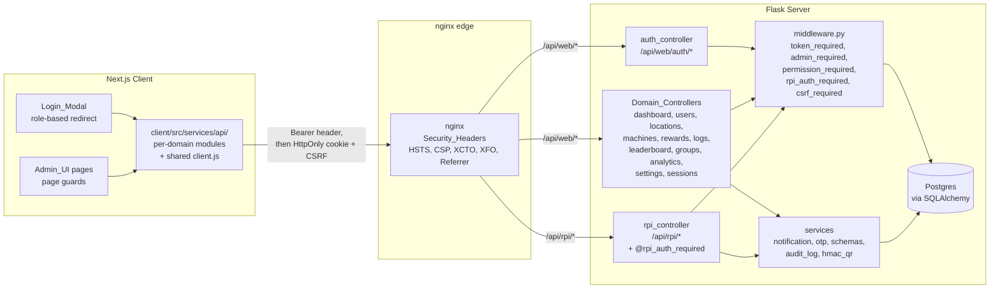
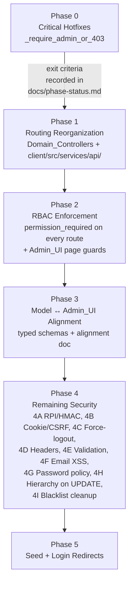
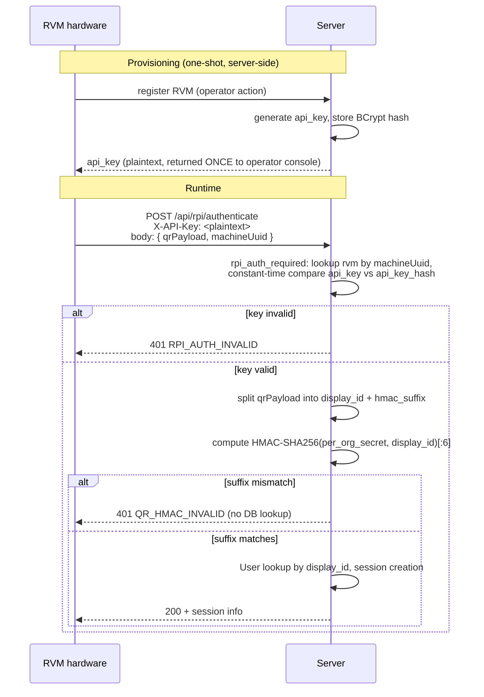
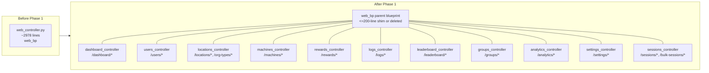

# Design Document — Phased Platform Hardening

## Overview

This design implements the six-phase EcoPoints platform hardening program defined in `requirements.md`. The phases are strictly ordered: Phase 0 closes the GET-bypass authorization defect, Phase 1 splits the 2978-line `web_controller.py` into per-domain controllers, Phase 2 enforces `@permission_required` end-to-end on the now-decomposed surface, Phase 3 aligns the Server's JSON shapes with the Admin_UI fields, Phase 4 closes the remaining audit-flagged gaps (RPI auth + HMAC QR, JWT-in-cookie + CSRF, force-logout, security headers, input validation, email XSS, password policy, role-hierarchy on UPDATE, blacklist cleanup), and Phase 5 re-establishes a deterministic seed plus role-based login redirects.

Two design choices anchor the rest of the document:

1. **Single admin guard helper.** Both `@admin_required` and `@permission_required` route their first authorization check through one private function, `_require_admin_or_403(current_user)`. This collapses the duplicate GET-bypass defect into a single line of code and makes the Phase 0 invariant (non-admin → 403, all methods, all decorators) provable by inspection.
2. **Restructure before enforce.** Phase 1 deliberately changes no decorators. It is a pure code move so that Phase 2's `@admin_required → @permission_required` substitution lands on small, reviewable Domain_Controller files instead of being smeared across a monolith. This ordering is what lets the Phase 2 RBAC sweep be mechanical rather than archaeological.

The design also locks down two non-functional commitments that thread through every phase: every schema change ships as a Flask-Migrate revision with a working downgrade, and every mutating user/role/permission/security action writes one `AdminLog` Audit_Log_Entry.

## Architecture

### High-level component view



### Phase progression and gates



### Authorization stack at the route level

After Phase 2, every route under `web_bp` (except the public `/api/web/health`) has the same shape:

```python
@some_domain_bp.route('/...', methods=['GET' | 'POST' | 'PUT' | 'DELETE'])
@token_required                       # injects current_user
@permission_required('category', ...) # calls _require_admin_or_403 first, then category check
@validate_request(SomeSchema)         # Phase 4E: rejects unknown fields, returns VALIDATION_ERROR
def handler(current_user, ...): ...
```

`@admin_required` survives only on the few routes that have no narrower category (e.g., `/api/web/auth/me`-equivalents that return generic admin info). Bare `@admin_required` is forbidden outside `auth_controller.py` and the public health route after Phase 2.

For `/api/rpi/*` (after Phase 4A) the stack is:

```python
@rpi_bp.route('/...', methods=['POST'])
@rpi_auth_required          # validates X-API-Key against rvms.api_key_hash
@validate_request(SomeRpiSchema)
def handler(rvm, ...): ...
```

### Cookie + CSRF transport (Phase 4B)

```mermaid
sequenceDiagram
    participant C as Client
    participant N as nginx
    participant S as Server
    Note over C,S: Login (cookie mode)
    C->>S: POST /api/web/auth/login (JSON creds)
    S->>S: validate, issue JWT (jti, iat, exp)
    S-->>C: 200 + Set-Cookie: token=...; HttpOnly; Secure; SameSite=Strict<br/>+ Set-Cookie: csrf_token=...; SameSite=Strict
    Note over C,S: State-changing request
    C->>S: PUT /api/web/users/42 (cookie: token, csrf_token)<br/>+ X-CSRF-Token: ...
    S->>S: token_required reads cookie<br/>csrf_required compares header == cookie
    alt token + csrf valid
        S-->>C: 200
    else csrf mismatch
        S-->>C: 403 { error.code: "CSRF_INVALID" }
    end
```

`AUTH_COOKIE_ONLY=false` during the transition: middleware reads the cookie first and falls back to `Authorization: Bearer` so existing clients keep working through deploy. Once the Client stops writing `localStorage`, `AUTH_COOKIE_ONLY` flips to `true` and the Bearer fallback is removed.

### RPI auth + HMAC QR (Phase 4A)



The hardware contract (`docs/rpi-api-contract.md`) is a Phase 4A deliverable: the RVM build is in progress, so there is no fleet to migrate and no need for a grace period; the contract is what the hardware team implements against on first boot.

### Phase 1 controller decomposition



Each Domain_Controller is a sub-blueprint registered under `web_bp` so the externally visible URL prefix `/api/web/...` stays byte-identical (Requirement 1.2 / 7.1).

## Components and Interfaces

### Server: `middleware.py`

After Phase 0, the decorator surface is:

```python
def _require_admin_or_403(current_user):
    """Phase 0 shared admin guard.
    Returns a (response, status) tuple if the user is not in Admin_Role_Set,
    else None. Both @admin_required and @permission_required call this first.
    """
    if current_user.role not in ADMIN_ROLE_SET:
        return jsonify({
            'success': False,
            'error': {'code': 'ADMIN_REQUIRED', 'message': 'Admin access required'}
        }), 403
    return None


def admin_required(f):
    @wraps(f)
    def decorated(current_user, *args, **kwargs):
        denied = _require_admin_or_403(current_user)
        if denied:
            return denied
        return f(current_user, *args, **kwargs)
    return decorated


def permission_required(*categories):
    """MUST be stacked below @token_required.
    Returns 403 ADMIN_REQUIRED for any non-admin role regardless of HTTP method.
    Returns 403 FORBIDDEN with `missing` field for admin roles missing the category.
    """
    def decorator(f):
        @wraps(f)
        def decorated(current_user, *args, **kwargs):
            denied = _require_admin_or_403(current_user)
            if denied:
                return denied
            role_perms = ROLE_PERMISSIONS.get(current_user.role, set())
            for cat in categories:
                if cat not in role_perms:
                    return jsonify({
                        'success': False,
                        'error': {'code': 'FORBIDDEN', 'missing': cat,
                                  'message': f"Role '{current_user.role}' lacks '{cat}'"}
                    }), 403
            return f(current_user, *args, **kwargs)
        return decorated
    return decorator
```

`ADMIN_ROLE_SET = {'superadmin', 'head_admin', 'auditor', 'technician', 'inventory_officer'}`. The `user` entry in `ROLE_PERMISSIONS` becomes a no-op annotated as a client-side hint, and `dependent` stays absent — the helper rejects both before the category map is even consulted, so "non-admin universal denial" (Phase 2 property) is structurally guaranteed.

New decorators added later in the program:

- **`@superadmin_required`** (existing) — unchanged; already correct.
- **`@rpi_auth_required`** (Phase 4A) — looks up the RVM by `machineUuid` (body or path), then `bcrypt.checkpw`-style constant-time compare of the `X-API-Key` header against `rvms.api_key_hash`. Rejects with HTTP 401 `error.code = "RPI_AUTH_INVALID"`.
- **`@csrf_required`** (Phase 4B) — applied inside `@token_required` for unsafe methods; compares `X-CSRF-Token` header against `csrf_token` cookie. Mismatch → HTTP 403 `error.code = "CSRF_INVALID"`.
- **`@validate_request(Schema)`** (Phase 4E) — runs the Pydantic v2 schema against `request.get_json()`. Unknown keys → HTTP 400 `error.code = "UNKNOWN_FIELD"`. Other validation failures → HTTP 400 `error.code = "VALIDATION_ERROR"` with `errors: [{field, message}]`.

JWT validation in `@token_required` gains one extra check during Phase 4C: after successfully decoding, look up `current_user.community_group.organization.force_logout_at` (the `Organization` row reachable via the existing `get_user_org_id` helper) and reject with HTTP 401 `error.code = "FORCED_LOGOUT"` when `payload['iat'] < force_logout_at` (treating both as Unix epoch seconds).

### Server: Domain_Controllers (Phase 1)

Each new file under `server/app/controllers/` exports one Flask `Blueprint` and is registered under the existing `web_bp` parent prefix. Mapping from current `web_controller.py` route groups to the new files:

| Domain_Controller file | URL paths it owns | Source line range moved |
| --- | --- | --- |
| `dashboard_controller.py` | `/dashboard/*` | `dashboard_stats` and helpers around it |
| `locations_controller.py` | `/locations/*`, `/org-types/*` | `get_org_types`, `create_org_type`, `delete_org_type`, `get_locations`, `create_location`, `update_location`, `delete_location` |
| `users_controller.py` | `/users/*` | `get_users`, `get_user`, `create_user`, `update_user`, `delete_user`, `adjust_user_points` |
| `machines_controller.py` | `/machines/*` | `get_machines`, `create_machine`, `update_machine`, `delete_machine` |
| `rewards_controller.py` | `/rewards/*` | reward CRUD |
| `logs_controller.py` | `/logs/*` (admin, bottle, machine, transaction, reward, access) | the various log-listing handlers |
| `leaderboard_controller.py` | `/leaderboard/*` | leaderboard endpoints |
| `groups_controller.py` | `/groups/*` (community groups) | group CRUD |
| `analytics_controller.py` | `/analytics/*` | analytics aggregations |
| `settings_controller.py` | `/settings/*` (notifications, security, force-logout) | notification settings + Phase 4C force-logout |
| `sessions_controller.py` | `/sessions/*`, `/bulk-sessions/*` | bulk-deposit + recycling-session admin views |

`web_controller.py` is reduced to either a thin re-export shim (≤200 lines, importing each Domain_Controller's blueprint and registering them) or deleted once `__init__.py` registers them directly. The Phase 1 PR may keep the shim for one release to minimize blast radius, then delete it; either path satisfies Requirement 1.6.

Shared serializer helpers (`_serialize_user`, `_serialize_organization`, `_serialize_rvm`, `_serialize_reward`, `_serialize_bottle_log`, `_serialize_machine_log`, `_serialize_admin_log`, `_serialize_reward_log`, `_log_action`, `_paginate`, `_scope_location_id`) move to `server/app/controllers/_shared.py` and are imported by each Domain_Controller. Having them in one place is a precondition for Phase 3's "rename to match Admin_UI fields" work landing in a single PR per page.

### Server: `auth_controller.py`

Phase 4B changes: on successful login, instead of returning `{ token: '...' }` only, the Server also writes:

- `Set-Cookie: token=<jwt>; HttpOnly; Secure; SameSite=Strict; Path=/; Max-Age=<JWT_EXPIRY_HOURS*3600>`
- `Set-Cookie: csrf_token=<random_url_safe>; Secure; SameSite=Strict; Path=/; Max-Age=<same>`

The response body keeps the legacy `token` field through Phase 4 to avoid breaking the still-Bearer Client during the transition. After `AUTH_COOKIE_ONLY=true`, the body field is removed (or null) and only cookies carry the JWT.

`/api/web/auth/me` is extended to return the authenticated user's `role` and the precomputed `permission_categories: [...]` (the projection of `ROLE_PERMISSIONS[role]` minus the implicit `read`). The Admin_UI uses this to drive page guards and menu filtering (Requirement 2.3 / 2.5).

### Server: `rpi_controller.py` (Phase 4A)

Every route except an optional `/api/rpi/health` gets `@rpi_auth_required`. `/api/rpi/authenticate` adds HMAC-suffix validation **before** any `User.query` lookup so that a bad QR cannot be used to enumerate users. `compute_qr_suffix(per_org_secret, display_id) = hexdigest(HMAC-SHA256(secret, display_id))[:6]`; comparison is constant-time via `hmac.compare_digest`. The per-org HMAC secret lives on the `Organization` row (new column `qr_hmac_secret_hash` is **not** what we want — the Server needs the plaintext secret to verify, not a hash; instead we read it from a secrets manager keyed by `organization_id`, with a column `qr_hmac_secret_ref` storing the secret manager reference). For the v1 implementation the secret is stored encrypted in `organizations.qr_hmac_secret_enc` (Fernet using `SECRET_KEY`-derived key) so that compromise of the DB alone does not yield the secret in plaintext, and rotation is implemented as "write a new ciphertext, invalidate previously issued QRs."

The `/api/rpi/authenticate` body changes to accept `qrPayload` of the form `<display_id>.<hmac_suffix>`. The Server splits on the rightmost `.`, validates the suffix, and only then resolves the user by `display_id`.

### Server: input-validation layer (Phase 4E)

A new module `server/app/schemas/__init__.py` defines one Pydantic v2 model per request body. Each Domain_Controller's request-accepting handlers wrap their body access through `@validate_request(SomeSchema)`. The decorator:

1. Calls `Schema.model_validate_json(request.data, strict=True)` with `model_config = ConfigDict(extra='forbid')`.
2. On `ValidationError`: returns 400 with `{ success: false, error: { code: 'VALIDATION_ERROR' | 'UNKNOWN_FIELD', errors: [{field, message}] } }`. Pydantic raises a distinct error class for `extra='forbid'` violations, which the decorator maps to `UNKNOWN_FIELD` per Requirement 3.8 / 4E.25.
3. On success: passes the parsed model as a kwarg `payload=...` to the wrapped handler.

This same `extra='forbid'` posture also satisfies Phase 3's strict-acceptance invariant.

### Server: `notification_service.py` (Phase 4F)

The internal `_build_email_html` helper interpolates user-supplied strings into HTML templates today. Phase 4F introduces a single utility `escape(s)` (calling `html.escape(s, quote=True)`) and replaces every f-string interpolation site that takes an attacker-controllable value (subjects, body fragments, org names, machine names, reward names, user names) with `escape(...)`. A unit test runs the renderer with `<script>alert(1)</script>` for each interpolation point and asserts the literal `<` does not appear in the output.

### Server: `seeder/seed.py` (Phase 5)

The seed script:

1. Creates one `OrgType` (e.g., "University").
2. Creates one `Organization` with deterministic `name = "EcoPoints Test University"`, `abbreviation = "EPTU"`.
3. Creates one `CommunityGroup` under that organization.
4. Creates one provisioned `RVM`, generating an `api_key` (printed once to stdout), storing the BCrypt hash in `api_key_hash`, and seeding a `qr_hmac_secret_enc` for the org.
5. Creates one `Reward` in the organization.
6. Creates one `User` per role with email `<role>@ecopoints.local`, password `os.environ.get('SEED_PASSWORD', 'SeedPass!23')` validated against `validate_password_policy()`. If the env-supplied password fails policy, the script exits non-zero **before** writing any rows.
7. Idempotency: every entity is upserted by a deterministic natural key (org name, email, machine_uuid). Re-running is a no-op for row counts and primary keys.

### Client: `client/src/services/api/` (Phase 1)

New directory layout:

```
client/src/services/api/
├── client.js          # request() core: fetch wrapper, JSON parsing, error normalization
├── index.js           # re-exports each domain module + default { auth, dashboard, ... }
├── auth.js            # /api/web/auth/* — login, register, verify-otp, me, logout
├── dashboard.js       # /api/web/dashboard/*
├── users.js           # /api/web/users/*
├── locations.js       # /api/web/locations/*, /api/web/org-types/*
├── machines.js        # /api/web/machines/*
├── rewards.js         # /api/web/rewards/*
├── logs.js            # /api/web/logs/*
├── leaderboard.js     # /api/web/leaderboard/*
├── groups.js          # /api/web/groups/*
├── analytics.js       # /api/web/analytics/*
├── settings.js        # /api/web/settings/*
└── sessions.js        # /api/web/sessions/*, /api/web/bulk-sessions/*
```

`client.js` is the **only** module that defines `request()`. Every other module imports it. The legacy `client/src/services/apiService.js` is deleted in the same PR, and every `import ... from '../services/apiService'` in `client/app/**` and `client/src/**` is rewritten to import from `'@/services/api'` (or the relative equivalent). The `cities` module from the old file is dropped entirely; its only consumers were the legacy `apiService` re-export and `client/src/data/mockData.js`'s `CITIES` list, which is local mock data and unaffected.

### Client: `Login_Modal` and `AuthContext`

Phase 4B: `AuthContext` stops calling `localStorage.setItem('ecopoints_token', ...)`. The login response flow becomes:

1. `auth.login()` POSTs credentials; the Server replies with `Set-Cookie` for `token` + `csrf_token`.
2. The Client reads `csrf_token` from `document.cookie` (it is not HttpOnly) and stashes it in memory for the next state-changing request.
3. `request()` in `client.js` is updated to attach `X-CSRF-Token` from that in-memory value on every POST/PUT/PATCH/DELETE.
4. On 401, `AuthContext` clears its in-memory user and triggers a redirect to the landing page (the cookies will be cleared by the Server-side logout endpoint or expire naturally).

Phase 5: `LogIn.jsx` (the actual modal at `client/src/components/pages/LogIn.jsx`) gains a single post-success branch:

```js
const role = user.role;
if (ADMIN_ROLES.has(role)) router.push('/admin');
else router.push('/rewards');
```

`client/app/login/page.js` remains a thin redirect to `/?login=true`.

### Client: Admin_UI page guards (Phase 2)

Each page under `client/app/admin/**/page.js` wraps its render in a small `<RequirePermission category="users" />` (or the equivalent hook) imported from `client/src/components/admin/RequirePermission.jsx`. The hook:

1. Reads `user` from `AuthContext`.
2. If `user.role` ∈ `{user, dependent}`, redirects to `/rewards` within the same render tick (using `useEffect` + `router.replace`).
3. Else, if `user.permission_categories` does not include `category`, redirects to `/admin`.
4. Else, renders children.

Navigation links in `client/src/components/admin/Sidebar.jsx` consult the same `permission_categories` list and hide entries the current user cannot access.

### nginx (Phase 4D)

`nginx/default.conf` adds, in the server block:

```
add_header X-Content-Type-Options       "nosniff" always;
add_header X-Frame-Options              "DENY" always;
add_header Strict-Transport-Security    "max-age=31536000; includeSubDomains" always;
add_header Referrer-Policy              "strict-origin-when-cross-origin" always;
add_header Content-Security-Policy-Report-Only "default-src 'self'; ..." always;
```

The `Content-Security-Policy-Report-Only` line is promoted to enforcing `Content-Security-Policy` after one full release window with zero CSP violation reports, satisfying Requirement 4D.22.

### Token_Cleanup_Job (Phase 4I)

A new Flask CLI command in `server/app/seeder/__init__.py` (or a sibling module) named `flask cleanup-tokens`:

```python
@click.command('cleanup-tokens')
@with_appcontext
def cleanup_tokens():
    started = time.monotonic()
    deleted = TokenBlacklist.query.filter(TokenBlacklist.expires_at < datetime.utcnow()).delete(synchronize_session=False)
    db.session.commit()
    duration = time.monotonic() - started
    current_app.logger.info(f"token_blacklist cleanup: deleted={deleted} duration_s={duration:.3f}")
```

The deployment README (`server/README.md`) documents a daily cron / Render Cron Job invocation.

## Data Models

Only two schema changes are introduced by this program. Both ship as Flask-Migrate revisions with working `downgrade`s.

### Phase 4A — `rvms.api_key_hash` and per-org HMAC secret storage

```python
# Migration phase4a_rpi_auth.py
def upgrade():
    op.add_column('rvms', sa.Column('api_key_hash', sa.String(length=255), nullable=True))
    op.add_column('organizations', sa.Column('qr_hmac_secret_enc', sa.LargeBinary(), nullable=True))
    # Backfill: seed-only environments get a generated key+secret; production rows are
    # set NULL and surfaced through a one-time provisioning UI.

def downgrade():
    op.drop_column('organizations', 'qr_hmac_secret_enc')
    op.drop_column('rvms', 'api_key_hash')
```

Updated SQLAlchemy model fragments:

```python
class RVM(db.Model):
    # ... existing columns ...
    api_key_hash = db.Column(db.String(255), nullable=True)  # bcrypt of plaintext key

    def verify_api_key(self, plaintext: str) -> bool:
        if not self.api_key_hash:
            return False
        return bcrypt.checkpw(plaintext.encode(), self.api_key_hash.encode())


class Organization(db.Model):
    # ... existing columns ...
    qr_hmac_secret_enc = db.Column(db.LargeBinary(), nullable=True)
    force_logout_at = db.Column(db.DateTime(timezone=True), nullable=True)  # added in Phase 4C

    def get_qr_hmac_secret(self) -> bytes:
        # Decrypt with Fernet keyed by SECRET_KEY-derived key.
        return _fernet().decrypt(self.qr_hmac_secret_enc)
```

### Phase 4C — `organizations.force_logout_at`

The column is added in the same `Organization` block above. A separate migration revision keeps the changes attributable per phase:

```python
def upgrade():
    op.add_column('organizations', sa.Column('force_logout_at', sa.DateTime(timezone=True), nullable=True))

def downgrade():
    op.drop_column('organizations', 'force_logout_at')
```

### `AdminLog` (existing, used heavily in Phases 0/2/4)

The model is unchanged; the design tightens its **usage**: a single helper `log_action(actor, action, target=None, before=None, after=None, category=None, notes=None)` is added to `_shared.py` and called from every mutating handler that touches users, role assignments, permissions, force-logout, API key rotation, or settings. The helper writes one row per call with `actor_user_id`, `target`, `action`, `before_json`, `after_json`, `ip`, `user_agent`, ISO-8601 `created_at`. This is what makes Cross-phase property "audit completeness" enforceable by counting `AdminLog` deltas in tests.

### `TokenBlacklist` (existing)

No schema change. Phase 4I's cleanup job operates against the existing `expires_at` column. The model already has the column; no migration is needed.

### Field-shape changes (Phase 3)

Phase 3 **does not** add columns. It is a contract alignment that affects the **JSON shapes** returned by serializers, not the SQL schema. The work is captured in `docs/model-ui-alignment.md` — one row per Admin_UI page listing its endpoint, the keys the page reads, the keys the endpoint returns, the type of each key, and the resolution (rename serializer key, add a derived field, or render an empty-state). No migrations are emitted by Phase 3.

### Migration testing

Every revision (`phase4a_rpi_auth`, `phase4c_force_logout`) is exercised against a Supabase-hosted Postgres instance with `flask db upgrade` followed by `flask db downgrade -1`. The schema diff (column lists, constraints, indexes) before and after the round-trip MUST be byte-identical. Evidence (the timestamped log) is linked from `docs/phase-status.md` for the introducing phase. This is the concrete enforcement of Cross-phase property "migration reversibility".


## Correctness Properties

*A property is a characteristic or behavior that should hold true across all valid executions of a system — essentially, a formal statement about what the system should do. Properties serve as the bridge between human-readable specifications and machine-verifiable correctness guarantees.*

The 36 testable acceptance criteria across the seven requirement clusters were classified using the prework tool and consolidated to remove logical redundancy (e.g., "non-admin → 403" appeared once per phase but is one universal property). The following 26 properties are the deduplicated set; each is universally quantified and references the requirements it validates.

### Property A: Universal admin guard

*For every* decorator `D ∈ {admin_required, permission_required}`, every HTTP method `M ∈ {GET, POST, PUT, PATCH, DELETE}`, and every authenticated user whose role is not in `Admin_Role_Set`, applying `D` to a handler and invoking it with method `M` SHALL produce HTTP 403 with `error.code = "ADMIN_REQUIRED"`.

**Validates: Requirements 0.1, 0.2, 0.3, 0.6, 0.8, 0.10, 2.10**

### Property B: Decorator stacking

*For every* route registered on `web_bp` (or any of its sub-blueprints) whose decorator chain contains `permission_required`, the chain SHALL also contain `token_required` immediately above `permission_required`.

**Validates: Requirements 0.5, 0.9**

### Property C: Dead-code-free client API layer

*For every* file under `client/`, the file SHALL contain zero references to `apiService.cities`, `services/api/cities`, or any other path that would resolve a `cities` API module.

**Validates: Requirements 1.4, 1.8**

### Property D: Backward-compatible API paths

*For every* `(method, path)` pair P documented in `api_routes_documentation.md` immediately before Phase 1, after Phase 1 closes the same `(method, path)` pair P SHALL respond with the same success status code and the same top-level JSON-key set; the response SHALL NOT change shape during or after the controller split.

**Validates: Requirements 1.2, 1.7, 7.1**

### Property E: Single-source request layer

*For every* module M in `client/src/services/api/` other than `client.js`, M SHALL import `request` from `./client` exactly once and SHALL NOT define its own fetch wrapper.

**Validates: Requirements 1.9**

### Property F: Phase-1 decorator preservation

*For every* `(method, path)` pair P registered before Phase 1, the multiset of authorization decorator names on P after Phase 1 SHALL equal the multiset of authorization decorator names on P before Phase 1.

**Validates: Requirements 1.5**

### Property G: Admin granularity enforcement

*For every* admin route R requiring permission category C, and every admin role X such that `C ∉ ROLE_PERMISSIONS[X]`, a request to R authenticated as a user with role X SHALL produce HTTP 403 with `error.code = "FORBIDDEN"` and `error.missing = C`.

**Validates: Requirements 2.1, 2.2, 2.9**

### Property H: Admin_UI page guard completeness

*For every* page P under `client/app/admin/` requiring permission category C, and every role X, navigation to P from a session authenticated as X SHALL render P's protected content if and only if `X ∈ Admin_Role_Set ∧ C ∈ ROLE_PERMISSIONS[X]`. When the guard fails, the Client SHALL redirect to `/rewards` if `X ∈ {user, dependent}` else to `/admin`, within the same render tick.

**Validates: Requirements 2.3, 2.4, 2.5, 2.11**

### Property I: Role-hierarchy on mutation

*For every* actor role `R_actor`, target role `R_target`, and operation `op ∈ {create user, update user}`, if `level(R_target) ≥ level(R_actor)`, then performing `op` to set the target's role to `R_target` SHALL produce HTTP 403 with `error.code = "ROLE_HIERARCHY_VIOLATION"`, and the target row SHALL be byte-identical before and after the rejected request.

**Validates: Requirements 2.6, 2.7, 4H.30, 4H.31**

### Property J: Audit log completeness and shape

*For every* successful mutating request to a user/role/permission/security endpoint, and for every 403-rejected request from Property G or Property I, exactly one new `AdminLog` row SHALL be written with `actor.user_id` matching the JWT subject, a non-null `action`, before/after JSON snapshots, IP, user-agent, and ISO-8601 timestamp.

**Validates: Requirements 2.8, 7.2, 7.3, 7.10**

### Property K: Page–field coverage

*For every* Admin_UI page P and every field F that P renders, the JSON schema returned by P's corresponding GET endpoint SHALL contain F under the same name.

**Validates: Requirements 3.1, 3.3, 3.7**

### Property L: Strict-acceptance on mutating endpoints

*For every* POST/PUT/PATCH endpoint E with declared schema S, and every key K submitted in a request body to E such that `K ∉ keys(S)`, the response SHALL be HTTP 400 with `error.code ∈ {"VALIDATION_ERROR", "UNKNOWN_FIELD"}` and the response body SHALL name K. Conversely, every form in the Admin_UI submitting field K to endpoint E SHALL satisfy `K ∈ keys(S)`.

**Validates: Requirements 3.2, 3.8, 4E.25**

### Property M: Universal RPI auth

*For every* request to a route under `/api/rpi/*` other than `/api/rpi/health`, if the request lacks an `X-API-Key` header that constant-time-equals the `api_key_hash`-verified plaintext for the `machineUuid` in the request, the Server SHALL respond HTTP 401 with `error.code = "RPI_AUTH_INVALID"`.

**Validates: Requirements 4A.2, 4A.3, 4A.8**

### Property N: HMAC-QR round-trip and short-circuit

*For every* organization's HMAC secret `S` and every `display_id` D, the payload `D + "." + HMAC-SHA256(S, D)[:6]` (lowercase hex) SHALL verify successfully at `/api/rpi/authenticate`. *For every* payload whose suffix does not equal `HMAC-SHA256(S, D)[:6]`, the Server SHALL respond HTTP 401 with `error.code = "QR_HMAC_INVALID"` AND SHALL NOT emit any `User`-lookup database query.

**Validates: Requirements 4A.5, 4A.6, 4A.9**

### Property O: Cookie + CSRF transport

*For every* successful response from `/api/web/auth/login` or `/api/web/auth/verify-otp`, the Server SHALL set both `Set-Cookie: token=…; HttpOnly; Secure; SameSite=Strict; Path=/` and `Set-Cookie: csrf_token=…; Secure; SameSite=Strict; Path=/`. *For every* request whose method is in `{POST, PUT, PATCH, DELETE}`, the Server SHALL accept the request only if the request's `X-CSRF-Token` header byte-equals its `csrf_token` cookie value; otherwise the Server SHALL respond HTTP 403 with `error.code = "CSRF_INVALID"`.

**Validates: Requirements 4B.11, 4B.13, 4B.14, 7.6**

### Property P: Cookie-vs-Bearer transition behavior

*For every* request whose `(token_cookie_present, authorization_header_present, AUTH_COOKIE_ONLY)` triple is `(C, H, F)`, the Middleware SHALL resolve the JWT from the cookie if `C = true`; else from the header if `H = true ∧ F = false`; else SHALL reject with HTTP 401.

**Validates: Requirements 4B.12**

### Property Q: No JWT in localStorage

*For every* file under `client/` other than under `__tests__` or `*.example`, the file SHALL NOT contain a call to `localStorage.{getItem,setItem,removeItem}` with the JWT key (`'ecopoints_token'` or any equivalent).

**Validates: Requirements 4B.16**

### Property R: Forced-logout invariant

*For every* JWT J and organization O reachable from J's user, if `J.iat < O.force_logout_at`, every authenticated request bearing J SHALL respond HTTP 401 with `error.code = "FORCED_LOGOUT"`. Conversely, *for every* successful invocation of `POST /api/web/settings/security/force-logout` by an actor in O, `O.force_logout_at` SHALL be updated to a value within ±5 seconds of `NOW()` and exactly one `AdminLog` row SHALL be written.

**Validates: Requirements 4C.18, 4C.19, 4C.20**

### Property S: Schema validation completeness

*For every* POST/PUT/PATCH route on the Server, the wrapped handler SHALL be decorated with `@validate_request(Schema)` where `Schema.model_config.extra == 'forbid'`. *For every* request body that fails the corresponding Schema for any reason other than an unknown key, the Server SHALL respond HTTP 400 with `error.code = "VALIDATION_ERROR"` and `error.errors` matching the array shape `[{field: string, message: string}, ...]`.

**Validates: Requirements 4E.23, 4E.24**

### Property T: Email HTML escape

*For every* user-supplied string S inserted into an HTML email template by `notification_service._build_email_html`, the rendered HTML SHALL contain `html.escape(S, quote=True)` and SHALL NOT contain S verbatim when S contains any character in `{<, >, &, ", '}`.

**Validates: Requirements 4F.26, 4F.27**

### Property U: Password policy on admin-create

*For every* password P submitted to `POST /api/web/users` by an admin, the Server SHALL accept the request iff `validate_password_policy(P)` returns True. On rejection, the Server SHALL respond HTTP 400 with `error.code = "WEAK_PASSWORD"` and the `users` row count SHALL NOT change.

**Validates: Requirements 4G.28, 4G.29**

### Property V: Bounded token blacklist

*For every* row R in `token_blacklist` with `R.expires_at < NOW() - 1 day`, after the next invocation of `flask cleanup-tokens`, R SHALL NOT exist. Every invocation SHALL emit one log line containing both `deleted=<integer>` and `duration_s=<float>`.

**Validates: Requirements 4I.32, 4I.33, 4I.35**

### Property W: Deterministic seed

*For every* run of the Seed_Script against any starting database state, after the run there SHALL exist exactly one `Organization`, one `CommunityGroup`, one `RVM` (with non-null `api_key_hash`), one `Reward`, and exactly one `User` per role in `{superadmin, head_admin, auditor, technician, inventory_officer, user, dependent}` with email `<role>@ecopoints.local`, role `<role>`, and `is_active = true`. *For every* second consecutive run, the row counts and primary keys of every seeded row SHALL be byte-identical to the first run's post-state.

**Validates: Requirements 5.1, 5.2, 5.5, 5.14**

### Property X: Seed password policy

*For every* environment value V supplied as `SEED_PASSWORD`, the Seed_Script SHALL apply the migration only if `validate_password_policy(V)` is True. If V fails the policy, the script SHALL exit with a non-zero status and SHALL NOT create or update any user rows.

**Validates: Requirements 5.3, 5.4**

### Property Y: Login redirect

*For every* successful login response with user role R, the Client SHALL navigate to `/admin` if `R ∈ Admin_Role_Set`, else to `/rewards`. *For every* role R, the post-login redirect target SHALL NOT be `/profile`.

**Validates: Requirements 5.7, 5.8, 5.9, 5.10, 5.11, 5.12, 5.13**

### Property Z: Secret hygiene

*For every* file under `server/`, `client/`, or `nginx/` not matching `*.example`, the file SHALL contain zero matches for any of the patterns: hardcoded `SECRET_KEY = "dev"` literals, hardcoded BCrypt salts, hardcoded API keys, hardcoded SMTP credentials, hardcoded SMS provider tokens, and hardcoded per-org HMAC secrets.

**Validates: Requirements 7.4, 7.9**

### Property AA: Production secret refusal

*For every* required secret env var V in the documented set `{SECRET_KEY, DATABASE_URL, per-org HMAC secret reference, SMTP password, SMS provider key}`, when `FLASK_ENV = "production"` and V is missing or equals a known development default, the Server SHALL refuse to start and SHALL log a message containing V's name. The log message SHALL NOT contain V's value.

**Validates: Requirements 7.5**

### Property BB: Migration reversibility

*For every* Flask-Migrate revision R introduced by phases 0 through 5, applying `flask db upgrade` followed by `flask db downgrade -1` against a Supabase-hosted Postgres instance SHALL leave the schema byte-identical (column lists, constraints, indexes) to the pre-upgrade state.

**Validates: Requirements 7.8, 7.11**

### Property CC: Monotonic phase gating

*For every* pair of consecutive phases `(N, N+1)` with `N ∈ {0, 1, 2, 3, 4}`, the merge timestamp of the most recent Phase `N+1` PR SHALL be strictly greater than the merge timestamp of the Phase N closure PR recorded in `docs/phase-status.md`.

**Validates: Requirements 6.1, 6.2, 6.3**

## Error Handling

All error responses share the envelope:

```json
{ "success": false, "error": { "code": "<UPPER_SNAKE>", "message": "<human-readable>", ...extras } }
```

`extras` varies by code (`missing` on `FORBIDDEN`, `errors: [...]` on `VALIDATION_ERROR`, `field` on `UNKNOWN_FIELD`). The full code set introduced or formalized by this program:

| Code | Status | Source phase | Extras |
| --- | --- | --- | --- |
| `ADMIN_REQUIRED` | 403 | Phase 0 | — |
| `FORBIDDEN` | 403 | Phase 2 | `missing: <category>` |
| `ROLE_HIERARCHY_VIOLATION` | 403 | Phase 2 / 4H | `actor_role`, `target_role` |
| `UNKNOWN_FIELD` | 400 | Phase 3 / 4E | `field` |
| `VALIDATION_ERROR` | 400 | Phase 4E | `errors: [{field, message}, ...]` |
| `RPI_AUTH_INVALID` | 401 | Phase 4A | — |
| `QR_HMAC_INVALID` | 401 | Phase 4A | — |
| `RPI_MACHINE_UNKNOWN` | 404 | Phase 4A | `machineUuid` |
| `RPI_RATE_LIMITED` | 429 | Phase 4A | `retry_after_s` |
| `CSRF_INVALID` | 403 | Phase 4B | — |
| `FORCED_LOGOUT` | 401 | Phase 4C | `force_logout_at` |
| `WEAK_PASSWORD` | 400 | Phase 4G | `policy: <human-readable>` |
| `SEED_PASSWORD_INVALID` | exit 1 | Phase 5 | (logged, not returned) |

### Layered handling

1. **Decorator layer** (`token_required`, `admin_required`, `permission_required`, `rpi_auth_required`, `csrf_required`, `validate_request`) returns its own envelope on failure. Decorators always return early so the wrapped handler never executes on a guard failure.
2. **Handler layer** wraps mutating logic in `try/except`. Schema-validated input means `ValueError` from the body is no longer reachable; remaining exceptions are logged as `ERROR` with the request ID and returned as a generic `{ code: "INTERNAL_ERROR" }` envelope. The pre-existing `try/except Exception: db.session.rollback()` pattern in `web_controller.py` continues to apply per Domain_Controller.
3. **Audit layer** writes one `AdminLog` row before returning a 4xx caused by Property G, I, R, U, or any successful mutation. The audit row is committed in the same transaction as the mutation when the mutation succeeds, and in a separate small transaction when the mutation fails — so a 500 in the mutation path never silently drops the audit row.

### RPI error ordering (Phase 4A)

`/api/rpi/authenticate` checks errors in this order — failing at any step short-circuits the rest:

1. Schema validation (`VALIDATION_ERROR` / `UNKNOWN_FIELD`).
2. `X-API-Key` validation against the machine's `api_key_hash` (`RPI_AUTH_INVALID`).
3. `machineUuid` resolves to an RVM (`RPI_MACHINE_UNKNOWN` if not).
4. HMAC suffix matches (`QR_HMAC_INVALID`). **Property N requires that no User-lookup query is emitted before this check passes**, so the user lookup is the next step, after HMAC.
5. User resolved by `display_id` (`USER_NOT_FOUND`, pre-existing).

## Testing Strategy

### Test pyramid

- **Unit tests** (Python `pytest` for the Server, Vitest/Jest for the Client) cover specific examples, edge cases, and error envelopes. Target: every error envelope listed in the table above has at least one example test that produces it.
- **Property-based tests** (Python `hypothesis` for the Server, fast-check for the Client) cover Properties A through CC. One property test per property; minimum 100 iterations per test.
- **Integration tests** (`pytest` with a real Postgres test DB; `docker-compose` end-to-end suite for nginx + server + client) cover deterministic external behavior — security headers from nginx (Property test for headers is explicitly INTEGRATION rather than PBT — see Phase 4D classification), CORS preflight, the migration reversibility check (`flask db upgrade` then `flask db downgrade -1`), and the Phase 5 login-redirect smoke test that drives a real Selenium/Playwright session per role.
- **Static-analysis tests**, run as pytest cases that walk the source tree, enforce: Property B (decorator stacking), Property C (no `cities` references), Property E (single `request()`), Property Q (no JWT in localStorage), Property Z (secret hygiene), and Phase 0/2 exit criteria (no `if request.method != 'GET'` early return; no bare `@admin_required` outside the allow-list). These are cheap to run and prevent regressions.

### Property-based testing libraries

- **Server**: `hypothesis` (already a community standard with Flask). Generators are built on top of `hypothesis.strategies`:
  - `roles()` → one of `{dependent, user, technician, inventory_officer, auditor, head_admin, superadmin}`.
  - `non_admin_roles()` → one of `{user, dependent}`.
  - `admin_roles()` → one of `{technician, inventory_officer, auditor, head_admin, superadmin}`.
  - `http_methods()` → one of `{GET, POST, PUT, PATCH, DELETE}`.
  - `display_ids()` → strings matching `^USER-[A-Z]{2,4}-\d{3,6}$`.
  - `unknown_keys()` → strings matching `^[a-zA-Z_][a-zA-Z0-9_]{0,15}$` filtered to be outside the schema's accept-list.
  - `passwords_satisfying_policy()` and `passwords_violating_policy()` (custom strategies).
- **Client**: `fast-check` (already idiomatic for Vitest/Jest). Generators mirror the Server set where shared.

Each property test is configured with `@settings(max_examples=200)` (Server) or `fc.assert(prop, { numRuns: 200 })` (Client) — minimum 100 per the design constraint, with a comfortable margin.

### Tagging convention

Every property test carries a header comment of the form:

```python
# Feature: phased-platform-hardening, Property G: Admin granularity enforcement
# For every admin route R requiring permission category C, and every admin role X
# such that C is not in ROLE_PERMISSIONS[X], a request to R authenticated as X
# returns 403 FORBIDDEN with error.missing = C.
```

This tag links the running test back to the design property and makes failures traceable to a specific clause in `requirements.md`.

### Phase-by-phase test inventory

- **Phase 0**: Property A, Property B; smoke tests for 0.4, 0.7, 0.11.
- **Phase 1**: Property C, Property D, Property E, Property F; smoke tests for 1.1, 1.3, 1.6.
- **Phase 2**: Property G, Property H, Property I, Property J (re-run continuously after each subsequent phase to catch regressions); smoke test for 2.12.
- **Phase 3**: Property K, Property L; smoke test for 3.5; alignment doc check (3.9).
- **Phase 4A**: Property M, Property N; smoke tests for 4A.4, 4A.7, 4A.10.
- **Phase 4B**: Property O, Property P, Property Q; smoke test for 4B.15.
- **Phase 4C**: Property R; smoke test for 4C.17.
- **Phase 4D**: integration tests for 4D.21 (headers present); smoke test for 4D.22 (release-mode flag).
- **Phase 4E**: Property S (folds into Property L from Phase 3).
- **Phase 4F**: Property T.
- **Phase 4G**: Property U.
- **Phase 4H**: Property I (re-run with `op = update`).
- **Phase 4I**: Property V; smoke test for 4I.34.
- **Phase 5**: Property W, Property X, Property Y; integration smoke test logging in as each seeded role and asserting redirect target.
- **Cross-phase**: Property J (continuously), Property Z, Property AA, Property BB, Property CC.

### Continuous regression

After each phase closes, the full property test suite runs in CI on every PR. Properties from earlier phases are non-negotiable invariants for the rest of the program — e.g., a Phase 4 PR that accidentally re-introduces a GET-bypass on a new decorator fails the Property A test on the regression run, which keeps the Phase 0 invariant from rotting.

### Test data and isolation

- Server property tests use a function-scoped `pytest` fixture that builds a fresh SQLAlchemy session against a transactional Postgres test schema, so each Hypothesis example sees an isolated DB state.
- The HMAC and BCrypt-related strategies bound their inputs to printable bytes plus a dedicated set of binary edge cases (NUL byte, high-bit characters) so that constant-time comparison is exercised across realistic and adversarial inputs.
- Property N's "no DB lookup" assertion is verified via `unittest.mock.patch` on `User.query` with a spy that records every `.filter_by` call; the property fails the test if any call occurs on a request that returns `QR_HMAC_INVALID`.
