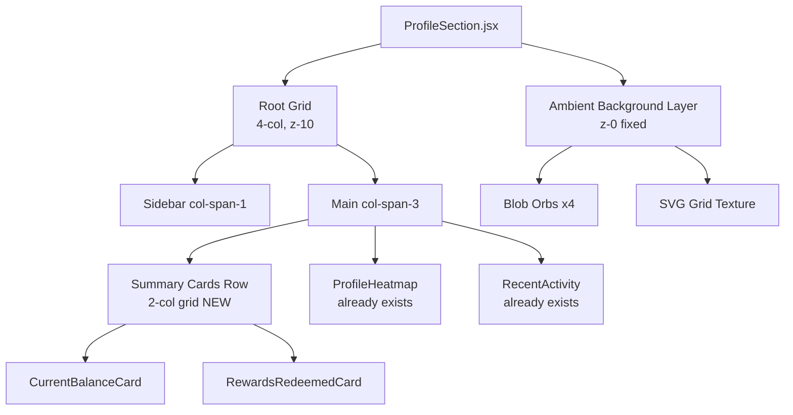
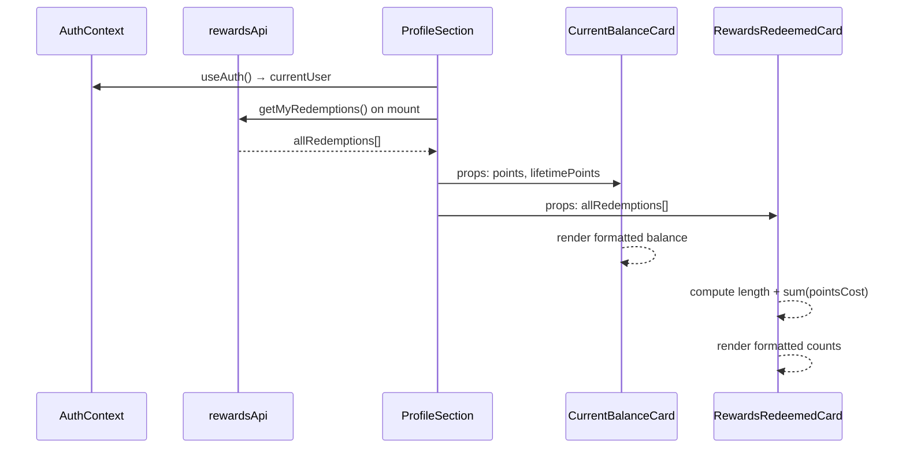
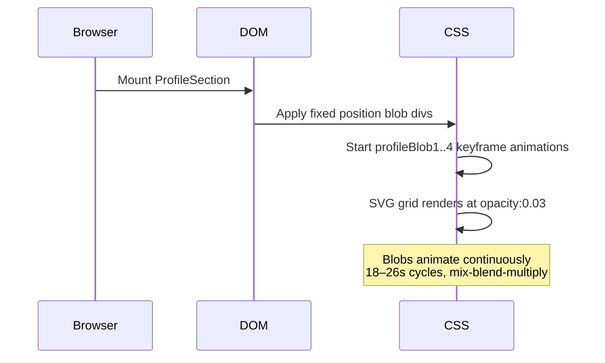

# Design Document: Profile Summary Cards

## Overview

This feature adds two premium summary cards — **Current Balance** and **Rewards Redeemed** — plus confirms and enhances the existing ambient background, all inside `ProfileSection.jsx`. The cards sit as a 2-column row directly above `ProfileHeatmap` in the `lg:col-span-3` main content area, giving users an immediate at-a-glance view of their EcoPoints standing before scrolling into activity detail.

The implementation is entirely self-contained within `ProfileSection.jsx` using inline Tailwind utility classes. No new files or dependencies are introduced. All data is already available in component scope via `currentUser` (from `useAuth()`) and `allRedemptions` (local state fetched on mount).

The ambient background already exists and only requires minor enhancement — a fourth blob colour and a subtle cube-grid SVG pattern — both of which are already partially in place and simply need to be confirmed against spec.

---

## Architecture



### Layer Model

| Layer | z-index | Element | Notes |
|-------|---------|---------|-------|
| Background | `z-0` (fixed) | Ambient blobs + SVG grid | Already exists, confirm/enhance |
| Content | `z-10` (relative) | Root 4-col grid | Already exists |
| Cards | inherits z-10 | Summary cards row | New addition |
| Modals | `z-[100]+` | Edit / QR modals | Already exists, unchanged |

---

## Sequence Diagrams

### Data Flow: Summary Cards Mount



### Ambient Background Lifecycle



---

## Components and Interfaces

### Component 1: AmbientBackground (inline, no props)

**Purpose**: Fixed decorative layer behind the entire profile page providing glassmorphic depth.

**Interface**: Rendered as an inline `<div aria-hidden="true">` with no props — it reads no external data.

**Structure**:
```tsx
// Already in ProfileSection.jsx return block — confirm matches spec below
<div aria-hidden="true" style={{ position:'fixed', inset:0, zIndex:0, pointerEvents:'none', overflow:'hidden', background:'#F8FAFC' }}>
  {/* Blob 1 — top-left, emerald */}
  <div style={{ /* top:-10%, left:-8%, w:600, h:600, blur:130px, opacity:0.07 */ }} />
  {/* Blob 2 — bottom-right, teal */}
  <div style={{ /* bottom:-5%, right:-6%, w:520, h:520, blur:120px, opacity:0.08 */ }} />
  {/* Blob 3 — middle-right, green */}
  <div style={{ /* top:30%, right:10%, w:380, h:380, blur:150px, opacity:0.05 */ }} />
  {/* Blob 4 — bottom-left, emerald-dark */}
  <div style={{ /* bottom:20%, left:15%, w:340, h:340, blur:100px, opacity:0.06 */ }} />
  {/* SVG cube/grid pattern */}
  <svg style={{ opacity:0.03 }}>
    <defs><pattern id="pgrid" width="32" height="32">...</pattern></defs>
    <rect width="100%" height="100%" fill="url(#pgrid)" />
  </svg>
  <style>{/* @keyframes profileBlob1..4 */}</style>
</div>
```

**Responsibilities**:
- Sit fixed behind all content at `z-0`
- Animate 4 organic blobs with slow `border-radius` + `translate` morphing
- Render SVG grid at near-invisible opacity for texture
- Never intercept pointer events (`pointerEvents:'none'`)

---

### Component 2: CurrentBalanceCard (inline JSX, receives data from parent scope)

**Purpose**: Premium dark-card showing the user's live EcoPoints balance and lifetime accumulation.

**Interface**:
```tsx
// Inline in ProfileSection.jsx — consumes from parent scope:
// currentUser.points        → main display value
// currentUser.lifetimePoints → footer display value
// Lucide icons: Zap (watermark + label glow icon)
```

**Visual Anatomy**:
```
┌─────────────────────────────────────────────┐
│ [Zap watermark, top-right, opacity:10%]      │
│  ● CURRENT BALANCE  [glow dot + Zap icon]   │
│                                              │
│        1,250 EP                              │  ← Space Mono, massive
│                                              │
│ ┌──────────────────────────────────────────┐│
│ │ Total Accumulated    12,400 EP           ││  ← bg-black/20 footer
│ └──────────────────────────────────────────┘│
└─────────────────────────────────────────────┘
```

**Responsibilities**:
- Display `currentUser.points` formatted with `toLocaleString()`
- Display `currentUser.lifetimePoints` in footer box
- Render two absolute blurred circles for internal "lighting"
- Render Zap icon watermark top-right at low opacity
- Show `—` placeholder when value is `null`/`undefined`

---

### Component 3: RewardsRedeemedCard (inline JSX, receives data from parent scope)

**Purpose**: Premium vibrant-gradient card showing the count of redeemed rewards and total points spent.

**Interface**:
```tsx
// Inline in ProfileSection.jsx — consumes from parent scope:
// allRedemptions.length       → main display value ("Items")
// allRedemptions[].pointsCost → summed for "Points Spent"
// Lucide icons: ShoppingBag (watermark + label icon container)
```

**Visual Anatomy**:
```
┌─────────────────────────────────────────────┐
│ [ShoppingBag watermark, top-right, 20% op]  │
│  [🛍 icon frost] REWARDS REDEEMED           │
│                                              │
│        8 Items                               │  ← Space Mono, massive
│                                              │
│ ┌──────────────────────────────────────────┐│
│ │ Points Spent         3,200 EP            ││  ← bg-white/10 footer
│ └──────────────────────────────────────────┘│
└─────────────────────────────────────────────┘
```

**Responsibilities**:
- Display `allRedemptions.length` as main value
- Compute and display `allRedemptions.reduce((sum, r) => sum + (r.pointsCost ?? 0), 0)` in footer
- Render ShoppingBag watermark and frosted-glass icon container
- Render blurred white circle bottom-left for internal lighting

---

## Data Models

### Model 1: CurrentUser (relevant fields only)

```tsx
interface CurrentUser {
  points: number;          // live spendable balance → Card 1 main value
  lifetimePoints: number;  // total ever earned      → Card 1 footer
  // ... other fields unchanged
}
```

**Validation Rules**:
- Both fields are numbers; treat `null`/`undefined` as `0` for display, show `—` via `fmt()` helper
- `points` ≤ `lifetimePoints` always (server-enforced)

### Model 2: Redemption

```tsx
interface Redemption {
  pointsCost: number;     // EP cost of this redemption → summed for Card 2 footer
  status: string;         // 'pending' | 'PENDING' | etc.
  rewardName: string;
  // ... other fields unchanged
}
```

**Validation Rules**:
- `pointsCost` may be absent on legacy records; default to `0` in sum
- `allRedemptions` array is already fetched and stored in component state

### Model 3: SummaryCardsRow (layout wrapper, no external props)

```tsx
// Layout container — no props, renders both cards side-by-side
// grid grid-cols-1 sm:grid-cols-2 gap-4
// Placed as first child of lg:col-span-3 main area
```

---

## Algorithmic Pseudocode

### Main Rendering Algorithm: SummaryCardsRow placement

```pascal
ALGORITHM renderMainArea(currentUser, allRedemptions)
INPUT: currentUser (from useAuth), allRedemptions (state array)
OUTPUT: JSX for lg:col-span-3 section

BEGIN
  // Step 1: Compute derived values
  balance      ← currentUser.points        ?? 0
  lifePoints   ← currentUser.lifetimePoints ?? 0
  redeemCount  ← allRedemptions.length
  pointsSpent  ← SUM(r.pointsCost ?? 0 FOR r IN allRedemptions)

  // Step 2: Render summary row ABOVE heatmap
  RETURN (
    <div className="lg:col-span-3 flex flex-col gap-4">
      <SummaryCardsRow balance={balance} lifePoints={lifePoints}
                       redeemCount={redeemCount} pointsSpent={pointsSpent} />
      <ProfileHeatmap />
      <RecentActivity />
    </div>
  )
END
```

**Preconditions**:
- `currentUser` is non-null (guarded by `RequireAuth`)
- `allRedemptions` is an array (initialised to `[]`, never null)

**Postconditions**:
- Summary cards always render, showing `—` when values are missing
- Heatmap and RecentActivity positions are unchanged

---

### Points Spent Aggregation Algorithm

```pascal
ALGORITHM computePointsSpent(redemptions)
INPUT:  redemptions — array of Redemption objects
OUTPUT: totalSpent  — non-negative integer

BEGIN
  totalSpent ← 0
  
  FOR each r IN redemptions DO
    ASSERT r IS object
    cost ← r.pointsCost IF r.pointsCost IS number AND r.pointsCost >= 0
           ELSE 0
    totalSpent ← totalSpent + cost
  END FOR
  
  ASSERT totalSpent >= 0
  RETURN totalSpent
END
```

**Preconditions**:
- `redemptions` is a valid array (may be empty)

**Postconditions**:
- Returns a non-negative integer
- Missing or negative `pointsCost` values are treated as `0`

**Loop Invariants**:
- `totalSpent` is always ≥ 0 throughout iteration
- All previously processed costs have been added

---

## Key Functions with Formal Specifications

### Function 1: `formatBalance(value)`

```tsx
function formatBalance(value: number | null | undefined): string
```

**Preconditions**:
- `value` is a number, null, or undefined

**Postconditions**:
- Returns `'—'` when value is `null` or `undefined`
- Returns `value.toLocaleString()` when value is a valid number
- Never throws

**Example**: `formatBalance(1250)` → `"1,250"`, `formatBalance(null)` → `"—"`

---

### Function 2: `computePointsSpent(redemptions)`

```tsx
function computePointsSpent(redemptions: Redemption[]): number
```

**Preconditions**:
- `redemptions` is a non-null array

**Postconditions**:
- Returns sum of all `pointsCost` values, defaulting missing values to `0`
- Result is always ≥ 0

**Implementation** (inline, as part of JSX):
```tsx
const pointsSpent = allRedemptions.reduce(
  (sum, r) => sum + (r.pointsCost ?? 0), 0
);
```

---

### Function 3: Card Layout Positioning

```tsx
// Insertion point in ProfileSection.jsx return block:
// BEFORE: <ProfileHeatmap />
// AFTER:  <SummaryCardsRow /> then <ProfileHeatmap />
```

**Preconditions**:
- Must be inside the `lg:col-span-3` flex column div
- Must appear before `<ProfileHeatmap />`

**Postconditions**:
- Cards occupy full width of the 3-column main area
- On mobile (< sm breakpoint), cards stack vertically
- On sm+, cards are side-by-side at equal width

---

## Example Usage

```tsx
// Inside ProfileSection.jsx lg:col-span-3 div:

{/* ── Summary Cards Row ── */}
<div className="grid grid-cols-1 sm:grid-cols-2 gap-4">

  {/* Card 1: Current Balance */}
  <div className="relative rounded-2xl overflow-hidden p-5 flex flex-col justify-between min-h-[160px]"
       style={{ background: '#064E3B' }}>
    {/* Lighting circles */}
    <div className="absolute -top-6 -right-6 w-32 h-32 rounded-full bg-emerald-500/20 blur-2xl" />
    <div className="absolute -bottom-6 -left-6 w-28 h-28 rounded-full bg-teal-400/20 blur-2xl" />
    {/* Zap watermark */}
    <Zap className="absolute top-3 right-3 text-emerald-300/10" size={80} />
    {/* Label */}
    <div className="flex items-center gap-2 relative z-10">
      <span className="w-2 h-2 rounded-full bg-emerald-400 shadow-[0_0_6px_#34d399]" />
      <Zap size={12} className="text-emerald-400" />
      <span className="text-[10px] font-black uppercase tracking-widest text-emerald-300"
            style={fonts.body}>Current Balance</span>
    </div>
    {/* Main value */}
    <div className="flex items-end gap-1.5 relative z-10 my-2">
      <span className="text-5xl font-black text-white leading-none" style={fonts.data}>
        {(currentUser?.points ?? 0).toLocaleString()}
      </span>
      <span className="text-sm font-bold text-emerald-300 mb-1" style={fonts.body}>EP</span>
    </div>
    {/* Footer */}
    <div className="relative z-10 bg-black/20 backdrop-blur-sm rounded-xl px-4 py-2 flex items-center justify-between">
      <span className="text-[10px] font-bold text-emerald-200/70 uppercase tracking-wider" style={fonts.body}>
        Total Accumulated
      </span>
      <span className="text-sm font-black text-white" style={fonts.data}>
        {(currentUser?.lifetimePoints ?? 0).toLocaleString()} EP
      </span>
    </div>
  </div>

  {/* Card 2: Rewards Redeemed */}
  <div className="relative rounded-2xl overflow-hidden p-5 flex flex-col justify-between min-h-[160px]"
       style={{ background: 'linear-gradient(135deg, #10B981, #00838F)' }}>
    {/* ShoppingBag watermark */}
    <ShoppingBag className="absolute -top-2 -right-2 text-white/20 rotate-12" size={100} />
    {/* Lighting circle */}
    <div className="absolute -bottom-6 -left-6 w-28 h-28 rounded-full bg-white/10 blur-2xl" />
    {/* Label */}
    <div className="flex items-center gap-2 relative z-10">
      <div className="w-5 h-5 rounded-md bg-white/20 backdrop-blur-md flex items-center justify-center">
        <ShoppingBag size={11} className="text-white" />
      </div>
      <span className="text-[10px] font-black uppercase tracking-widest text-white/80"
            style={fonts.body}>Rewards Redeemed</span>
    </div>
    {/* Main value */}
    <div className="flex items-end gap-1.5 relative z-10 my-2">
      <span className="text-5xl font-black text-white leading-none" style={fonts.data}>
        {allRedemptions.length}
      </span>
      <span className="text-sm font-bold text-white/70 mb-1" style={fonts.body}>Items</span>
    </div>
    {/* Footer */}
    <div className="relative z-10 bg-white/10 backdrop-blur-md rounded-xl px-4 py-2 flex items-center justify-between">
      <span className="text-[10px] font-bold text-white/70 uppercase tracking-wider" style={fonts.body}>
        Points Spent
      </span>
      <span className="text-sm font-black text-white" style={fonts.data}>
        {allRedemptions.reduce((sum, r) => sum + (r.pointsCost ?? 0), 0).toLocaleString()} EP
      </span>
    </div>
  </div>

</div>
```

---

## Correctness Properties

### Property 1: Balance non-negative

`∀ render. (currentUser.points ?? 0) >= 0` — the displayed balance is never a negative number.

**Validates: Requirements 1.1**

### Property 2: Lifetime ≥ balance

`∀ render. lifetimePoints >= points` — total accumulated is always ≥ current spendable balance (server invariant, displayed correctly).

**Validates: Requirements 1.2**

### Property 3: Points-spent ≤ lifetime

`∀ allRedemptions. computePointsSpent(allRedemptions) <= currentUser.lifetimePoints` — the sum of redemption costs cannot exceed lifetime points earned.

**Validates: Requirements 2.3**

### Property 4: Redemption count accuracy

`∀ allRedemptions. displayedCount === allRedemptions.length` — the card shows the exact array length, not a cached or filtered count.

**Validates: Requirements 2.1**

### Property 5: No-render crash on empty

`∀ currentUser where points=null. formatBalance(null) === '—'` — missing data never causes a runtime error.

**Validates: Requirements 1.3**

### Property 6: Points-spent default

`∀ r where r.pointsCost=undefined. contribution(r) === 0` — legacy records without `pointsCost` contribute `0` to the sum.

**Validates: Requirements 2.3**

### Property 7: Card layout order

`∀ renders. position(SummaryCardsRow) < position(ProfileHeatmap)` — summary cards always appear above the heatmap in document order.

**Validates: Requirements 3.1**

### Property 8: Ambient z-order

`∀ renders. z(AmbientBackground) < z(ContentGrid)` — blobs never cover interactive elements.

**Validates: Requirements 4.1**

---

## Error Handling

### Scenario 1: `currentUser.points` is null/undefined

**Condition**: Auth context returns user without a `points` field (e.g. partial hydration)
**Response**: `(currentUser?.points ?? 0).toLocaleString()` resolves to `"0"`; alternatively the `fmt()` helper returns `'—'`
**Recovery**: No action needed — display degrades gracefully; value updates on next auth refresh

### Scenario 2: `allRedemptions` fetch fails

**Condition**: `rewardsApi.getMyRedemptions()` throws (network error, auth expired)
**Response**: The existing `catch` block silently keeps `allRedemptions = []`, so Card 2 shows `0 Items` and `0 EP` spent
**Recovery**: User can refresh the page; no error is surfaced to the card UI

### Scenario 3: Individual redemption missing `pointsCost`

**Condition**: Legacy redemption record lacks the `pointsCost` field
**Response**: `?? 0` nullish coalescing in the `reduce` defaults the value to `0`
**Recovery**: Sum remains correct; no visual artefact

### Scenario 4: Very large numbers (e.g. 1,000,000+ points)

**Condition**: Power user with extreme lifetime points
**Response**: `toLocaleString()` formats correctly; the `text-5xl` size may truncate on very small screens
**Recovery**: Font scales down naturally with Tailwind responsive utilities; no data loss

---

## Testing Strategy

### Unit Testing Approach

Test the two pure computation helpers in isolation:

- `formatBalance(null)` → `'—'`
- `formatBalance(0)` → `'0'`
- `formatBalance(1250)` → `'1,250'`
- `computePointsSpent([])` → `0`
- `computePointsSpent([{pointsCost:100}, {pointsCost:200}])` → `300`
- `computePointsSpent([{pointsCost:undefined}])` → `0`

### Property-Based Testing Approach

**Property Test Library**: fast-check

- **Property 1 — sum never negative**: For any array of redemptions where each `pointsCost` is a non-negative number, `computePointsSpent` returns ≥ 0.
- **Property 2 — sum is additive**: `computePointsSpent(A.concat(B)) === computePointsSpent(A) + computePointsSpent(B)`
- **Property 3 — count matches length**: For any array `arr`, the rendered count equals `arr.length`
- **Property 4 — format roundtrip**: For any integer `n ≥ 0`, `formatBalance(n)` is a non-empty string with no leading zeros (except `"0"` itself)

### Integration Testing Approach

- Render `ProfileSection` with a mocked `AuthContext` providing `currentUser.points = 1250` and `currentUser.lifetimePoints = 12400`
- Assert Card 1 displays `"1,250"` and footer shows `"12,400 EP"`
- Render with `allRedemptions = [{pointsCost: 100}, {pointsCost: 200}]`
- Assert Card 2 shows `"2"` and footer shows `"300 EP"`
- Render with `allRedemptions = []` — assert `"0 Items"` and `"0 EP"`

---

## Performance Considerations

- Both cards are pure renders — no additional `useEffect`, `useCallback`, or `useMemo` required
- The `reduce` for `pointsSpent` is O(n) over `allRedemptions`, which is bounded by a user's redemption history (typically < 100 items); no memoisation needed
- The ambient background uses CSS keyframe animations (GPU-composited `transform` and `border-radius`) — no JS animation loop
- All blur effects are rendered via CSS `filter: blur()` which is GPU-accelerated in modern browsers
- Cards use `backdrop-blur-sm` / `backdrop-blur-md` via Tailwind — these are composited layers with minimal reflow cost

---

## Security Considerations

- No user-controlled data is rendered as HTML (all values are numbers formatted via `toLocaleString()`) — no XSS risk
- `currentUser.points` and `lifetimePoints` come from the authenticated server session via `useAuth()` — no client-side mutation possible
- `allRedemptions` data is fetched from an authenticated API endpoint; the component only reads, never writes, from this data for card display purposes

---

## Responsive Behavior

| Breakpoint | Summary Cards Layout |
|------------|---------------------|
| `< sm` (< 640px) | `grid-cols-1` — cards stack vertically, full width |
| `sm+` (≥ 640px) | `grid-cols-2` — cards side by side, equal width |
| `lg+` (≥ 1024px) | Same as sm, but main area is now col-span-3 of a 4-col grid |

Cards use `min-h-[160px]` to prevent collapse and `overflow-hidden` to contain absolute-positioned decorative elements within card bounds.

---

## Placement in ProfileSection.jsx

```
ProfileSection return block
└── <section> (relative, min-h-screen)
    ├── AmbientBackground (fixed, z-0) ← confirm/enhance existing
    └── Root Grid (4-col, z-10)
        ├── Sidebar (col-span-1) ← unchanged
        └── Main (col-span-3, flex-col gap-4)
            ├── [NEW] Summary Cards Row (grid-cols-2)
            │   ├── CurrentBalanceCard
            │   └── RewardsRedeemedCard
            ├── ProfileHeatmap ← already exists, position unchanged
            └── RecentActivity ← already exists, position unchanged
```

The ambient background `<div>` is already the first child of the `<section>` at the top of the return block. The summary cards row is inserted as the first child of the `lg:col-span-3` div, directly before `<ProfileHeatmap />`.

---

## Dependencies

| Dependency | Already Available | Notes |
|-----------|-------------------|-------|
| `lucide-react` — `Zap`, `ShoppingBag` | ✅ `ShoppingBag` already imported in ProfileSection.jsx | `Zap` needs to be added to the import list |
| `currentUser` from `useAuth()` | ✅ Already in scope | `points` and `lifetimePoints` fields used |
| `allRedemptions` state | ✅ Already fetched and stored | Array of redemption objects |
| Tailwind CSS utilities | ✅ Already configured | `backdrop-blur`, `blur-*`, `bg-*/opacity` all available |
| `fonts` constant | ✅ Defined at top of ProfileSection.jsx | `fonts.heading`, `fonts.body`, `fonts.data` |
| `Space Mono` font | ✅ In tailwind.config.js as `font-mono` | Used for number display |
