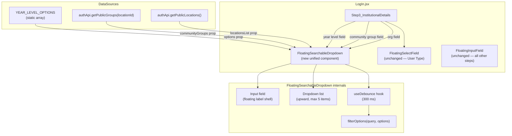
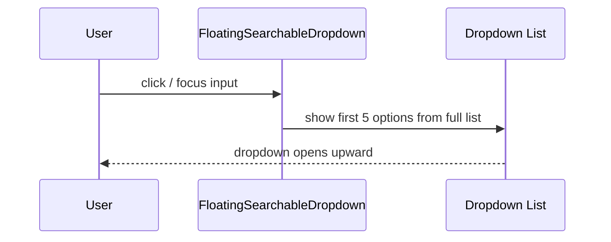
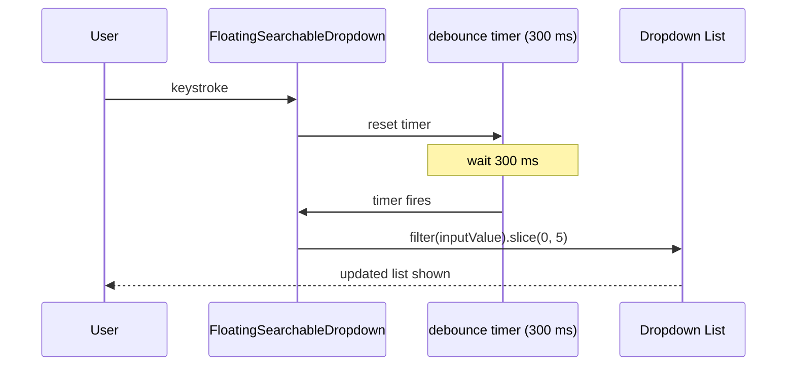
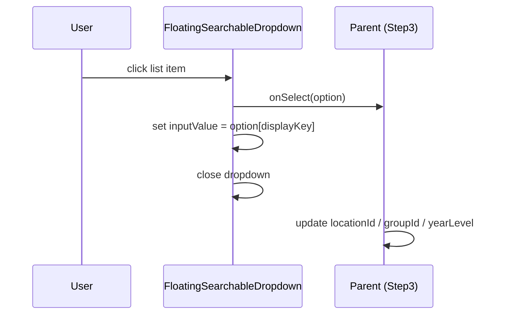
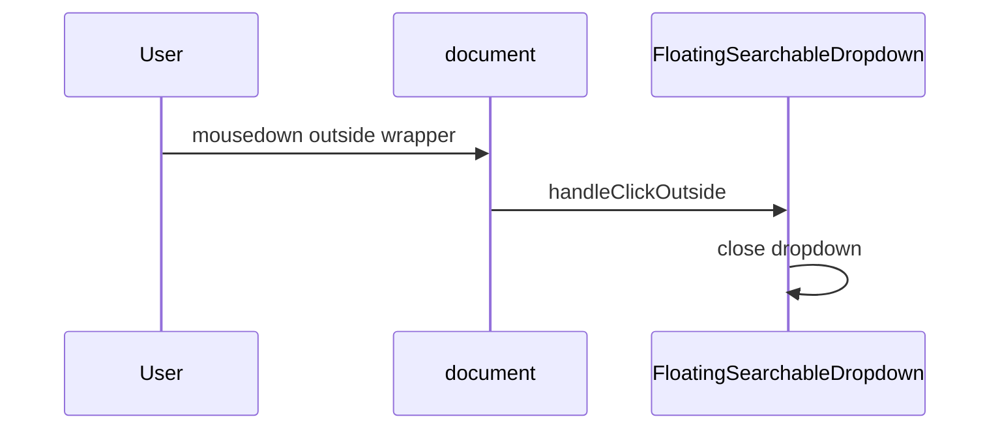

# Design Document — Signup Dropdown UX Enhancement

## Overview

This feature replaces the inconsistent dropdown controls in Step 3 of `SignUp_Wizard` (`LogIn.jsx`) with a single, reusable `FloatingSearchableDropdown` component that unifies the visual shell of `FloatingInputField` with the rich upward-list UX of the existing `FloatingSearchDropdown`.

The three affected fields are:

| Field | Before | After |
|---|---|---|
| Organization | `FloatingSearchDropdown` (legacy lime styling, no floating label, shows results only on input) | `FloatingSearchableDropdown` (emerald floating label, shows 5 defaults on focus, debounced filter) |
| Community Group | `FloatingDatalistField` (native browser datalist) | `FloatingSearchableDropdown` (same rich design, disabled state when no org selected) |
| Year Level | `FloatingInputField` (plain text) | `FloatingSearchableDropdown` (fixed 5-option list, all shown on focus) |

No other Step 3 controls (User Type / `FloatingSelectField`) are changed.

---

## Architecture



**State ownership:** `SignUp_Wizard` continues to own all field state. `FloatingSearchableDropdown` owns only `inputValue` (the typed text), `isOpen` (dropdown visibility), and the internal debounce timer. The parent controls what is ultimately committed by responding to `onSelect(option)` and `onClear()`.

---

## Sequence Diagrams

### Focus → Show Defaults



### Type → Debounced Filter



### Select → Close



### Outside Click → Close



---

## Components and Interfaces

### `FloatingSearchableDropdown` (new)

**File:** `client/src/components/pages/LogIn.jsx` — defined as a local named function above `Step3_InstitutionalDetails`.

#### Props

```typescript
interface FloatingSearchableDropdownProps {
  // Field identity
  id: string;                    // Used for label htmlFor and aria-controls
  label: string;                 // Floating label text

  // Visual
  icon: React.ReactNode;         // Left icon (Lucide element)

  // Value control (controlled component)
  value: string;                 // Display text currently in the input
  onChange: (text: string) => void; // Called on every keystroke (raw input)

  // Options
  options: DropdownOption[];     // Full options list (filtered internally)
  onSelect: (option: DropdownOption) => void; // Called when user clicks an item
  onClear?: () => void;          // Called when input is cleared to empty string

  // Option display keys
  searchKey?: string;            // Field to match against (default: "name")
  displayKey?: string;           // Field to show as primary text (default: "name")
  subtitleKey?: string;          // Field for subtitle/avatar initials (default: "abbreviation")

  // Behaviour
  emptyMessage?: string;         // Text shown when no matches (default: "No results found")
  disabled?: boolean;            // Disables input + greys out field

  // Validation
  error?: boolean;               // Triggers rose colour state
  onBlur?: (e: React.FocusEvent) => void;
}

interface DropdownOption {
  id: string | number;
  name: string;
  abbreviation?: string;
  [key: string]: unknown;
}
```

#### Internal State

```typescript
// Internal to FloatingSearchableDropdown
const [isOpen, setIsOpen]       = useState(false);
const [debouncedQuery, setDebouncedQuery] = useState('');  // trails value by 300 ms
```

#### Constants

```typescript
const MAX_ITEMS = 5;           // Maximum items shown in dropdown at all times
const DEBOUNCE_MS = 300;       // Delay before filter is applied after typing stops
const YEAR_LEVEL_OPTIONS = [   // Static option list for Year Level field
  { id: 1, name: '1st Year', abbreviation: 'Y1' },
  { id: 2, name: '2nd Year', abbreviation: 'Y2' },
  { id: 3, name: '3rd Year', abbreviation: 'Y3' },
  { id: 4, name: '4th Year', abbreviation: 'Y4' },
  { id: 5, name: '5th Year', abbreviation: 'Y5' },
];
```

---

## Data Models

### DropdownOption shape (existing + extended)

```typescript
// Existing shape from API — already used in locationsList / communityGroups
interface LocationOption {
  id: number;
  name: string;
  abbreviation: string;
}

interface GroupOption {
  id: number;
  name: string;
  abbreviation?: string;
}

// New — Year Level (static, no API)
interface YearLevelOption {
  id: number;
  name: '1st Year' | '2nd Year' | '3rd Year' | '4th Year' | '5th Year';
  abbreviation: 'Y1' | 'Y2' | 'Y3' | 'Y4' | 'Y5';
}
```

All three shapes satisfy `DropdownOption` — the new component is data-shape-agnostic as long as `searchKey` and `displayKey` are set correctly.

---

## Algorithmic Pseudocode

### filterOptions — core filter algorithm

```pascal
FUNCTION filterOptions(query, options, searchKey, subtitleKey, maxItems)
  INPUT:
    query      — trimmed string typed by user (may be empty)
    options    — full DropdownOption[]
    searchKey  — key to search against (e.g. "name")
    subtitleKey — secondary key (e.g. "abbreviation")
    maxItems   — integer cap (= 5)
  OUTPUT: DropdownOption[] of length ≤ maxItems

  IF query = "" THEN
    RETURN options.slice(0, maxItems)   // default: first N items
  END IF

  result ← []
  q ← query.toLowerCase()

  FOR each option IN options DO
    primary   ← option[searchKey]?.toLowerCase() ?? ""
    secondary ← option[subtitleKey]?.toLowerCase() ?? ""
    IF primary.includes(q) OR secondary.includes(q) THEN
      result.push(option)
    END IF
    IF result.length = maxItems THEN
      BREAK
    END IF
  END FOR

  RETURN result
END FUNCTION
```

**Preconditions:**
- `options` is a valid array (may be empty)
- `maxItems` ≥ 1
- `searchKey` exists on option objects

**Postconditions:**
- Returned array length ≤ `maxItems`
- When `query` is empty, returns first `maxItems` items regardless of search match
- When `query` is non-empty, only items matching primary or secondary key are returned
- Input array is never mutated

**Loop Invariant:** `result.length` ≤ `maxItems` at all times during iteration.

---

### useDebounce — internal timing logic

```pascal
PROCEDURE useDebounce(value, delayMs)
  INPUT: value — current string, delayMs — integer
  OUTPUT: debouncedValue — string (delayed by delayMs)

  ON value change:
    CLEAR existing timer
    SET timer ← setTimeout(
      ACTION: update debouncedValue ← value,
      DELAY: delayMs
    )
  
  ON component unmount:
    CLEAR timer
END PROCEDURE
```

This is implemented as a React hook using `useEffect` + `useRef` for the timer ID, returning a state variable that trails `value` by `delayMs` milliseconds.

---

### FloatingSearchableDropdown — main render logic

```pascal
PROCEDURE FloatingSearchableDropdown(props)
  // --- Derived state ---
  isFloated  ← isFocused OR value.length > 0
  query      ← debouncedValue                     // trails typed value by 300 ms
  displayed  ← filterOptions(query, options, searchKey, subtitleKey, MAX_ITEMS)

  // --- Event handlers ---
  ON input focus:
    setIsFocused(true)
    setIsOpen(true)                                // always open on focus

  ON input blur:
    setIsFocused(false)
    // NOTE: do NOT close here — closing on blur causes item click to be eaten
    //       Closing is handled by onMouseDown outside or item selection

  ON input change (e):
    props.onChange(e.target.value)                 // propagate raw value up
    IF e.target.value = "" THEN
      props.onClear?()
    END IF
    setIsOpen(true)

  ON item click (option):
    props.onSelect(option)                         // parent commits the selection
    setIsOpen(false)

  ON outside mousedown:
    setIsOpen(false)

  // --- Render ---
  RENDER floating label shell (same as FloatingInputField):
    borderColor  ← error ? rose-500 : isFocused ? emerald-500 : slate-200
    iconColor    ← error ? rose-500 : isFocused ? emerald-500 : value ? emerald-400 : slate-400
    labelColor   ← error ? rose-500 : isFloated ? emerald-600 : slate-400

  IF isOpen AND NOT disabled THEN
    RENDER dropdown list (upward, z-50):
      header row: "{displayed.length} Result(s)"
      FOR each item IN displayed:
        RENDER item row: avatar circle + primary text + subtitle
      END FOR
      IF displayed.length = 0:
        RENDER empty state with emptyMessage
      END IF
  END IF
END PROCEDURE
```

---

## Key Functions with Formal Specifications

### `filterOptions(query, options, searchKey, subtitleKey, maxItems)`

**Preconditions:**
- `options` is an Array (length ≥ 0)
- `maxItems` is a positive integer
- `searchKey` is a non-empty string

**Postconditions:**
- `result.length ≤ maxItems` always holds
- When `query === ""` → result equals `options.slice(0, maxItems)`
- When `query !== ""` → every item in result satisfies `item[searchKey].toLowerCase().includes(query.toLowerCase()) || item[subtitleKey]?.toLowerCase().includes(query.toLowerCase())`
- No side effects on `options`

**Loop Invariant:** `result.length ≤ maxItems` before, during, and after every iteration.

---

### Focus → Open behavior

**Precondition:** Component is not `disabled`.

**Postcondition:** `isOpen === true` after `onFocus` fires, regardless of current `value` length.

This is the key behavioral difference from the legacy `FloatingSearchDropdown`, which required `value.length > 0` to show the dropdown.

---

### Debounce timing

**Precondition:** User has stopped typing.

**Postcondition:** Exactly 300 ms after the last keystroke, `debouncedValue` is updated to match `value`, triggering a re-render of the filtered list.

**Invariant:** Only the latest timer is ever active (previous timers are cleared on each new keystroke).

---

## Example Usage

### Organization field (API-backed)

```jsx
<FloatingSearchableDropdown
  id="signup-org"
  label="Organization"
  icon={<Building2 size={18} />}
  value={orgInput}
  onChange={(text) => {
    setOrgInput(text);
    if (!text) { setLocationId(null); setGroupInput(''); setGroupId(null); }
  }}
  onClear={() => { setLocationId(null); setGroupInput(''); setGroupId(null); }}
  options={locationsList}
  onSelect={(opt) => {
    setOrgInput(opt.name);
    setLocationId(opt.id);
    setGroupInput('');
    setGroupId(null);
    setTouched(t => ({ ...t, orgInput: true }));
  }}
  searchKey="name"
  displayKey="name"
  subtitleKey="abbreviation"
  emptyMessage="No institutions found"
  error={touched.orgInput && !locationId}
/>
```

### Community Group field (API-backed, disabled until org selected)

```jsx
<FloatingSearchableDropdown
  id="signup-group"
  label="Community Group"
  icon={<Users size={18} />}
  value={groupInput}
  onChange={setGroupInput}
  onClear={() => setGroupId(null)}
  options={communityGroups}
  onSelect={(opt) => {
    setGroupInput(opt.name);
    setGroupId(opt.id);
    setTouched(t => ({ ...t, groupInput: true }));
  }}
  searchKey="name"
  displayKey="name"
  subtitleKey="abbreviation"
  emptyMessage="No groups found"
  disabled={!locationId || isSubmitting}
  error={touched.groupInput && !groupId}
/>
```

### Year Level field (static options, Student only)

```jsx
{userType === 'Student' && (
  <FloatingSearchableDropdown
    id="signup-yearlevel"
    label="Year Level"
    icon={<BookOpen size={18} />}
    value={yearLevel}
    onChange={setYearLevel}
    onClear={() => setYearLevel('')}
    options={YEAR_LEVEL_OPTIONS}
    onSelect={(opt) => {
      setYearLevel(opt.name);
      setTouched(t => ({ ...t, yearLevel: true }));
    }}
    searchKey="name"
    displayKey="name"
    subtitleKey="abbreviation"
    emptyMessage="No year levels found"
    error={touched.yearLevel && !yearLevel.trim()}
  />
)}
```

---

## Correctness Properties

*A property is a characteristic or behavior that should hold true across all valid executions of a system — essentially, a formal statement about what the system should do. Properties serve as the bridge between human-readable specifications and machine-verifiable correctness guarantees.*

### Property 1: Max-5 invariant

*For any* options array and any query string, `filterOptions(query, options, searchKey, subtitleKey, maxItems).length ≤ 5` holds after every invocation.

**Validates: Requirements 1.4, 7.3**

### Property 2: Focus-open invariant

*For any* input value string, when the `FloatingSearchableDropdown` is not `disabled` and the input receives focus, `isOpen` is `true` immediately after the focus event.

**Validates: Requirements 1.1**

### Property 3: Debounce idempotence

*For any* sequence of keystrokes that ends and then pauses, exactly one filter evaluation fires 300 ms after the final keystroke — regardless of how many intermediate keystrokes occurred.

**Validates: Requirements 1.3**

### Property 4: Empty-query default

*For any* non-empty options array, when `query === ""`, `filterOptions` returns exactly `options.slice(0, 5)` — never an empty list.

**Validates: Requirements 1.2, 7.1**

### Property 5: Selection closure and display-key fidelity

*For any* `DropdownOption` in the displayed list, clicking that item always calls `onSelect` with the option object, sets the input's displayed text to `option[displayKey]`, and sets `isOpen` to `false`.

**Validates: Requirements 1.5**

### Property 6: Outside-click closure

*For any* open-dropdown state, a `mousedown` event on a DOM node outside the component wrapper always sets `isOpen` to `false` without calling `onSelect` or `onChange`.

**Validates: Requirements 1.6**

### Property 7: Disabled passthrough

*For any* user interaction (focus, click, keystroke), when `disabled === true` the dropdown never opens and `isOpen` remains `false`.

**Validates: Requirements 2.2 (disabled state), 3.2**

### Property 8: Error state propagation

*For any* render where `error === true`, the border, icon, and floating label elements all carry rose color tokens, and no emerald color tokens appear on those elements.

**Validates: Requirements 2.3**

### Property 9: Label float consistency

*For any* value string and focus state, the floating label is in the floated (above-border) position if and only if `isFocused === true` OR `value.length > 0`.

**Validates: Requirements 2.4, 2.5**

### Property 10: filterOptions case-insensitive match

*For any* query string and options array, `filterOptions` returns every option whose `option[searchKey]` or `option[subtitleKey]` contains `query` using case-insensitive comparison, up to `maxItems` items.

**Validates: Requirements 7.2**

### Property 11: filterOptions immutability

*For any* options array passed to `filterOptions`, the original array is not mutated after the function returns.

**Validates: Requirements 7.4**

### Property 12: Community Group disabled when no organization

*For any* signup wizard state where `locationId` is `null` or `undefined`, the Community Group `FloatingSearchableDropdown` receives `disabled={true}` and never opens.

**Validates: Requirements 3.1, 3.2**

---

## Error Handling

### API load failure (Organization / Community Group)

**Condition:** `getPublicLocations()` or `getPublicGroups()` rejects.

**Response:** `locationsError` / `groupsError` state is set; an inline rose-coloured error message with a "Retry" button is rendered below the field (unchanged from existing behavior).

**Recovery:** User taps "Retry"; the fetch is re-attempted. The dropdown renders with an empty list in the meantime (empty-state message shown on focus).

---

### Empty options list on focus

**Condition:** API hasn't returned yet, or returned an empty array.

**Response:** Dropdown opens showing the empty-state (`emptyMessage` string) rather than crashing.

---

### Typing when disabled

**Condition:** `disabled === true` (Community Group before org is chosen).

**Response:** Input is non-interactive (`disabled` HTML attribute set); dropdown never opens; field renders with reduced opacity and `cursor-not-allowed`.

---

### Outside click while dropdown is open

**Condition:** User clicks outside the wrapper `div`.

**Response:** `isOpen` set to `false`; no `onSelect` or `onChange` is fired.

---

## Testing Strategy

### Unit Testing Approach

Test `filterOptions` in isolation:
- Empty query returns first 5 items
- Query matching zero items returns `[]`
- Query matching >5 items returns exactly 5
- Case-insensitive matching
- Subtitle/abbreviation matching
- Boundary: `maxItems = 1`

Test `useDebounce`:
- Returns initial value immediately
- Only updates after `delayMs` ms (use fake timers)
- Clears pending timer on rapid updates

### Property-Based Testing Approach

**Property test library:** fast-check (already in project ecosystem for JS/TS)

Key properties to generate:
- For any `options` array and any `query`, `filterOptions` result length ≤ 5
- For any empty string `query`, result is `options.slice(0, 5)`
- For any `query`, every result item's `name` contains `query` (case-insensitive) OR its `abbreviation` contains `query`

### Integration Testing Approach

Test `FloatingSearchableDropdown` rendered in jsdom (React Testing Library):
1. On render: dropdown closed
2. On focus: dropdown opens with ≤5 items
3. On type (after 300 ms fake timer): list filters
4. On item click: `onSelect` called, dropdown closes, input text = item name
5. On outside click: dropdown closes
6. `disabled=true`: input non-interactive, dropdown never opens
7. `error=true`: border class contains `rose-500`
8. `value=""` after clear: shows first 5 defaults on next focus

---

## Performance Considerations

- **Debounce (300 ms):** Prevents filter re-computation on every keystroke. For API-backed fields this prevents unnecessary re-renders; the filtering is entirely client-side on the pre-fetched list, so no additional API calls are made during typing.
- **Max 5 items:** The `filterOptions` function short-circuits the loop once 5 items are found, avoiding full-array scans on large location/group lists.
- **Static `YEAR_LEVEL_OPTIONS`:** Declared outside the component as a module-level constant — never reallocated on re-render.
- **`useRef` for timer:** Debounce timer stored in a ref rather than state, avoiding extra renders from timer updates.

---

## Security Considerations

- All option data comes from the existing `getPublicLocations` / `getPublicGroups` endpoints, which are already rate-limited and validated server-side. No new API surface is introduced.
- Input text is displayed as text content (not `dangerouslySetInnerHTML`), so XSS via crafted option names is not possible.
- The `disabled` prop correctly prevents interaction when organization context is missing.

---

## Migration Map

The following changes will be made to `LogIn.jsx`:

| Before | After | Scope |
|---|---|---|
| `FloatingSearchDropdown` (legacy, lime-themed, used for Org) | `FloatingSearchableDropdown` (emerald-themed, shows defaults on focus) | Replace component call in Step3 |
| `FloatingDatalistField` (native datalist for Community Group) | `FloatingSearchableDropdown` with `disabled={!locationId}` | Replace component call + remove `FloatingDatalistField` definition if unused |
| `FloatingInputField` plain text (Year Level) | `FloatingSearchableDropdown` with `options={YEAR_LEVEL_OPTIONS}` | Replace component call |
| `FloatingSearchDropdown` component definition (old) | `FloatingSearchableDropdown` component definition (new) | Replace/rename definition |

`FloatingDatalistField` can be removed once Community Group is migrated. `FloatingSelectField` and `FloatingInputField` are untouched.

---

## Dependencies

- **React** (`useState`, `useEffect`, `useRef`) — already in use
- **Lucide React** (`Search`, `BookOpen`, etc.) — already imported in `LogIn.jsx`
- **Tailwind CSS** — emerald/rose/slate utility classes already applied throughout `LogIn.jsx`
- No new npm packages required
