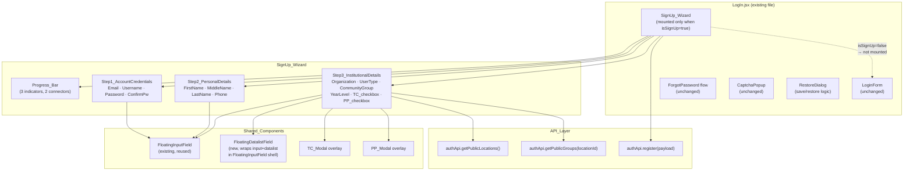

# Design Document — Sign-Up Modal Redesign

## Overview

This feature replaces the existing 2-phase sign-up form in `LogIn.jsx` (which uses legacy `InputField` and `FloatingSearchDropdown` components) with a redesigned **3-step SignUp_Wizard** that fully adopts the floating-label design language already established by `FloatingInputField`. The wizard lives entirely inside or alongside `LogIn.jsx` and must not disturb the Login, Forgot Password, or CAPTCHA flows.

Key design goals:
- **Visual consistency**: All text inputs use `FloatingInputField` (floating label, icon, separator, emerald/rose color states).
- **Step-by-step UX**: Three focused steps — Account Credentials, Personal Details, Institutional Details — connected by a `Progress_Bar` with numbered indicators and connector lines.
- **Inline validation**: Per-field error messages appear only after a field is `touched` (first `onBlur`), never on pristine fields. The "Next Step" / "Create Account" button is disabled until the step's required fields are valid.
- **Password match indicator**: A live "Match" / "Mismatch" badge below Confirm Password when both fields are non-empty.
- **Datalist inputs for Organization and Community Group**: New `FloatingDatalistField` sub-component wrapping `<input>` + `<datalist>` in the `FloatingInputField` visual shell.
- **Conditional Year Level field**: Shown only when `userType` is "Student".
- **T&C / PP modals**: Opened as in-page overlays (`TC_Modal`, `PP_Modal`) without navigating away.
- **Save/Restore dialog**: When the user switches away to Sign In mid-form, current data is snapshotted; returning to Sign Up offers "Start Fresh" or "Restore".
- **DOM gating**: `SignUp_Wizard` is not mounted at all when `isSignUp` is `false`.
- **Unchanged API contract**: `authApi.register`, `authApi.getPublicLocations`, `authApi.getPublicGroups` and the `Register_Payload` shape are preserved exactly.


---

## Architecture



**State ownership**: All wizard field state, step state, touched state, and loading state live in `SignUp_Wizard` as `useState` hooks. `LogIn.jsx` owns only the `isSignUp` toggle, the `savedSignUpData` snapshot, and the `showRestoreDialog` flag — exactly as the existing `saveSignUpData` / `restoreSignUpData` pattern already does.

---

## Components and Interfaces

### `SignUp_Wizard` (new component)

**File:** `client/src/components/pages/LogIn.jsx` — defined as a named function, rendered conditionally in `LogIn` return: `{isSignUp && <SignUp_Wizard ... />}`

#### Props interface

```typescript
interface SignUpWizardProps {
  onSwitchToSignIn: () => void;       // Call when registration succeeds or user clicks "Sign In"
  onSaveSnapshot: (data: SignUpSnapshot) => void;   // Called before switching to login with data
  savedSnapshot: SignUpSnapshot | null;             // Passed in from LogIn when restore dialog resolves
  onSnapshotConsumed: () => void;     // Called after snapshot is restored, to clear it in LogIn
}
```

#### Internal state

```typescript
// Navigation
const [step, setStep] = useState(1);                // 1 | 2 | 3

// Step 1 — Account Credentials
const [email, setEmail] = useState('');
const [username, setUsername] = useState('');
const [password, setPassword] = useState('');
const [confirmPassword, setConfirmPassword] = useState('');

// Step 2 — Personal Details
const [firstName, setFirstName] = useState('');
const [middleName, setMiddleName] = useState('');
const [lastName, setLastName] = useState('');
const [phone, setPhone] = useState('');

// Step 3 — Institutional Details
const [orgInput, setOrgInput] = useState('');        // displayed text in org input
const [locationId, setLocationId] = useState(null);  // number | null from matched location
const [locationsList, setLocationsList] = useState([]);
const [locationsError, setLocationsError] = useState('');
const [userType, setUserType] = useState('');
const [groupInput, setGroupInput] = useState('');    // displayed text in group input
const [groupId, setGroupId] = useState(null);        // number | null
const [communityGroups, setCommunityGroups] = useState([]);
const [groupsError, setGroupsError] = useState('');
const [yearLevel, setYearLevel] = useState('');
const [tcChecked, setTcChecked] = useState(false);
const [ppChecked, setPpChecked] = useState(false);

// Touched state — becomes true on first onBlur
const [touched, setTouched] = useState({
  email: false, username: false, password: false, confirmPassword: false,
  firstName: false, middleName: false, lastName: false, phone: false,
  orgInput: false, userType: false, groupInput: false, yearLevel: false,
});

// Submission
const [isSubmitting, setIsSubmitting] = useState(false);
const [submitError, setSubmitError] = useState('');

// Modals
const [showTCModal, setShowTCModal] = useState(false);
const [showPPModal, setShowPPModal] = useState(false);
```

#### Derived values (pure, computed inline)

```typescript
// Validation predicates
const emailValid     = /^[^\s@]{1,64}@[^\s@]+\.[^\s@]{2,}$/.test(email) && email.length <= 254;
const usernameValid  = /^[a-zA-Z0-9._]{3,30}$/.test(username);
const passwordRules  = {
  minLength:  password.length >= 8,
  maxLength:  password.length <= 128,
  hasUpper:   /[A-Z]/.test(password),
  hasLower:   /[a-z]/.test(password),
  hasDigit:   /[0-9]/.test(password),
  noSpace:    !/\s/.test(password),
};
const passwordValid      = Object.values(passwordRules).every(Boolean);
const confirmMatchValid  = confirmPassword.length > 0 && confirmPassword === password;

const nameRegex      = /^[a-zA-Z\s\-']{1,50}$/;
const firstNameValid = nameRegex.test(firstName);
const lastNameValid  = nameRegex.test(lastName);
const phoneValid     = /^9\d{9}$/.test(phone);

const step1Valid = emailValid && usernameValid && passwordValid && confirmMatchValid;
const step2Valid = firstNameValid && lastNameValid && phoneValid;
const step3Valid =
  locationId !== null &&
  userType !== '' &&
  groupId !== null &&
  tcChecked &&
  ppChecked &&
  (userType !== 'Student' || yearLevel.trim() !== '');

// Password match indicator
const showMatchIndicator = password.length > 0 && confirmPassword.length > 0;
const passwordsMatch     = password === confirmPassword;

// Payload builder
const buildPayload = () => ({
  firstName,
  middleName: middleName.trim() || undefined,
  lastName,
  name: `${firstName}${middleName.trim() ? ' ' + middleName.trim() : ''} ${lastName}`.trim(),
  username,
  email,
  phone: `+63${phone}`,
  password,
  userType: userType.toLowerCase().replace(/ /g, '_'),
  locationId,
  groupId: groupId ?? undefined,
  yearLevel: (userType === 'Student' && yearLevel.trim()) ? yearLevel.trim() : undefined,
});
```

#### JSX layout sketch

```jsx
// SignUp_Wizard
<div className="w-full flex flex-col items-center">
  <Progress_Bar currentStep={step} />

  {step === 1 && (
    <Step1_AccountCredentials
      email={email} setEmail={setEmail}
      username={username} setUsername={setUsername}
      password={password} setPassword={setPassword}
      confirmPassword={confirmPassword} setConfirmPassword={setConfirmPassword}
      touched={touched} setTouched={setTouched}
      passwordRules={passwordRules}
      showMatchIndicator={showMatchIndicator} passwordsMatch={passwordsMatch}
      step1Valid={step1Valid}
      onNext={() => setStep(2)}
      onSwitchToSignIn={onSwitchToSignIn}
    />
  )}

  {step === 2 && (
    <Step2_PersonalDetails
      firstName={firstName} setFirstName={setFirstName}
      middleName={middleName} setMiddleName={setMiddleName}
      lastName={lastName} setLastName={setLastName}
      phone={phone} setPhone={setPhone}
      touched={touched} setTouched={setTouched}
      step2Valid={step2Valid}
      onNext={() => setStep(3)}
      onBack={() => setStep(1)}
    />
  )}

  {step === 3 && (
    <Step3_InstitutionalDetails
      orgInput={orgInput} setOrgInput={setOrgInput}
      locationId={locationId} setLocationId={setLocationId}
      locationsList={locationsList} locationsError={locationsError}
      userType={userType} setUserType={setUserType}
      groupInput={groupInput} setGroupInput={setGroupInput}
      groupId={groupId} setGroupId={setGroupId}
      communityGroups={communityGroups} groupsError={groupsError}
      yearLevel={yearLevel} setYearLevel={setYearLevel}
      tcChecked={tcChecked} setTcChecked={setTcChecked}
      ppChecked={ppChecked} setPpChecked={setPpChecked}
      touched={touched} setTouched={setTouched}
      step3Valid={step3Valid}
      isSubmitting={isSubmitting}
      submitError={submitError}
      onSubmit={handleSubmit}
      onBack={() => setStep(2)}
      onOpenTC={() => setShowTCModal(true)}
      onOpenPP={() => setShowPPModal(true)}
    />
  )}

  {showTCModal && <TC_Modal onClose={() => setShowTCModal(false)} />}
  {showPPModal && <PP_Modal onClose={() => setShowPPModal(false)} />}
</div>
```

---

### `Progress_Bar` (new sub-component)

**Props:** `{ currentStep: 1 | 2 | 3 }`

```jsx
// Three step indicators + two connector lines
<div className="flex items-center justify-center w-full mb-6">
  {[1, 2, 3].map((n, i) => (
    <React.Fragment key={n}>
      {/* Connector line before steps 2 and 3 */}
      {i > 0 && (
        <div className={`flex-1 h-0.5 transition-colors duration-300
          ${currentStep > i ? 'bg-emerald-500' : 'bg-slate-200'}`} />
      )}
      {/* Step indicator circle */}
      <div className={`w-8 h-8 rounded-full flex items-center justify-center text-sm font-bold
          border-2 transition-all duration-300
          ${n === currentStep
            ? 'bg-emerald-500 border-emerald-500 text-white'          // current
            : n < currentStep
              ? 'bg-emerald-100 border-emerald-400 text-emerald-600'  // completed
              : 'bg-white border-slate-200 text-slate-400'            // upcoming
          }`}>
        {n}
      </div>
    </React.Fragment>
  ))}
</div>
```

---

### `FloatingDatalistField` (new sub-component)

A variant of `FloatingInputField` that renders an `<input list="...">` + `<datalist>` instead of a plain `<input>`. Uses the same JS-driven floating label, icon, separator, and color-state logic.

#### Props interface

```typescript
interface FloatingDatalistFieldProps {
  id: string;
  label: string;
  icon?: React.ReactNode;
  value: string;
  onChange: (value: string) => void;
  onOptionSelect: (option: { id: number; name: string }) => void;
  options: Array<{ id: number; name: string }>;
  required?: boolean;
  error?: boolean;
  onFocus?: () => void;
  onBlur?: () => void;
  disabled?: boolean;
}
```

The `<datalist>` element uses `id="${id}-list"` and the `<input>` uses `list="${id}-list"`. On `onChange`, if the entered text exactly matches an option's `name` (case-insensitive), `onOptionSelect` is called with the matching option object. Otherwise `onOptionSelect` is called with `null` to clear the resolved ID.

---

### Step 1 — Account Credentials

Four `FloatingInputField` instances. Password error message lists specific unmet criteria. Match indicator shown below Confirm Password.

```jsx
<div className="w-full space-y-1">
  <FloatingInputField id="signup-email" type="email" label="Email"
    icon={<Mail size={18} />} value={email} onChange={...}
    onBlur={() => setTouched(t => ({...t, email: true}))}
    error={touched.email && !emailValid} />
  {touched.email && !emailValid && (
    <p className="text-xs text-rose-500 pl-3">Enter a valid email address (max 254 chars).</p>
  )}

  <FloatingInputField id="signup-username" type="text" label="Username"
    icon={<AtSign size={18} />} value={username} onChange={...}
    onBlur={() => setTouched(t => ({...t, username: true}))}
    error={touched.username && !usernameValid} />
  {touched.username && !usernameValid && (
    <p className="text-xs text-rose-500 pl-3">3–30 characters: letters, numbers, dots, underscores only.</p>
  )}

  <FloatingInputField id="signup-password" type="password" label="Password"
    icon={<Lock size={18} />} value={password} onChange={...}
    onBlur={() => setTouched(t => ({...t, password: true}))}
    error={touched.password && !passwordValid} />
  {touched.password && !passwordValid && (
    <ul className="text-xs text-rose-500 pl-3 list-disc list-inside space-y-0.5">
      {!passwordRules.minLength && <li>At least 8 characters</li>}
      {!passwordRules.maxLength && <li>Maximum 128 characters</li>}
      {!passwordRules.hasUpper  && <li>At least one uppercase letter (A–Z)</li>}
      {!passwordRules.hasLower  && <li>At least one lowercase letter (a–z)</li>}
      {!passwordRules.hasDigit  && <li>At least one digit (0–9)</li>}
      {!passwordRules.noSpace   && <li>Must not contain spaces</li>}
    </ul>
  )}

  <FloatingInputField id="signup-confirm-password" type="password" label="Confirm Password"
    icon={<Lock size={18} />} value={confirmPassword} onChange={...}
    onBlur={() => setTouched(t => ({...t, confirmPassword: true}))}
    error={false} />
  {showMatchIndicator && (
    <p className={`text-xs font-semibold pl-3 ${passwordsMatch ? 'text-emerald-600' : 'text-rose-500'}`}>
      {passwordsMatch ? 'Match' : 'Mismatch'}
    </p>
  )}

  <button type="button" disabled={!step1Valid} onClick={onNext}
    className="w-full mt-4 py-2.5 bg-emerald-600 text-white rounded-lg font-bold
      hover:bg-emerald-700 transition-all disabled:opacity-50 disabled:cursor-not-allowed
      flex items-center justify-center gap-2">
    Next Step <ArrowRight size={16} />
  </button>
</div>
```

### Step 2 — Personal Details

```jsx
<div className="w-full space-y-1">
  <FloatingInputField id="signup-firstname" type="text" label="First Name"
    icon={<User size={18} />} value={firstName} onChange={...}
    onBlur={() => setTouched(t => ({...t, firstName: true}))}
    error={touched.firstName && !firstNameValid} />
  {touched.firstName && !firstNameValid && (
    <p className="text-xs text-rose-500 pl-3">1–50 characters; letters, spaces, hyphens, apostrophes only.</p>
  )}

  <FloatingInputField id="signup-middlename" type="text" label="Middle Name (optional)"
    icon={<User size={18} />} value={middleName} onChange={...}
    onBlur={() => setTouched(t => ({...t, middleName: true}))}
    error={false} />

  <FloatingInputField id="signup-lastname" type="text" label="Last Name"
    icon={<User size={18} />} value={lastName} onChange={...}
    onBlur={() => setTouched(t => ({...t, lastName: true}))}
    error={touched.lastName && !lastNameValid} />
  {touched.lastName && !lastNameValid && (
    <p className="text-xs text-rose-500 pl-3">1–50 characters; letters, spaces, hyphens, apostrophes only.</p>
  )}

  <div className="relative w-full pt-6">
    {/* Phone prefix badge */}
    <span className="absolute left-14 top-[calc(24px+12px)] text-sm text-slate-400 pointer-events-none z-10">+63</span>
    <FloatingInputField id="signup-phone" type="text" label="Phone Number"
      icon={<Phone size={18} />} value={phone} onChange={...}
      onBlur={() => setTouched(t => ({...t, phone: true}))}
      error={touched.phone && !phoneValid} />
  </div>
  {touched.phone && !phoneValid && (
    <p className="text-xs text-rose-500 pl-3">Enter 10-digit PH mobile number starting with 9 (e.g. 9171234567).</p>
  )}

  <div className="flex gap-3 mt-4">
    <button type="button" onClick={onBack}
      className="flex-1 py-2.5 border border-slate-200 text-slate-600 rounded-lg font-medium
        hover:bg-slate-50 transition-all flex items-center justify-center gap-2">
      <ArrowLeft size={16} /> Back
    </button>
    <button type="button" disabled={!step2Valid} onClick={onNext}
      className="flex-1 py-2.5 bg-emerald-600 text-white rounded-lg font-bold
        hover:bg-emerald-700 transition-all disabled:opacity-50 disabled:cursor-not-allowed
        flex items-center justify-center gap-2">
      Next Step <ArrowRight size={16} />
    </button>
  </div>
</div>
```

---

### Step 3 — Institutional Details

```jsx
<div className="w-full space-y-1">
  {/* Organization — FloatingDatalistField */}
  <FloatingDatalistField id="signup-org" label="Organization"
    icon={<Building2 size={18} />}
    value={orgInput} onChange={setOrgInput}
    options={locationsList}
    onOptionSelect={(opt) => { setLocationId(opt?.id ?? null); setGroupInput(''); setGroupId(null); }}
    onBlur={() => setTouched(t => ({...t, orgInput: true}))}
    error={touched.orgInput && !locationId} />
  {locationsError && (
    <p className="text-xs text-rose-500 pl-3">{locationsError}
      <button className="underline ml-1" onClick={retryLoadLocations}>Retry</button>
    </p>
  )}

  {/* User Type — native <select> styled to match FloatingInputField shell */}
  <FloatingSelectField id="signup-usertype" label="User Type"
    icon={<Users size={18} />}
    value={userType} onChange={(v) => { setUserType(v); setYearLevel(''); }}
    options={['Student','Alumni','Faculty','Staff','Employee']}
    onBlur={() => setTouched(t => ({...t, userType: true}))}
    error={touched.userType && !userType} />

  {/* Community Group — FloatingDatalistField, populated after org selected */}
  <FloatingDatalistField id="signup-group" label="Community Group"
    icon={<Users size={18} />}
    value={groupInput} onChange={setGroupInput}
    options={communityGroups}
    onOptionSelect={(opt) => setGroupId(opt?.id ?? null)}
    onBlur={() => setTouched(t => ({...t, groupInput: true}))}
    disabled={!locationId}
    error={touched.groupInput && !groupId} />
  {groupsError && (
    <p className="text-xs text-rose-500 pl-3">{groupsError}
      <button className="underline ml-1" onClick={retryLoadGroups}>Retry</button>
    </p>
  )}

  {/* Year Level — conditional on Student */}
  {userType === 'Student' && (
    <>
      <FloatingInputField id="signup-yearlevel" type="text" label="Year Level"
        icon={<BookOpen size={18} />} value={yearLevel} onChange={...}
        onBlur={() => setTouched(t => ({...t, yearLevel: true}))}
        error={touched.yearLevel && !yearLevel.trim()} />
      {touched.yearLevel && !yearLevel.trim() && (
        <p className="text-xs text-rose-500 pl-3">Year Level is required for Student accounts.</p>
      )}
    </>
  )}

  {/* T&C and PP checkboxes */}
  <label className="flex items-start gap-2 text-xs text-slate-600 cursor-pointer mt-2">
    <input type="checkbox" checked={tcChecked} onChange={e => setTcChecked(e.target.checked)}
      className="mt-0.5 accent-emerald-600" />
    <span>I agree to the{' '}
      <button type="button" onClick={onOpenTC}
        className="text-emerald-600 underline hover:text-emerald-700">Terms & Conditions</button>
    </span>
  </label>
  <label className="flex items-start gap-2 text-xs text-slate-600 cursor-pointer">
    <input type="checkbox" checked={ppChecked} onChange={e => setPpChecked(e.target.checked)}
      className="mt-0.5 accent-emerald-600" />
    <span>I agree to the{' '}
      <button type="button" onClick={onOpenPP}
        className="text-emerald-600 underline hover:text-emerald-700">Privacy Policy</button>
    </span>
  </label>

  {submitError && (
    <p className="text-xs text-rose-500 text-center font-medium mt-2">{submitError}</p>
  )}

  <div className="flex gap-3 mt-4">
    <button type="button" onClick={onBack} disabled={isSubmitting}
      className="flex-1 py-2.5 border border-slate-200 text-slate-600 rounded-lg font-medium
        hover:bg-slate-50 transition-all flex items-center justify-center gap-2
        disabled:opacity-50 disabled:cursor-not-allowed">
      <ArrowLeft size={16} /> Back
    </button>
    <button type="button" disabled={!step3Valid || isSubmitting} onClick={onSubmit}
      className="flex-1 py-2.5 bg-emerald-600 text-white rounded-lg font-bold
        hover:bg-emerald-700 transition-all disabled:opacity-50 disabled:cursor-not-allowed
        flex items-center justify-center gap-2">
      {isSubmitting ? <><Loader2 size={16} className="animate-spin" /> Creating...</> : 'Create Account'}
    </button>
  </div>
</div>
```

---

## Data Models

### SignUp_Wizard state table

| State variable | Type | Default | Purpose |
|---|---|---|---|
| `step` | `1 \| 2 \| 3` | `1` | Current wizard step |
| `email` | `string` | `''` | Step 1 email input |
| `username` | `string` | `''` | Step 1 username input |
| `password` | `string` | `''` | Step 1 password input |
| `confirmPassword` | `string` | `''` | Step 1 confirm password input |
| `firstName` | `string` | `''` | Step 2 first name |
| `middleName` | `string` | `''` | Step 2 middle name (optional) |
| `lastName` | `string` | `''` | Step 2 last name |
| `phone` | `string` | `''` | Step 2 phone (10 digits, no prefix) |
| `orgInput` | `string` | `''` | Step 3 organization display text |
| `locationId` | `number \| null` | `null` | Resolved location ID from datalist match |
| `locationsList` | `LocationOption[]` | `[]` | Fetched from `getPublicLocations()` |
| `locationsError` | `string` | `''` | Error message for locations fetch failure |
| `userType` | `string` | `''` | Step 3 selected user type |
| `groupInput` | `string` | `''` | Step 3 community group display text |
| `groupId` | `number \| null` | `null` | Resolved group ID from datalist match |
| `communityGroups` | `GroupOption[]` | `[]` | Fetched from `getPublicGroups(locationId)` |
| `groupsError` | `string` | `''` | Error message for groups fetch failure |
| `yearLevel` | `string` | `''` | Step 3 year level (only shown for Student) |
| `tcChecked` | `boolean` | `false` | Terms & Conditions checkbox |
| `ppChecked` | `boolean` | `false` | Privacy Policy checkbox |
| `touched` | `Record<FieldKey, boolean>` | all `false` | Per-field blur tracking |
| `isSubmitting` | `boolean` | `false` | In-flight register request |
| `submitError` | `string` | `''` | Error message from register call |
| `showTCModal` | `boolean` | `false` | TC_Modal visibility |
| `showPPModal` | `boolean` | `false` | PP_Modal visibility |

### SignUpSnapshot (save/restore schema, owned by `LogIn.jsx`)

```typescript
interface SignUpSnapshot {
  step: number;
  email: string;        username: string;
  password: string;     confirmPassword: string;
  firstName: string;    middleName: string;
  lastName: string;     phone: string;
  orgInput: string;     locationId: number | null;
  userType: string;
  groupInput: string;   groupId: number | null;
  yearLevel: string;
  tcChecked: boolean;   ppChecked: boolean;
}
```

### Register_Payload (unchanged API contract)

```typescript
interface RegisterPayload {
  firstName: string;
  middleName?: string;      // undefined when empty
  lastName: string;
  name: string;             // derived: "First [Middle] Last".trim()
  username: string;
  email: string;
  phone: string;            // "+63" + 10-digit string
  password: string;
  userType: string;         // lowercased + underscored, e.g. "head_admin"
  locationId: number;
  groupId?: number;         // undefined when no group selected
  yearLevel?: string;       // undefined when non-student or empty
}
```

### Tailwind class mapping

#### FloatingInputField color states (applies to all wizard fields)

| Element | Default | Focused | Filled (value present, unfocused) | Error |
|---|---|---|---|---|
| Container border | `border-slate-200` | `border-emerald-500` | `border-slate-200` | `border-rose-500` |
| Icon | `text-slate-400` | `text-emerald-500` | `text-emerald-400` | `text-rose-500` |
| Separator color | `bg-slate-300` | `bg-slate-300` | `bg-slate-300` | `bg-rose-200` |
| Separator opacity | `opacity-0` | `opacity-100` | `opacity-100` | `opacity-100` |
| Label color | `text-slate-400` | `text-emerald-600` | `text-emerald-600` | `text-rose-500` |
| Label position | resting (in-field) | floated (on border) | floated (on border) | floated (on border) |

#### Progress_Bar step indicator states

| State | Background | Border | Text |
|---|---|---|---|
| Current step | `bg-emerald-500` | `border-emerald-500` | `text-white` |
| Completed step | `bg-emerald-100` | `border-emerald-400` | `text-emerald-600` |
| Upcoming step | `bg-white` | `border-slate-200` | `text-slate-400` |

#### Connector line states

| State | Class |
|---|---|
| Leading to completed step | `bg-emerald-500` |
| Leading to upcoming step | `bg-slate-200` |

#### "Next Step" / "Create Account" button states

| State | Classes |
|---|---|
| Enabled | `bg-emerald-600 hover:bg-emerald-700 text-white` |
| Disabled | `opacity-50 cursor-not-allowed` (on top of base classes) |

#### Password match indicator

| State | Class |
|---|---|
| Match | `text-emerald-600` |
| Mismatch | `text-rose-500` |
| Hidden (either field empty) | not rendered |

---

## Correctness Properties

*A property is a characteristic or behavior that should hold true across all valid executions of a system — essentially, a formal statement about what the system should do. Properties serve as the bridge between human-readable specifications and machine-verifiable correctness guarantees.*

**Property reflection notes before writing properties:**

From the prework analysis, several requirements map to the same underlying function. After reflection:
- Requirements 2.3, 2.4, 2.5 (email / username / password field validation) are each independently testable — the validation logic differs per field so they remain separate properties.
- Requirements 3.3 and 3.4 (first name / last name) use identical rules; they can be combined into one "name field validation" property.
- Requirements 5.1–5.5 (payload construction) can be unified into one comprehensive payload-shape property.
- Requirements 1.3 and 1.4 (progress bar reflects step on advance and on back) can be unified into one "progress bar tracks current step" property.
- Requirements 3.8 and 4.14 (back navigation preserves state) can be unified into one "back navigation state preservation" property.
- Requirements 6.1 and 6.3 (save then restore) naturally form a round-trip property.

---

### Property 1: Only the current step is visible

*For any* step value in {1, 2, 3}, when `SignUp_Wizard` renders with that step as current, exactly one step panel is visible in the DOM and it corresponds to the current step number; the other two step panels are not mounted or not visible.

**Validates: Requirements 1.1**

---

### Property 2: Progress_Bar always reflects current step

*For any* step value in {1, 2, 3}, the Progress_Bar step indicator for that number shall have the "current" visual state (filled emerald), indicators for completed steps (n < currentStep) shall have the "completed" state, and indicators for upcoming steps (n > currentStep) shall have the "upcoming" (dimmed) state.

**Validates: Requirements 1.2, 1.3, 1.4**

---

### Property 3: Untouched fields never show validation errors

*For any* field in the wizard, when its `touched` flag is `false` (the user has not yet triggered `onBlur` on it), no validation error message shall be visible below that field, regardless of its current value.

**Validates: Requirements 2.2**

---

### Property 4: Email validation correctly classifies all inputs

*For any* string `s`, the email validation logic shall classify `s` as valid if and only if it contains exactly one `@` symbol with a non-empty local part (no spaces, max 64 chars), a non-empty domain with at least one `.`, and total length ≤ 254 characters. When a touched Email field contains an invalid string, the error is shown; when it contains a valid string, no error is shown.

**Validates: Requirements 2.3**

---

### Property 5: Username validation correctly classifies all inputs

*For any* string `s`, the username validation logic shall classify `s` as valid if and only if its length is between 3 and 30 characters (inclusive) and every character is an ASCII alphanumeric, `.`, or `_`. A touched Username field shall show an error for invalid strings and no error for valid strings.

**Validates: Requirements 2.4**

---

### Property 6: Password error message lists exactly the unmet criteria

*For any* string `s` used as a password value, after the Password field is touched, the displayed error message shall contain error text if and only if at least one criterion is unmet, and shall list only the specific criteria that `s` violates (minimum 8 chars, maximum 128 chars, at least one uppercase, at least one lowercase, at least one digit, no spaces).

**Validates: Requirements 2.5**

---

### Property 7: Password match indicator is shown iff both fields are non-empty

*For any* pair of strings `(p, c)`, the match indicator shall be visible if and only if both `p` and `c` are non-empty, and when visible it shall display "Match" if `p === c` or "Mismatch" if `p !== c`.

**Validates: Requirements 2.6**

---

### Property 8: Step 1 "Next Step" button enabled iff all four fields pass validation

*For any* combination of `(email, username, password, confirmPassword)` strings, the Step 1 "Next Step" button shall be enabled (not disabled) if and only if: email is valid per the email rules, username is valid per the username rules, password satisfies all five password criteria, and confirmPassword is non-empty and identical to password.

**Validates: Requirements 2.7**

---

### Property 9: Name field validation correctly classifies all inputs

*For any* string `s` used as a First Name or Last Name value, the validation logic shall classify `s` as valid if and only if it is non-empty, ≤ 50 characters, and contains only letters (a–z, A–Z), spaces, hyphens, or apostrophes. A touched name field shall show an error for invalid strings and no error for valid strings.

**Validates: Requirements 3.3, 3.4**

---

### Property 10: Phone validation correctly classifies all inputs

*For any* string `s` used as a phone value, the validation logic shall classify `s` as valid if and only if it is exactly 10 characters, all characters are digits (0–9), and the first character is `9`. A touched Phone field shall show an error for invalid strings and no error for valid strings.

**Validates: Requirements 3.5**

---

### Property 11: Step 2 "Next Step" button enabled iff required fields pass

*For any* combination of `(firstName, lastName, phone)` strings, the Step 2 "Next Step" button shall be enabled if and only if all three pass their respective validation rules. Middle Name validation shall not affect the button state.

**Validates: Requirements 3.6**

---

### Property 12: Back navigation preserves all field values across steps

*For any* form state with values in any subset of fields, after advancing from step N to step N+1 and then pressing Back, all field values from steps 1 through N shall be identical to their values before advancing (no field is reset by back navigation).

**Validates: Requirements 3.8, 4.14**

---

### Property 13: Organization change clears Community Group

*For any* two distinct organization values `(org1, org2)`, after the user selects `org1` (causing a `locationId` to be set and `communityGroups` to be populated), then changes to `org2`, the `groupInput` value and `groupId` shall both be cleared (empty string and null respectively).

**Validates: Requirements 4.6**

---

### Property 14: Step 3 "Create Account" button enabled iff all required conditions are met

*For any* combination of Step 3 state values `(locationId, userType, groupId, tcChecked, ppChecked, yearLevel)`, the "Create Account" button shall be enabled if and only if: `locationId` is non-null, `userType` is non-empty, `groupId` is non-null, `tcChecked` is true, `ppChecked` is true, and — when `userType === 'Student'` — `yearLevel` is non-empty.

**Validates: Requirements 4.13**

---

### Property 15: Register payload is constructed correctly from form state

*For any* valid form state `(firstName, middleName, lastName, username, email, phone, password, userType, locationId, groupId, yearLevel)`, the `buildPayload()` function shall produce a `Register_Payload` where: `name` equals `"${firstName}${middleName ? ' '+middleName : ''} ${lastName}".trim()`, `phone` equals `"+63${phone}"`, `userType` equals `userType.toLowerCase().replace(/ /g,'_')`, `middleName` is `undefined` when the input is empty, `groupId` is `undefined` when the input is null, and `yearLevel` is `undefined` when `userType !== 'Student'` or the year level input is empty.

**Validates: Requirements 5.1, 5.2, 5.3, 5.4, 5.5**

---

### Property 16: Save/restore round-trip recovers exact field values

*For any* form state snapshot (all field values + step number), saving the snapshot and then restoring it shall produce a wizard state where every field value and the step number are identical to their values at the time of the save.

**Validates: Requirements 6.1, 6.3**

---

## Error Handling

### API: `getPublicLocations()` failure

When the call fails, `locationsError` is set to a user-friendly message ("Could not load institutions. Please retry.") and the Organization field renders an inline error with a "Retry" button that re-invokes `getPublicLocations()`. The Create Account button stays disabled because `locationId` remains null.

### API: `getPublicGroups(locationId)` failure

Same pattern as above but for `groupsError` below the Community Group field. Group field stays empty; Create Account button stays disabled.

### API: `authApi.register()` failure

`setSubmitError` is called with the server's error message (extracted from `err.body?.error` → `err.message` → fallback string). No fields are reset. The spinner stops and buttons are re-enabled. The error appears below the Create Account button.

### Custom org input with no matching `locationId`

If the user types a free-form org name that does not match any datalist option, `locationId` stays null. The Create Account button remains disabled via the `step3Valid` derived value. No explicit error is shown until the field is touched and no match exists.

### Loading state during submission

While `isSubmitting` is true:
- All Step 3 inputs use `disabled` prop.
- Create Account button shows `<Loader2>` spinner.
- Back button has `disabled` prop.
- This prevents double-submit and field changes mid-flight.

### Mode-toggle guard (`isExpanding`)

The existing `isExpanding` guard in `LogIn.jsx` is preserved. When `isExpanding` is `true`, `toggleMode()` is a no-op. This prevents race conditions from rapid toggle clicks.

### `SignUp_Wizard` unmounting

When `isSignUp` becomes `false`, the `SignUp_Wizard` is not rendered (`{isSignUp && <SignUp_Wizard ... />}`). React unmounts it, releasing all wizard state. The snapshot (if any) is preserved in `LogIn.jsx`'s state until the restore dialog resolves.

---

## Testing Strategy

The project uses **Vitest** + **@testing-library/react** + **fast-check**. Tests live in `client/src/components/pages/` alongside the source file.

### Unit tests (example-based)

**Rendering / structure:**
- SignUp_Wizard is not mounted when `isSignUp` is false.
- Progress_Bar renders 3 numbered indicators and 2 connectors.
- Step 1 renders exactly 4 `FloatingInputField` instances.
- Step 2 renders Middle Name label containing "(optional)".
- Step 3 Year Level field is absent when userType ≠ "Student".
- Step 3 Year Level field appears when userType === "Student".
- T&C and PP links open TC_Modal and PP_Modal respectively (click → modal visible).

**State transitions:**
- Clicking "Next Step" on valid Step 1 advances to Step 2.
- Clicking "Next Step" on valid Step 2 advances to Step 3.
- Clicking "Back" on Step 2 returns to Step 1.
- Clicking "Back" on Step 3 returns to Step 2.
- Changing organization clears communityGroup input and groupId.
- Switching to non-Student userType clears yearLevel.

**API integration (mocked):**
- `getPublicLocations` is called on mount / first step 3 entry.
- Organization datalist is populated with returned names.
- `getPublicGroups` is called when a valid locationId is set.
- `getPublicLocations` failure shows inline error with Retry button.
- `getPublicGroups` failure shows inline error with Retry button.
- `authApi.register` called with correct payload on Create Account.
- On register success: fields reset, step reset to 1, `onSwitchToSignIn` called.
- On register error: `submitError` rendered below button, fields not reset.
- During submission: spinner shown, Create Account and Back buttons disabled.

**Save/restore:**
- Switching to Sign In with data calls `onSaveSnapshot` with current field values.
- "Restore" in dialog re-populates all fields from snapshot.
- "Start Fresh" in dialog resets to Step 1 with empty fields.
- Dismissing dialog (click-outside) behaves as "Start Fresh".

### Property-based tests (fast-check)

Minimum 100 iterations per test. Each test references its design property via a comment tag.

```typescript
// Feature: signup-modal-redesign, Property 3: Untouched fields never show validation errors
it("untouched fields never show errors regardless of value", () => {
  fc.assert(fc.property(
    fc.string(),  // any email value
    (value) => {
      const { queryByText } = render(
        <SignUp_Wizard onSwitchToSignIn={() => {}} onSaveSnapshot={() => {}}
          savedSnapshot={null} onSnapshotConsumed={() => {}} />
      );
      // Type into email without blurring (touched stays false)
      fireEvent.change(screen.getByLabelText(/email/i), { target: { value } });
      // No error message should be visible
      expect(queryByText(/valid email/i)).toBeNull();
      expect(queryByText(/invalid email/i)).toBeNull();
    }
  ), { numRuns: 100 });
});
```

```typescript
// Feature: signup-modal-redesign, Property 7: Password match indicator is shown iff both fields non-empty
it("match indicator shown iff both password fields non-empty", () => {
  fc.assert(fc.property(
    fc.string(),  // password value
    fc.string(),  // confirmPassword value
    (pw, cpw) => {
      const { queryByText } = renderStep1WithValues(pw, cpw);
      const matchIndicator = queryByText(/^(Match|Mismatch)$/);
      if (pw.length === 0 || cpw.length === 0) {
        expect(matchIndicator).toBeNull();
      } else {
        expect(matchIndicator).not.toBeNull();
        if (pw === cpw) {
          expect(matchIndicator?.textContent).toBe('Match');
        } else {
          expect(matchIndicator?.textContent).toBe('Mismatch');
        }
      }
    }
  ), { numRuns: 100 });
});
```

```typescript
// Feature: signup-modal-redesign, Property 8: Step 1 Next Step button enabled iff all four fields valid
it("Step 1 Next Step disabled unless all four fields pass validation", () => {
  fc.assert(fc.property(
    fc.emailAddress(),
    fc.stringMatching(/^[a-zA-Z0-9._]{3,30}$/),
    fc.string({ minLength: 8 }).filter(s => /[A-Z]/.test(s) && /[a-z]/.test(s) && /[0-9]/.test(s) && !/\s/.test(s)),
    (email, username, password) => {
      // With all fields valid + matching confirmPassword: button enabled
      const { getByText: gt1 } = renderStep1WithValues(email, username, password, password);
      expect(gt1(/next step/i).closest('button')).not.toBeDisabled();
      // With mismatched confirmPassword: button disabled
      const { getByText: gt2 } = renderStep1WithValues(email, username, password, password + 'x');
      expect(gt2(/next step/i).closest('button')).toBeDisabled();
    }
  ), { numRuns: 100 });
});
```

```typescript
// Feature: signup-modal-redesign, Property 15: Register payload constructed correctly from form state
it("buildPayload derives name, phone prefix, userType, and optional fields correctly", () => {
  fc.assert(fc.property(
    fc.record({
      firstName:  fc.string({ minLength: 1 }),
      middleName: fc.string(),   // may be empty
      lastName:   fc.string({ minLength: 1 }),
      phone:      fc.stringMatching(/^9\d{9}$/),
      userType:   fc.constantFrom('Student', 'Alumni', 'Faculty', 'Staff', 'Employee'),
      groupId:    fc.option(fc.integer({ min: 1 })),
      yearLevel:  fc.string(),
    }),
    ({ firstName, middleName, lastName, phone, userType, groupId, yearLevel }) => {
      const payload = buildPayload({ firstName, middleName, lastName, phone, userType, groupId, yearLevel,
        email: 'x@y.com', username: 'user', password: 'Passw0rd', locationId: 1 });
      const expectedName = `${firstName}${middleName.trim() ? ' '+middleName.trim() : ''} ${lastName}`.trim();
      expect(payload.name).toBe(expectedName);
      expect(payload.phone).toBe(`+63${phone}`);
      expect(payload.userType).toBe(userType.toLowerCase().replace(/ /g, '_'));
      expect(payload.middleName).toBe(middleName.trim() || undefined);
      expect(payload.groupId).toBe(groupId ?? undefined);
      if (userType !== 'Student' || !yearLevel.trim()) {
        expect(payload.yearLevel).toBeUndefined();
      } else {
        expect(payload.yearLevel).toBe(yearLevel.trim());
      }
    }
  ), { numRuns: 100 });
});
```

```typescript
// Feature: signup-modal-redesign, Property 16: Save/restore round-trip recovers exact field values
it("save then restore recovers all field values and step number", () => {
  fc.assert(fc.property(
    fc.record({
      step:            fc.constantFrom(1, 2, 3),
      email:           fc.string(),
      username:        fc.string(),
      password:        fc.string(),
      confirmPassword: fc.string(),
      firstName:       fc.string(),
      middleName:      fc.string(),
      lastName:        fc.string(),
      phone:           fc.string(),
      orgInput:        fc.string(),
      locationId:      fc.option(fc.integer({ min: 1 })),
      userType:        fc.string(),
      groupInput:      fc.string(),
      groupId:         fc.option(fc.integer({ min: 1 })),
      yearLevel:       fc.string(),
      tcChecked:       fc.boolean(),
      ppChecked:       fc.boolean(),
    }),
    (snapshot) => {
      // Save the snapshot, then restore it, verify each field
      const restored = restoreSnapshot(snapshot);
      expect(restored).toStrictEqual(snapshot);
    }
  ), { numRuns: 100 });
});
```

### What is not property-tested

- TC_Modal and PP_Modal content rendering (visual/snapshot tests).
- Animation timing and CSS transitions (manual review).
- `isExpanding` guard behavior (example-based interaction test).
- `getPublicLocations` / `getPublicGroups` API wiring (integration tests with mocked API).
- Accessibility tree, tab order, and ARIA attributes (manual review with screen reader).
