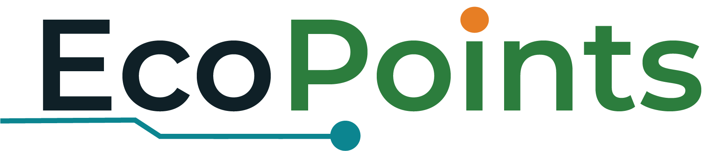

Role: You are an expert UI/UX Designer specializing in modern, high-converting, "Editorial Tech" landing pages (similar to Apple product pages or premium hardware brands).

Task: Design a web Hero Section using a light-mode "Eco-Tech" aesthetic. The layout must use an "Annotated UI" concept where digital elements overlap a physical 3D product.

Color Palette & Vibe:
*   Background: Clean, off-white/light-slate.
*   Typography: Deep Forest Green for primary text. Use a thick, bold, modern sans-serif font for the headline. 
*   Accents: Vibrant Emerald Green for primary buttons, highlights, and glowing elements.
*   Vibe: Crisp, physical-meets-digital, premium, accessible.

Layout Structure (2-Column Grid):
1.  Background Depth (Z-index 0): 
    *   Place a massive, ultra-low opacity (e.g., 3%) text watermark in the dead center background.
    *   Add very soft, highly blurred, large ambient light circles (one emerald, one soft amber) in the far corners to give the flat background a slight 3D depth.
    *   Use 

2.  Left Column - Typography & CTA (Z-index 10):
    *   Small "Badge" at the top: A small, pill-shaped tag with an emerald outline and text indicating a status (e.g., [Status Tag]).
    *   Headline: Massive, bold, left-aligned, stacked text with very tight line-height. Make one of the words feature an Emerald Green gradient. (Placeholder: [Stacked Headline 3 Lines])
    *   Sub-headline: A clean, medium-weight paragraph below the headline. (Placeholder: [Paragraph Text])
    *   Buttons: Two buttons side-by-side. The primary button is solid Deep Forest Green with a hover shadow. The secondary button is outlined/ghost style.

3.  Right Column - Product Showcase & Annotations (Z-index 20):
    *   Centerpiece: A large 3D render of a smart tech machine/kiosk slightly angled. 
    *   Floating Annotations (Crucial): Surround the machine with 3 floating "tags". These tags must use Glassmorphism (frosted glass background, slight blur, subtle white border). Each tag should contain a small colored icon connected with the short descriptive text beside it. Connect these tags to the machine with very subtle dashed lines.
    *   Overlapping App Snippet (Crucial): In the bottom right corner of this column, overlapping the machine slightly, place a floating "UI Card". This card should look like a snippet from a mobile app (e.g., showing a recent digital transaction or stat). Give it a clean white background and a distinct drop shadow to create a sense of layered depth over the physical machine.

## Content
### Catchphrase
- Scan. Drop. Earn. Smart recycling made rewarding.
### Body Text
- EcoPoints bridges the gap between environmental action and immediate gratification. Help keep the campus clean by feeding our AI-powered bin, and earn digital points for every bottle you recycle!
### Annotations
- QR Scanner for Account Access
- Door Accessed Bottle Disposal
- Accessible for the Community

### Attachment
- Attached with this plan is a sample and inspo you can use in creating the hero page.