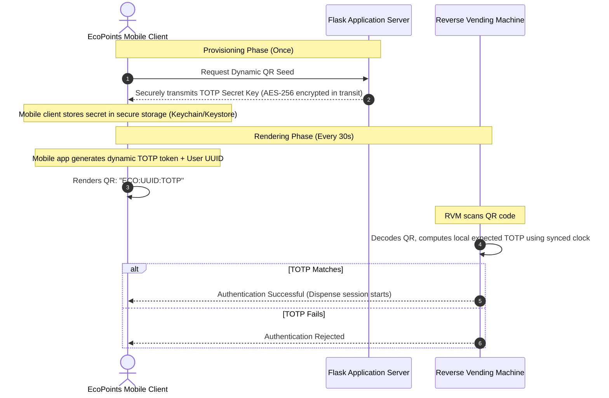

# Dynamic Time-Based QR Code Rotation (Step 2 Implementation Guide)

> **Status:** Architectural Design & Future Implementation Guide (Stage 2)
> **Objective:** Prevent QR code screen-sharing, replication, and physical printing bypasses by transitioning from secure static tokens (Step 1) to dynamic time-rotating credentials.

---

## 1. Overview & Threat Model

While Stage 1 establishes secure, random, high-entropy `qr_token` keys instead of predictable sequential IDs, they are still **static**. A static QR token remains vulnerable if a user prints their QR code on paper or takes a screenshot and shares it with others (permitting unauthorized recycling/redemption transactions).

Dynamic QR Code Rotation eliminates this threat vectors by introducing **temporal expiration**. The QR code changes every **30 to 60 seconds**.

### Threat Vector Analysis

| Attack Vector | Static QR Token (Stage 1) | Dynamic QR Token (Stage 2) |
| :--- | :--- | :--- |
| **Predictable ID Scanning** | 🚫 **Prevented** (Random 32-char Hex Token) | 🚫 **Prevented** (Random Seed + TOTP Hash) |
| **Paper Printing / Cloning** | ⚠️ *Vulnerable* (Printed QR code works forever) | 🚫 **Prevented** (Expires in 30–60 seconds) |
| **Screen-Capture Replay** | ⚠️ *Vulnerable* (Screenshot works forever) | 🚫 **Prevented** (Captured code expires shortly after) |
| **Man-in-the-Middle (MitM)** | ⚠️ *Vulnerable* (Eavesdropped token reusable) | 🚫 **Prevented** (One-time-use token signature) |

---

## 2. Proposed Architecture

The dynamic QR rotation strategy leverages a **TOTP-like (Time-Based One-Time Password) Hybrid JWT architecture** designed to operate securely even under intermittent connectivity or complete offline states at the Reverse Vending Machine (RVM) edge.



---

## 3. Cryptographic Token Design

Instead of generating arbitrary text, the Dynamic QR contains a structured, high-entropy, compact token:

```
ECO:<user_uuid>:<timestamp_bucket>:<signature_hmac>
```

### Components

1. **Protocol Identifier (`ECO`)**: A 3-character prefix to filter non-EcoPoints QR codes at the hardware scanner level.
2. **User Identifier (`user_uuid`)**: The database-level unique identifier of the user (or the static `display_id`).
3. **Time Bucket (`timestamp_bucket`)**: The epoch time divided by the step interval (e.g., `epoch / 30`).
4. **Cryptographic Signature (`signature_hmac`)**: A SHA-256 HMAC signature computed using the user's private TOTP seed:
   ```python
   hmac.new(user.totp_seed.encode(), f"{user_uuid}:{timestamp_bucket}".encode(), hashlib.sha256).hexdigest()[:16]
   ```

> [!IMPORTANT]
> To keep the QR code easy to scan for budget cameras on RVM hardware, we use a truncated 16-character hexadecimal slice of the SHA-256 HMAC. This keeps the total QR character count low (under 80 characters), resulting in a low-density, highly readable QR matrix.

---

## 4. Offline Edge Validation at the RVM

A major constraint of RVM hardware is network latency or temporary offline states. To validate dynamic QR codes offline at the RVM edge, follow this procedure:

### Key Synchronization Protocol

On initial setup (or periodically when connected to the network), the RVM synchronizes a cryptographically encrypted local cache of the user mapping table:

| User ID | Cryptographic TOTP Seed (Encrypted) | Active Status |
| :--- | :--- | :--- |
| `USER-PUP-001` | `K5XW633PNV2Q====` | `True` |
| `USER-PUP-002` | `MFRGGZDFMZJQ====` | `True` |

When a user scans a dynamic QR:
1. The RVM decodes the QR string and extracts `user_uuid`, `timestamp_bucket`, and `signature_hmac`.
2. The RVM retrieves the corresponding `totp_seed` from its secure local cache.
3. The RVM computes its own local verification HMAC using the current time and `totp_seed`.
4. If they match, the user is authenticated instantly with **zero database network queries required**.

---

## 5. Clock Drift & Window Synchronization

Because RVM internal hardware clocks and user mobile phones can drift from true NTP time, strict timestamp matching will cause false authentication failures.

### The Sliding Window Protocol

To accommodate clock drift, the validation logic must test the scanned token against a sliding window of **three 30-second intervals**:
1. The **Current Window** ($T_0$)
2. The **Previous Window** ($T_{-1}$) — allows for client clocks running slightly behind.
3. The **Next Window** ($T_{+1}$) — allows for client clocks running slightly ahead.

```python
import time
import hmac
import hashlib

def verify_dynamic_qr(scanned_payload, user_totp_seed):
    # Format: ECO:<user_uuid>:<time_bucket>:<signature>
    parts = scanned_payload.split(':')
    if len(parts) != 4 or parts[0] != 'ECO':
        return False
        
    user_uuid, time_bucket, signature = parts[1], int(parts[2]), parts[3]
    
    # Get current global time step
    time_step = 30  # 30 seconds expiration
    current_time = int(time.time())
    current_bucket = current_time // time_step
    
    # Sliding window: -1, 0, +1
    for offset in [-1, 0, 1]:
        test_bucket = current_bucket + offset
        
        # Verify the time bucket inside the scanned QR doesn't deviate wildly from reality
        if abs(time_bucket - test_bucket) > 1:
            continue
            
        # Re-compute expected signature
        msg = f"{user_uuid}:{time_bucket}"
        expected_sig = hmac.new(
            user_totp_seed.encode('utf-8'),
            msg.encode('utf-8'),
            hashlib.sha256
        ).hexdigest()[:16]
        
        if hmac.compare_digest(expected_sig, signature):
            # Signature matches! Record this time bucket to prevent replay attacks
            if is_time_bucket_spent(user_uuid, time_bucket):
                return False  # Replay attack blocked
            mark_time_bucket_spent(user_uuid, time_bucket)
            return True
            
    return False
```

> [!WARNING]
> **Replay Attack Prevention**: To prevent an attacker from copying a dynamic QR code and using it multiple times within its remaining 30-second window, the RVM **must** track a local log of spent `time_buckets` for each user. Once a specific `time_bucket` is used to start an authentication session, that bucket is marked as "spent" and cannot be scanned again.

---

## 6. Phase 2 Database Schema Changes

To transition from Step 1 to Step 2, the following additions should be made to `server/app/models.py`:

```python
class User(db.Model):
    __tablename__ = 'users'
    # Existing columns ...
    
    # Step 1 static token
    qr_token = db.Column(db.String(100), unique=True, nullable=True, index=True)
    
    # Step 2 Dynamic Rotation Fields
    totp_seed = db.Column(db.String(32), nullable=True) # Generated using pyotp.random_base32()
    qr_rotation_interval = db.Column(db.Integer, default=30) # Expiry in seconds
    
    def generate_totp_seed(self):
        import pyotp
        self.totp_seed = pyotp.random_base32()
```

## 7. Migration Steps for Developers

When ready to implement Stage 2 dynamic rotation:

1. **Install Python dependencies**:
   ```bash
   pip install pyotp
   ```
2. **Add schema migration**:
   Run `flask db migrate -m "Add totp_seed columns"` and apply `flask db upgrade`.
3. **Write dynamic QR component in React**:
   Use `otplib` or `jsSHA` on the React client side to compute dynamic HMAC-SHA256 signatures in real-time inside the `ProfileSection.jsx` component.
4. **Enable background clock synchronization** on RVM terminals using NTP daemons to keep clock drift under $\pm 5$ seconds.
