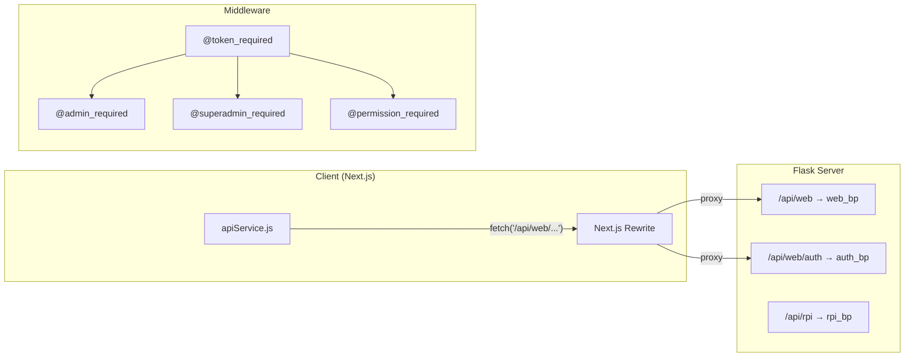

# EcoPoints API — Routes & Service Breakdown

> **Purpose**: Document all current routes, middleware, and client-side API service. After the Phased Platform Hardening program (see `.kiro/specs/phased-platform-hardening/`), this document is the **authoritative post-hardened API surface**: route inventory matches the Property D snapshot fixture, the typed JSON schemas in the lower half match the Phase 3 alignment doc, and the security-control notes below summarise the cookie + CSRF transport, force-logout endpoint, schema-validated mutation contract, and Domain_Controller layout produced across phases 0 through 5.

> **Document layout.** The first half (Architecture Overview → Route Count Summary) is the human-readable inventory. The lower half (Typed JSON Response Schemas) is the machine-checked schema document for Phase 3 / Property K. A clearly labelled **Historical context** section at the bottom of the inventory preserves the pre-hardening "issues for refactor" notes so audit reviewers can trace which hardening tasks each legacy issue was resolved by.

---

## Post-hardening surface (summary)

The hardening program closed in 2026-05 with the following security and structural controls in production. Each row links the control to the property test that pins it.

| Phase | Control | Where | Property |
| --- | --- | --- | --- |
| 0 | `@admin_required` and `@permission_required` short-circuit through `_require_admin_or_403` for every method (no GET-bypass). | `server/app/middleware.py` | Property A |
| 1 | `web_controller.py` reduced to a 25-line shim; routes split across 11 Domain_Controllers under `server/app/controllers/` (dashboard, users, locations, machines, rewards, logs, leaderboard, groups, analytics, settings, sessions). Route inventory is byte-stable against the Phase 1 snapshot fixture. | `server/app/controllers/` | Property D, Property F |
| 1 | Client API split into `client/src/services/api/{client,auth,dashboard,users,locations,machines,rewards,logs,leaderboard,groups,analytics,settings,sessions}.js` with a single `index.js` barrel. The legacy `apiService.js` and the `cities` module are removed. | `client/src/services/api/` | Property C, Property E |
| 2 | Every admin route uses `@token_required → @permission_required(<category>)`; per-route categories are enumerated below in the **Permission categories per route** table. `GET /api/web/auth/me` returns `permission_categories` for the Client. | `server/app/middleware.py`; per-controller files | Property G, Property H |
| 2 | Every mutating user / role / permission / security request writes exactly one structured `AdminLog` envelope via `_shared.log_action()`. | `server/app/controllers/_shared.py` | Property J |
| 3 | Every aligned admin endpoint returns a typed JSON schema (see Typed JSON Response Schemas below). The Admin_UI reads field names verbatim and renders an em-dash placeholder for null/missing fields via `formatField()`. Enums are returned as canonical lowercase. | `server/app/controllers/_shared.py`; `client/src/lib/formatField.js`; `client/src/lib/enumLabels.js` | Property K |
| 4B | Login issues `Set-Cookie: token=…; HttpOnly; Secure; SameSite=Strict; Path=/` and `Set-Cookie: csrf_token=…; Secure; SameSite=Strict; Path=/`. Unsafe methods require `X-CSRF-Token` to byte-equal the `csrf_token` cookie. The Bearer-header path stays available behind `AUTH_COOKIE_ONLY=false` for transition. | `server/app/controllers/auth_controller.py`; `server/app/middleware.py`; `client/src/services/api/client.js` | Property O, Property P, Property Q |
| 4C | `POST /api/web/settings/security/force-logout` writes `organizations.force_logout_at = NOW()`; `@token_required` rejects any JWT whose `iat < force_logout_at` with HTTP 401 `FORCED_LOGOUT`. | `server/app/controllers/settings_controller.py`; `server/app/middleware.py` | Property R |
| 4D | nginx emits `X-Content-Type-Options`, `X-Frame-Options: DENY`, `Strict-Transport-Security`, `Referrer-Policy`, and `Content-Security-Policy-Report-Only` on every browser response. | `nginx/default.conf` | (integration test in `server/tests/integration/test_security_headers.py`) |
| 4E | Every `POST/PUT/PATCH` route under `auth_bp` and the Domain_Controllers carries a `@validate_request(Schema)` decorator with a Pydantic v2 schema whose `model_config.extra == 'forbid'`. Unknown keys yield HTTP 400 `UNKNOWN_FIELD`; type/structure errors yield HTTP 400 `VALIDATION_ERROR`. RPI routes are deferred under the rpi-carveout. | `server/app/schemas/`; `server/app/middleware.py` | Property S, Property L |
| 4F | Every user-supplied interpolation in `notification_service._build_email_html` is wrapped with `html.escape(..., quote=True)`. | `server/app/services/notification_service.py` | Property T |
| 4G | Admin-created users go through the same shared `validate_password_policy()` as public registration. Failures return HTTP 400 `WEAK_PASSWORD` and write no row. | `server/app/services/password_policy.py`; `server/app/controllers/users_controller.py` | Property U |
| 4H | Both `POST /api/web/users` and `PUT /api/web/users/<id>` reject role-hierarchy violations (`level(target_role) >= level(actor_role)`) with HTTP 403 `ROLE_HIERARCHY_VIOLATION` before any field assignment. | `server/app/controllers/users_controller.py`; `server/app/controllers/_shared.py::level` | Property I |
| 4I | `flask cleanup-tokens` CLI deletes `token_blacklist` rows where `expires_at < NOW()` and emits `deleted=<int> duration_s=<float>`. The schedule is documented in `server/README.md`. | `server/app/seeder/cleanup.py`; `server/README.md` | Property V |
| 5 | The seeder is deterministic and idempotent: one `OrgType`, one `Organization`, one `CommunityGroup`, one `Reward`, one `RVM` (rpi-carveout: API key + HMAC secret deferred), and one `User` per role. Login redirects every admin role to `/admin` and `{user, dependent}` to `/rewards` (never `/profile`). | `server/app/seeder/seed.py`; `client/src/components/pages/LogIn.jsx` | Property W, Property X, Property Y |
| Cross-phase | Production refuses to start if any required secret (`SECRET_KEY`, `DATABASE_URL`, `SMTP_PASSWORD`, `SEMAPHORE_API_KEY`) is missing or matches a known dev default; the variable name is logged but the value is never echoed. Static scan finds zero hardcoded secrets across `server/`, `client/`, `nginx/`. Migration round-trips are byte-identical against Postgres. | `server/app/__init__.py`; `tools/tests/test_secret_hygiene.py`; `server/tests/integration/test_migration_reversibility.py` | Property Z, Property AA, Property BB, Property CC |

The full closure record, including merge timestamps and per-phase exit-criteria evidence, lives in [`docs/phase-status.md`](docs/phase-status.md). The property coverage table mapping each letter A–CC to its test file is in [`docs/property-coverage.md`](docs/property-coverage.md).

> **Phase 4A — RPI Authentication, HMAC QR, and Hardware Contract — is intentionally `deferred`** under the rpi-carveout. The RPI Controller Routes section below reflects the pre-hardening surface for those endpoints; HMAC-suffix QR validation, per-RVM API keys, the `@rpi_auth_required` decorator, and `docs/rpi-api-contract.md` arrive when Phase 4A resumes.

---

## Architecture Overview



### File Locations

| Layer | File | Lines | Description |
|-------|------|-------|-------------|
| **App Factory** | [\_\_init\_\_.py](file:///c:/Users/pc/Documents/Github/server/app/__init__.py) | 96 | Registers 3 blueprints, CORS, extensions |
| **Root Routes** | [routes.py](file:///c:/Users/pc/Documents/Github/server/app/routes.py) | 27 | `/` and `/health` only |
| **Middleware** | [middleware.py](file:///c:/Users/pc/Documents/Github/server/app/middleware.py) | 141 | JWT decorators, role hierarchy, permissions |
| **Auth Controller** | [auth_controller.py](file:///c:/Users/pc/Documents/Github/server/app/controllers/auth_controller.py) | 614 | Login, register, 2FA, profile |
| **Web Controller** | [web_controller.py](file:///c:/Users/pc/Documents/Github/server/app/controllers/web_controller.py) | **2978** | ALL admin panel endpoints (monolith) |
| **RPI Controller** | [rpi_controller.py](file:///c:/Users/pc/Documents/Github/server/app/controllers/rpi_controller.py) | 379 | Raspberry Pi / RVM hardware endpoints |
| **Client API** | [apiService.js](file:///c:/Users/pc/Documents/Github/client/src/services/apiService.js) | 639 | Unified fetch wrapper + all API calls |

---

## Middleware Decorators

| Decorator | Purpose | Notes |
|-----------|---------|-------|
| `@token_required` | Validates JWT Bearer token, injects `current_user` | Checks blacklist, active status |
| `@admin_required` | Requires `is_admin` role | Allows GET for non-admins (⚠️ data leak risk) |
| `@superadmin_required` | Requires `superadmin` role | Strict — blocks all non-superadmins |
| `@permission_required(*cats)` | Checks role has specific permission categories | e.g. `@permission_required('users', 'write')` |

### Role Hierarchy

| Role | Level | Permissions |
|------|-------|-------------|
| `dependent` | 0 | — |
| `user` | 1 | read, logs, analytics, locations, users, machines, rewards, groups |
| `technician` | 2 | read, machines, logs |
| `inventory_officer` | 3 | read, rewards, logs |
| `auditor` | 4 | read, logs, analytics, bulk_sessions |
| `head_admin` | 5 | ALL |
| `superadmin` | 6 | ALL |

---

## Authentication Routes

**Blueprint**: `auth_bp` — prefix `/api/web/auth`

JWT strategy: Bearer token in `Authorization` header. Token stored in `localStorage` on client.

| Method | Route | Auth | Rate Limit | Description |
|--------|-------|------|------------|-------------|
| **POST** | `/api/web/auth/login` | PUBLIC | 10/min | Login with email/username + password. Returns `{ token, user }`. If 2FA enabled → returns `{ requires2FA, tempToken }` |
| **POST** | `/api/web/auth/verify-otp` | PUBLIC | 10/min | Verify 2FA OTP code + complete login. Body: `{ tempToken, code }` |
| **GET** | `/api/web/auth/me` | LOGGEDIN | — | Get currently authenticated user profile |
| **POST** | `/api/web/auth/logout` | LOGGEDIN | — | Blacklists JWT token + logs action |
| **PUT** | `/api/web/auth/profile` | LOGGEDIN | — | Update own profile (firstName, lastName, email, phone) |
| **POST** | `/api/web/auth/change-password` | LOGGEDIN | — | Change own password (requires current password) |
| **POST** | `/api/web/auth/register` | PUBLIC | 5/min | Public user registration. Body: `{ firstName, lastName, password, userType, locationId, ... }` |
| **GET** | `/api/web/auth/locations` | PUBLIC | — | Active organizations for signup dropdown |
| **GET** | `/api/web/auth/groups` | PUBLIC | — | Community groups for a location. Query: `?location_id=` |

> [!NOTE]
> Login flow supports **2FA** (email/SMS OTP). If org or user has 2FA enabled, login returns a `tempToken` instead of a full JWT. Client must call `/verify-otp` to complete.

> [!WARNING]
> **Security concern**: Token stored in `localStorage` — vulnerable to XSS. Reference photo shows HttpOnly cookie approach as ideal target.

---

## Web Controller Routes

**Blueprint**: `web_bp` — prefix `/api/web`

> [!IMPORTANT]
> This is a **2978-line monolith**. All admin panel routes live in a single file. Primary candidate for splitting during refactor.

### Health

| Method | Route | Auth | Description |
|--------|-------|------|-------------|
| **GET** | `/api/web/health` | PUBLIC | Health check |

---

### Dashboard

| Method | Route | Auth | Description |
|--------|-------|------|-------------|
| **GET** | `/api/web/dashboard/stats` | ADMIN | Aggregated stats (users, machines, bottles, points, rewards). Location-scoped |

---

### Org Types (Lookup — Superadmin managed)

| Method | Route | Auth | Description |
|--------|-------|------|-------------|
| **GET** | `/api/web/org-types` | ADMIN | List all organization types |
| **POST** | `/api/web/org-types` | SUPERADMIN | Create organization type |
| **DELETE** | `/api/web/org-types/:id` | SUPERADMIN | Delete organization type (blocked if referenced) |

---

### Locations (Organizations)

| Method | Route | Auth | Description |
|--------|-------|------|-------------|
| **GET** | `/api/web/locations` | ADMIN | List organizations. Superadmin sees all; others see own org |
| **POST** | `/api/web/locations` | SUPERADMIN | Create new organization + address + default community group |
| **PUT** | `/api/web/locations/:id` | ADMIN | Update organization details + address |
| **DELETE** | `/api/web/locations/:id` | SUPERADMIN | Soft-delete: sets status=Inactive, cascades to RVMs/rewards/users |

---

### Users

| Method | Route | Auth | Description |
|--------|-------|------|-------------|
| **GET** | `/api/web/users` | ADMIN | List users. Filters: `?role=`, `?user_type=`, `?is_admin=`. Paginated (`?page=`, `?per_page=`) |
| **GET** | `/api/web/users/:id` | ADMIN | Get single user by ID |
| **POST** | `/api/web/users` | ADMIN | Create user (regular or admin). Role hierarchy enforced |
| **PUT** | `/api/web/users/:id` | ADMIN | Update user fields (name, email, role, isActive, etc.) |
| **DELETE** | `/api/web/users/:id` | ADMIN | Soft-delete: sets `is_active=false` |
| **POST** | `/api/web/users/:id/adjust-points` | ADMIN | Manual points adjustment (+/-). Creates Transaction. Triggers suspicious activity alert if above threshold |

---

### Machines (RVMs)

| Method | Route | Auth | Description |
|--------|-------|------|-------------|
| **GET** | `/api/web/machines` | ADMIN | List RVMs. Location-scoped. Paginated |
| **POST** | `/api/web/machines` | ADMIN | Register new RVM |
| **PUT** | `/api/web/machines/:id` | ADMIN | Update RVM (name, location, online status, capacity) |
| **DELETE** | `/api/web/machines/:id` | ADMIN | Decommission RVM (sets `is_online=false`) |

---

### Rewards

| Method | Route | Auth | Description |
|--------|-------|------|-------------|
| **GET** | `/api/web/rewards` | LOGGEDIN | List rewards. Location-scoped. Paginated |
| **POST** | `/api/web/rewards` | ADMIN | Create reward + default variant |
| **PUT** | `/api/web/rewards/:id` | ADMIN | Update reward. Triggers low/out-of-stock alerts |
| **DELETE** | `/api/web/rewards/:id` | ADMIN | Deactivate reward |
| **POST** | `/api/web/rewards/:id/redeem` | LOGGEDIN | Redeem reward for current user. Deducts points, creates Transaction + RewardRedemption |
| **GET** | `/api/web/rewards/my-redemptions` | LOGGEDIN | List current user's redemptions |

---

### Logs

| Method | Route | Auth | Description |
|--------|-------|------|-------------|
| **GET** | `/api/web/logs/bottles` | ADMIN | Recycling item logs. Location-scoped. Limit 500 |
| **GET** | `/api/web/logs/machines` | ADMIN | Maintenance logs. Location-scoped. Triggers unresolved maintenance alert |
| **POST** | `/api/web/logs/machines` | ADMIN | Create maintenance log entry |
| **GET** | `/api/web/logs/access` | ADMIN | Admin action (audit) logs. Location-scoped. Limit 500 |
| **GET** | `/api/web/logs/rewards` | ADMIN | Reward redemption logs. Location-scoped. Limit 500 |
| **PUT** | `/api/web/logs/rewards/:id` | ADMIN | Update redemption status (pending → claimed) |
| **GET** | `/api/web/logs/transactions` | ADMIN | Transaction logs (earn/redeem/adjustment). Location-scoped. Limit 500 |

---

### Leaderboard

| Method | Route | Auth | Description |
|--------|-------|------|-------------|
| **GET** | `/api/web/leaderboard` | ADMIN | Top users by lifetime points + top groups. Location-scoped |

---

### Community Groups

| Method | Route | Auth | Description |
|--------|-------|------|-------------|
| **GET** | `/api/web/groups` | ADMIN | List community groups. Location-scoped |
| **POST** | `/api/web/groups` | ADMIN | Create community group |
| **PUT** | `/api/web/groups/:id` | ADMIN | Update community group |
| **DELETE** | `/api/web/groups/:id` | ADMIN | Delete group (blocked if has users) |

---

### Analytics

| Method | Route | Auth | Description |
|--------|-------|------|-------------|
| **GET** | `/api/web/analytics` | ADMIN | Comprehensive analytics: recycling trends, user growth, points economy, machine utilization, reward insights, peak hours/days, user type distribution, location comparison, item status breakdown, summary totals |

---

### Settings — Notifications

| Method | Route | Auth | Description |
|--------|-------|------|-------------|
| **GET** | `/api/web/settings/notifications` | ADMIN | Get all notification settings for org (creates defaults if missing) |
| **PUT** | `/api/web/settings/notifications` | ADMIN | Batch-update notification settings |
| **POST** | `/api/web/settings/notifications/test` | ADMIN | Send test email or SMS |
| **GET** | `/api/web/settings/notifications/logs` | ADMIN | Notification log history. Limit 200 |

### Settings — Points Configuration

| Method | Route | Auth | Description |
|--------|-------|------|-------------|
| **GET** | `/api/web/settings/points` | ADMIN | Get points-per-bottle config for org |
| **PUT** | `/api/web/settings/points` | ADMIN | Update points-per-bottle config |

### Settings — Channel Configuration (Email & SMS)

| Method | Route | Auth | Description |
|--------|-------|------|-------------|
| **GET** | `/api/web/settings/channels` | ADMIN | Get email/SMS channel config |
| **PUT** | `/api/web/settings/channels` | HEAD_ADMIN+ | Update channel config |

### Settings — Security

| Method | Route | Auth | Description |
|--------|-------|------|-------------|
| **GET** | `/api/web/settings/security` | ADMIN | Get security config (2FA, session timeout, lockout) |
| **PUT** | `/api/web/settings/security` | HEAD_ADMIN+ | Update security config |
| **POST** | `/api/web/settings/security/force-logout` | HEAD_ADMIN+ | Force-logout all sessions for org |
| **GET** | `/api/web/settings/security/login-history` | ADMIN | Login/logout history for org. Limit 100 |

---

### Bulk Sessions

| Method | Route | Auth | Description |
|--------|-------|------|-------------|
| **GET** | `/api/web/sessions/bulk` | ADMIN | List recycling sessions. Location-scoped. Limit 200 |
| **POST** | `/api/web/sessions/bulk` | ADMIN | Create bulk session with items. Credits wallet |
| **GET** | `/api/web/sessions/bulk/:id` | ADMIN | Session detail with items |

### Bulk Deposits

| Method | Route | Auth | Description |
|--------|-------|------|-------------|
| **GET** | `/api/web/bulk-deposits` | ADMIN | List manual bulk deposits. Location-scoped. Limit 200 |
| **POST** | `/api/web/bulk-deposits` | ADMIN | Admin credits points directly to wallet (no RVM) |

---

## RPI Controller Routes

**Blueprint**: `rpi_bp` — prefix `/api/rpi`

> [!CAUTION]
> **No authentication** on RPI routes. Machines identify by `machineUuid` only — no JWT, no API key. This is a known security gap flagged in the security audit.

### Machine Authentication

| Method | Route | Auth | Description |
|--------|-------|------|-------------|
| **POST** | `/api/rpi/machine/identify` | NONE | Identify RVM by `machineUuid` |
| **POST** | `/api/rpi/machine/heartbeat` | NONE | Periodic heartbeat. Updates `is_online` and capacity |
| **POST** | `/api/rpi/machine/status` | NONE | Update machine online/capacity status. Triggers offline/full alerts |

### User Authentication (QR Code)

| Method | Route | Auth | Description |
|--------|-------|------|-------------|
| **POST** | `/api/rpi/authenticate` | NONE | Authenticate user via QR code `display_id`. Body: `{ qrPayload, machineUuid }` |

### Recycling Sessions

| Method | Route | Auth | Description |
|--------|-------|------|-------------|
| **POST** | `/api/rpi/session/start` | NONE | Start recycling session. Body: `{ machineUuid, walletId }` |
| **POST** | `/api/rpi/session/:id/deposit` | NONE | Deposit single item. Body: `{ detectedClass, confidenceScore, pointsAwarded, status }` |
| **POST** | `/api/rpi/session/:id/end` | NONE | End session + credit wallet. Body: `{ status }` (completed/timed_out/error) |

### Points Configuration

| Method | Route | Auth | Description |
|--------|-------|------|-------------|
| **GET** | `/api/rpi/config/points/:org_id` | NONE | Get point-per-item config for RVM-side calculation |

---

## Client-Side API Service

**File**: [apiService.js](file:///c:/Users/pc/Documents/Github/client/src/services/apiService.js)

### Architecture

```
apiService.js
├── Token Management: getToken(), setToken(), clearToken()  (localStorage)
├── Core: request(endpoint, options)  — attach Bearer token, handle 401 redirect
└── Modules (exported named objects):
    ├── auth        → /api/web/auth/*
    ├── dashboard   → /api/web/dashboard/*
    ├── analytics   → /api/web/analytics
    ├── orgTypes    → /api/web/org-types
    ├── cities      → /api/web/cities (⚠️ dead — backend removed)
    ├── locations   → /api/web/locations
    ├── users       → /api/web/users
    ├── machines    → /api/web/machines
    ├── rewards     → /api/web/rewards
    ├── logs        → /api/web/logs/*
    ├── leaderboard → /api/web/leaderboard
    ├── groups      → /api/web/groups
    ├── settings    → /api/web/settings/*
    ├── bulkSessions→ /api/web/sessions/bulk
    └── healthCheck → /api/web/health
```

### Core `request()` Behavior

1. Builds URL with query params
2. Attaches `Bearer <token>` from `localStorage`
3. On **401** → clears token, redirects to `/?login=true` (if on admin pages)
4. Throws on non-OK response or `success: false`

> [!WARNING]
> `cities` module exists in apiService.js but backend city routes are removed. Dead code.

---

## Route Count Summary

| Blueprint | Routes | Lines |
|-----------|--------|-------|
| `auth_bp` | 9 | 614 |
| `web_bp` | 46 | 2978 |
| `rpi_bp` | 7 | 379 |
| **Root** | 2 | 27 |
| **Total** | **64** | **3998** |

---

## Key Issues for Refactor

| # | Issue | Impact |
|---|-------|--------|
| 1 | **Monolith web_controller.py** (2978 lines) | Unreadable, hard to maintain. Should split into domain-specific route files |
| 2 | **Inconsistent auth guards** | `@admin_required` passes GET for non-admins → potential data exposure |
| 3 | **No RPI authentication** | Any device can call `/api/rpi/*` with a known `machineUuid` |
| 4 | **Mixed concerns in controller** | Serializers, business logic, notification hooks, and route handlers all in one file |
| 5 | **Dead client code** | `cities` module in apiService.js has no backend counterpart |
| 6 | **Hardcoded limits** | `.limit(500)`, `.limit(200)`, `.limit(100)` scattered, not configurable |
| 7 | **No pagination on many routes** | Only `users` and `machines` use `_paginate()`. Logs, leaderboard, sessions do not |
| 8 | **Notification hooks inline** | Alert triggers are scattered in every route handler instead of a service/event layer |
| 9 | **localStorage token** | XSS-vulnerable. Ideal: HttpOnly cookie (as shown in reference photo) |
| 10 | **No request validation layer** | Each route manually validates `request.get_json()` — no schema validation (e.g. Marshmallow) |

---

## Typed JSON Response Schemas (Phase 3 — Requirement 3.5)

> **Source of truth.** [docs/model-ui-alignment.md](file:///c:/Users/pc/Documents/Github/docs/model-ui-alignment.md) (Phase 3, task 8.1).
>
> **Type taxonomy.** Every field is typed against:
> `string | integer | number | boolean | iso8601_datetime | enum<…> | array<…> | object`.
>
> **Nullability.** Optional/nullable fields are explicitly marked `| null`.
>
> **Post-Phase-3 shape.** Schemas reflect the response shape **after** task 8.2
> (renames + derived fields). Fields gated on a future migration are documented
> as `<type> | null` with an inline note; the response will return `null` until
> the migration lands.
>
> **Enum casing.** Per Requirement 3.6, `role`, `machine.status`, and
> `reward_redemption.status` use canonical lowercase values.
>
> **Envelope.** Unless otherwise noted, every endpoint wraps its payload as
> `{ success: boolean, ...payload }`. Only the `payload` keys are listed below.

---

### `GET /api/web/analytics`

```
Response (200):
  success: boolean
  analytics: object{
    recyclingTrends: array<object{
      month: string,                              // "YYYY-MM"
      accepted: integer,
      rejected: integer,
      total: integer,
      points: integer
    }>,
    dailyTrends: array<object{
      day: string,                                // "YYYY-MM-DD"
      dow: integer,                               // 0=Sun … 6=Sat
      accepted: integer,
      rejected: integer,
      total: integer
    }>,
    userGrowth: object{
      baseline: integer,
      months: array<object{
        month: string,                            // "YYYY-MM"
        count: integer
      }>
    },
    pointsEconomy: array<object{
      month: string,                              // "YYYY-MM"
      type: enum<earn,redeem,adjustment,bulk_transaction>,
      amount: integer
    }>,
    machineUtilization: array<object{
      name: string,
      itemCount: integer,
      sessionCount: integer,
      isOnline: boolean,
      organizationId: integer,
      organizationName: string
    }>,
    peakHours: array<object{
      hour: integer,                              // 0…23
      count: integer
    }>,
    peakDays: array<object{
      day: enum<Sun,Mon,Tue,Wed,Thu,Fri,Sat>,
      dayIndex: integer,
      count: integer
    }>,
    userTypeDistribution: array<object{
      type: enum<student,faculty,staff,Unknown>,
      count: integer
    }>,
    conditionDistribution: array<object{
      condition: enum<Accepted,Rejected,Unknown>,
      count: integer
    }>,
    rewardInsights: array<object{
      name: string,
      redemptionCount: integer,
      totalPointsSpent: integer,
      pointsRequired: integer
    }>,
    locationComparison: array<object{
      name: string,
      bottles: integer,
      points: integer,
      users: integer,
      orgType: string | null                      // 8.2: derived from Organization.org_type_ref.name
    }>,
    summary: object{
      totalItems: integer,
      totalPoints: integer,
      totalSessions: integer,
      totalRedemptions: integer,
      totalUsers: integer,
      avgPointsPerSession: number,
      avgItemsPerSession: number
    }
  }
```

---

### `GET /api/web/sessions/bulk`

```
Response (200):
  success: boolean
  sessions: array<object{
    id: integer,
    userId: integer | null,
    userName: string,
    userEmail: string | null,
    machineId: integer | null,
    machineName: string,
    locationId: integer | null,
    locationName: string,
    itemCount: integer,
    totalPointsEarned: integer,
    notes: string | null,                         // 8.2: null until `recycling_sessions.notes` migration lands
    startTime: iso8601_datetime,
    endTime: iso8601_datetime | null,
    status: enum<active,completed,timed_out,error>
  }>
```

---

### `GET /api/web/leaderboard`

```
Response (200):
  success: boolean
  topUsers: array<object{
    id: integer,
    name: string,
    points: integer,
    lifetimePoints: integer,
    streak: integer,
    bottlesCollected: integer,
    userType: enum<student,faculty,staff> | null,
    department: string | null,
    groupType: string | null,
    locationId: integer,
    locationName: string
  }>
  topGroups: array<object{
    id: integer,
    name: string,
    abbreviation: string | null,
    groupType: string | null,
    locationId: integer,
    totalPoints: integer,
    memberCount: integer
  }>
```

---

### `GET /api/web/locations`

```
Response (200):
  success: boolean
  locations: array<object{
    id: integer,
    name: string,
    fullName: string | null,
    orgType: string | null,
    typeId: integer | null,
    streetAddress: string | null,
    barangay: string | null,
    cityName: string | null,
    cityId: integer | null,                       // 8.2: derived from CITIES lookup against OrgAddress.city_municipality
    zipCode: string | null,
    address: object | null,
    contactPerson: string | null,
    contactEmail: string | null,
    contactPhone: string | null,
    contacts: array<object>,
    status: enum<Active,Inactive>,
    machineCount: integer,
    userCount: integer,
    totalPoints: integer,
    createdAt: iso8601_datetime
  }>
```

---

### `GET /api/web/org-types`

```
Response (200):
  success: boolean
  orgTypes: array<object{
    id: integer,
    name: string
  }>
```

---

### `GET /api/web/logs/access`

```
Response (200):
  success: boolean
  logs: array<object{
    id: integer,
    adminUserId: integer | null,
    adminName: string,
    adminRole: enum<superadmin,head_admin,auditor,technician,inventory_officer,user,dependent>,
    action: string,
    target: string | null,
    category: string | null,
    notes: string | null,                         // 8.2: human-readable note (envelope split into `meta`)
    meta: object | null,                          // 8.2: { before, after, ip, user_agent } envelope
    timestamp: iso8601_datetime,
    locationId: integer | null,
    locationName: string                          // defaults to "Global" for global actions
  }>
```

---

### `GET /api/web/logs/bottles`

```
Response (200):
  success: boolean
  logs: array<object{
    id: integer,
    sessionId: integer,
    sessionType: enum<rvm,bulk> | null,           // 8.2: null until session-source derivation lands
    userId: integer | null,
    userName: string,
    userEmail: string | null,
    machineId: integer | null,
    machineName: string,
    locationId: integer | null,
    locationName: string,
    detectedClass: string,
    confidenceScore: number | null,
    pointsAwarded: integer,
    status: enum<Accepted,Rejected>,
    volumeMl: integer | null,                     // 8.2: null until `recycling_items.volume_ml` migration lands
    condition: enum<With Label,No Label,Rejected> | null,  // 8.2: null until derivation lands
    brand: string | null,                         // 8.2: null until brand tracking is decided
    timestamp: iso8601_datetime,
    scannedAt: iso8601_datetime
  }>
```

---

### `GET /api/web/logs/machines`

```
Response (200):
  success: boolean
  logs: array<object{
    id: integer,
    rvmId: integer,
    machineName: string,
    locationId: integer | null,
    locationName: string,
    performedById: integer | null,
    performedBy: string,
    actionType: string,
    status: enum<Resolved,Pending,Cancelled>,
    resolved: boolean,                            // derived from status == "Resolved"
    notes: string | null,
    timestamp: iso8601_datetime
  }>
```

---

### `GET /api/web/logs/rewards`

```
Response (200):
  success: boolean
  logs: array<object{
    id: integer,
    walletId: integer,
    userName: string,
    userEmail: string | null,
    rewardId: integer,
    rewardName: string,
    variantId: integer | null,
    variantName: string | null,
    pointsSpent: integer,
    redemptionCode: string,
    status: enum<pending,claimed,used,expired>,
    redeemedAt: iso8601_datetime | null,
    claimedAt: iso8601_datetime | null,
    timestamp: iso8601_datetime,                  // 8.2: derived = claimedAt or redeemedAt
    locationId: integer | null,
    locationName: string | null
  }>
```

---

### `GET /api/web/logs/transactions`

```
Response (200):
  success: boolean
  logs: array<object{
    id: integer,
    walletId: integer,
    userName: string,
    userEmail: string | null,
    transactionType: enum<earn,redeem,adjustment,bulk_transaction>,
    amount: integer,
    balanceBefore: integer,
    balanceAfter: integer,
    description: string | null,                   // 8.2: derived human-readable summary
    referenceType: string | null,
    referenceId: integer | null,
    locationId: integer | null,
    locationName: string | null,
    timestamp: iso8601_datetime
  }>
```

---

### `GET /api/web/machines`

```
Response (200):
  success: boolean
  machines: array<object{
    id: integer,
    machineUuid: string,                          // UUID v4
    name: string,
    locationId: integer,
    locationName: string | null,
    orgName: string | null,
    isOnline: boolean,
    isCapacityFull: boolean | null,
    status: enum<online,offline,maintenance>,     // 8.2: derived from isOnline / maintenance flag (canonical lowercase, Req. 3.6)
    currentCapacity: integer | null,              // 8.2: null until `rvms.current_capacity` migration lands
    totalItemsCollected: integer | null,          // 8.2: null until COUNT(recycling_items) join is wired
    lastSync: iso8601_datetime | null,            // 8.2: derived from RVM.heartbeat_at
    createdAt: iso8601_datetime
  }>
  pagination: object{
    page: integer,
    perPage: integer,
    total: integer,
    totalPages: integer
  }
```

---

### `GET /api/web/rewards`

```
Response (200):
  success: boolean
  rewards: array<object{
    id: integer,
    name: string,
    description: string | null,
    category: string | null,
    pointsRequired: integer,
    stockQuantity: integer,
    dispensed: integer | null,                    // 8.2: SUM(quantity_redeemed) WHERE status IN (claimed,used)
    variants: array<object{
      id: integer,
      varietyName: string,
      stockQuantity: integer,
      isActive: boolean
    }>,
    imageUrl: string | null,
    isActive: boolean,
    locationId: integer,
    locationName: string | null,
    createdAt: iso8601_datetime
  }>
  pagination: object{
    page: integer,
    perPage: integer,
    total: integer,
    totalPages: integer
  }
```

---

### `GET /api/web/settings/notifications`

```
Response (200):
  success: boolean
  settings: array<object{
    id: integer,
    alertKey: string,
    label: string,
    description: string,
    category: enum<inventory,hardware,activity,reports,security,general>,
    emailEnabled: boolean,
    smsEnabled: boolean,
    threshold: integer | null,
    recipients: array<string>,
    isActive: boolean
  }>
  alertTypes: object                              // alert-key → metadata map (keys are alertKey strings)
```

---

### `GET /api/web/settings/notifications/logs`

```
Response (200):
  success: boolean
  logs: array<object{
    id: integer,
    alertKey: string,
    channel: enum<email,sms>,
    recipient: string,
    subject: string | null,                       // null for SMS
    bodyPreview: string,
    status: enum<sent,failed>,
    errorMessage: string | null,
    sentAt: iso8601_datetime
  }>
```

---

### `GET /api/web/settings/points`

```
Response (200):
  success: boolean
  config: object{
    smallWithLabel: integer,
    smallNoLabel: integer,
    mediumWithLabel: integer,
    mediumNoLabel: integer,
    largeWithLabel: integer,
    largeNoLabel: integer
  }
```

---

### `GET /api/web/settings/security`

```
Response (200):
  success: boolean
  config: object{
    twoFactorRequired: boolean,
    twoFactorMethod: enum<email,sms>,
    sessionTimeoutMinutes: integer,
    maxLoginAttempts: integer,
    lockoutDurationMinutes: integer
  }
```

---

### `GET /api/web/settings/security/login-history`

```
Response (200):
  success: boolean
  history: array<object{
    id: integer,
    action: string,
    adminName: string,
    adminRole: string | null,
    ipAddress: string | null,                     // 8.2: passes through `AdminLog.ip` once Phase-4 audit-column split lands; null for envelope-shaped legacy rows
    timestamp: iso8601_datetime
  }>
```

---

### `GET /api/web/users`

```
Response (200):
  success: boolean
  users: array<object{
    id: integer,
    displayId: string | null,
    name: string,
    firstName: string | null,
    middleName: string | null,
    lastName: string | null,
    username: string | null,
    email: string | null,
    phone: string | null,
    role: enum<superadmin,head_admin,auditor,technician,inventory_officer,user,dependent>,
    userType: enum<student,faculty,staff> | null,
    yearLevel: string | null,                     // 8.2: null until `users.year_level` migration lands (or field is dropped)
    isActive: boolean,
    pointsBalance: integer,
    lifetimePoints: integer,
    streak: integer,
    walletId: integer | null,
    locationId: integer | null,
    locationName: string | null,
    groupName: string | null,
    lastLogin: iso8601_datetime | null,
    createdAt: iso8601_datetime,
    updatedAt: iso8601_datetime | null
  }>
  pagination: object{
    page: integer,
    perPage: integer,
    total: integer,
    totalPages: integer
  }
```

#### `GET /api/web/users?is_admin=true` (admin-permissions view)

Same response envelope and `users[]` schema as `GET /api/web/users`, with two
additions per row to drive `admin/users/permissions/page.js`:

```
users[i]:
  // ...all fields from GET /api/web/users above, plus:
  permissions: object{                            // 8.2: derived from ROLE_PERMISSIONS[role]
    // keyed by category (users, machines, rewards, locations, logs, analytics,
    // settings, groups, sessions, leaderboard, dashboard); each value is a
    // capability map:
    [category: string]: object{
      view: boolean,
      edit: boolean,
      create: boolean,
      delete: boolean,
      export: boolean
    }
  }
```

The admin-permissions filter restricts `role` to `enum<superadmin,head_admin,auditor,technician,inventory_officer>`.

---

### `GET /api/web/auth/me`

```
Response (200):
  success: boolean
  user: object{
    id: integer,
    displayId: string | null,
    name: string,
    firstName: string | null,
    middleName: string | null,
    lastName: string | null,
    username: string | null,
    email: string | null,
    phone: string | null,
    role: enum<superadmin,head_admin,auditor,technician,inventory_officer,user,dependent>,
    userType: enum<student,faculty,staff> | null,
    gender: enum<male,female,other,prefer_not_to_say> | null,  // 8.2: null until `users.gender` migration lands
    age: integer | null,                          // 8.2: derived from `users.date_of_birth`; null until migration lands
    dateOfBirth: string | null,                   // ISO 8601 date "YYYY-MM-DD"; null until migration lands
    isActive: boolean,
    pointsBalance: integer,
    lifetimePoints: integer,
    streak: integer,
    walletId: integer | null,
    locationId: integer | null,
    locationName: string | null,
    groupName: string | null,
    qrPayload: string | null,                     // Phase 4A: "<displayId>.<hmacSuffix>"; null until 4A signs payloads
    campusRank: integer | null,                   // 8.2: position in Wallet.lifetime_points within own organization
    organizationUserCount: integer | null,        // 8.2: companion to campusRank (the "/N" denominator)
    lastLogin: iso8601_datetime | null,
    createdAt: iso8601_datetime,
    updatedAt: iso8601_datetime | null
  }
  permission_categories: array<string>            // sorted ROLE_PERMISSIONS[user.role]; empty array for {user, dependent}
```

---

## Suggested Split for Refactor

```
server/app/controllers/
├── auth_controller.py        ← keep (already isolated)
├── dashboard_controller.py   ← extract from web_controller
├── users_controller.py       ← extract
├── locations_controller.py   ← extract
├── machines_controller.py    ← extract
├── rewards_controller.py     ← extract
├── logs_controller.py        ← extract
├── leaderboard_controller.py ← extract
├── groups_controller.py      ← extract
├── analytics_controller.py   ← extract
├── settings_controller.py    ← extract (notifications + points + channels + security)
├── sessions_controller.py    ← extract (bulk sessions + bulk deposits)
└── rpi_controller.py         ← keep (already isolated)
```

```
client/src/services/
├── api/
│   ├── client.js             ← core request() + token management
│   ├── auth.js
│   ├── dashboard.js
│   ├── users.js
│   ├── locations.js
│   ├── machines.js
│   ├── rewards.js
│   ├── logs.js
│   ├── leaderboard.js
│   ├── groups.js
│   ├── analytics.js
│   ├── settings.js
│   └── sessions.js
└── index.js                  ← re-export all modules
```
