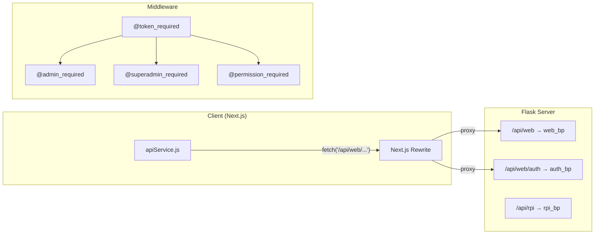

# EcoPoints API — Routes & Service Breakdown

> **Purpose**: Document all current routes, middleware, and client-side API service for planning the router/API refactor.

---

## Architecture Overview



### File Locations

| Layer | File | Lines | Description |
|-------|------|-------|-------------|
| **App Factory** | [\_\_init\_\_.py](file:///c:/Users/pc/Documents/Github/server/app/__init__.py) | 96 | Registers 3 blueprints, CORS, extensions |
| **Root Routes** | [routes.py](file:///c:/Users/pc/Documents/Github/server/app/routes.py) | 27 | `/` and `/health` only |
| **Middleware** | [middleware.py](file:///c:/Users/pc/Documents/Github/server/app/middleware.py) | 141 | JWT decorators, role hierarchy, permissions |
| **Auth Controller** | [auth_controller.py](file:///c:/Users/pc/Documents/Github/server/app/controllers/auth_controller.py) | 614 | Login, register, 2FA, profile |
| **Web Controller** | [web_controller.py](file:///c:/Users/pc/Documents/Github/server/app/controllers/web_controller.py) | **2978** | ALL admin panel endpoints (monolith) |
| **RPI Controller** | [rpi_controller.py](file:///c:/Users/pc/Documents/Github/server/app/controllers/rpi_controller.py) | 379 | Raspberry Pi / RVM hardware endpoints |
| **Client API** | [apiService.js](file:///c:/Users/pc/Documents/Github/client/src/services/apiService.js) | 639 | Unified fetch wrapper + all API calls |

---

## Middleware Decorators

| Decorator | Purpose | Notes |
|-----------|---------|-------|
| `@token_required` | Validates JWT Bearer token, injects `current_user` | Checks blacklist, active status |
| `@admin_required` | Requires `is_admin` role | Allows GET for non-admins (⚠️ data leak risk) |
| `@superadmin_required` | Requires `superadmin` role | Strict — blocks all non-superadmins |
| `@permission_required(*cats)` | Checks role has specific permission categories | e.g. `@permission_required('users', 'write')` |

### Role Hierarchy

| Role | Level | Permissions |
|------|-------|-------------|
| `dependent` | 0 | — |
| `user` | 1 | read, logs, analytics, locations, users, machines, rewards, groups |
| `technician` | 2 | read, machines, logs |
| `inventory_officer` | 3 | read, rewards, logs |
| `auditor` | 4 | read, logs, analytics, bulk_sessions |
| `head_admin` | 5 | ALL |
| `superadmin` | 6 | ALL |

---

## Authentication Routes

**Blueprint**: `auth_bp` — prefix `/api/web/auth`

JWT strategy: Bearer token in `Authorization` header. Token stored in `localStorage` on client.

| Method | Route | Auth | Rate Limit | Description |
|--------|-------|------|------------|-------------|
| **POST** | `/api/web/auth/login` | PUBLIC | 10/min | Login with email/username + password. Returns `{ token, user }`. If 2FA enabled → returns `{ requires2FA, tempToken }` |
| **POST** | `/api/web/auth/verify-otp` | PUBLIC | 10/min | Verify 2FA OTP code + complete login. Body: `{ tempToken, code }` |
| **GET** | `/api/web/auth/me` | LOGGEDIN | — | Get currently authenticated user profile |
| **POST** | `/api/web/auth/logout` | LOGGEDIN | — | Blacklists JWT token + logs action |
| **PUT** | `/api/web/auth/profile` | LOGGEDIN | — | Update own profile (firstName, lastName, email, phone) |
| **POST** | `/api/web/auth/change-password` | LOGGEDIN | — | Change own password (requires current password) |
| **POST** | `/api/web/auth/register` | PUBLIC | 5/min | Public user registration. Body: `{ firstName, lastName, password, userType, locationId, ... }` |
| **GET** | `/api/web/auth/locations` | PUBLIC | — | Active organizations for signup dropdown |
| **GET** | `/api/web/auth/groups` | PUBLIC | — | Community groups for a location. Query: `?location_id=` |

> [!NOTE]
> Login flow supports **2FA** (email/SMS OTP). If org or user has 2FA enabled, login returns a `tempToken` instead of a full JWT. Client must call `/verify-otp` to complete.

> [!WARNING]
> **Security concern**: Token stored in `localStorage` — vulnerable to XSS. Reference photo shows HttpOnly cookie approach as ideal target.

---

## Web Controller Routes

**Blueprint**: `web_bp` — prefix `/api/web`

> [!IMPORTANT]
> This is a **2978-line monolith**. All admin panel routes live in a single file. Primary candidate for splitting during refactor.

### Health

| Method | Route | Auth | Description |
|--------|-------|------|-------------|
| **GET** | `/api/web/health` | PUBLIC | Health check |

---

### Dashboard

| Method | Route | Auth | Description |
|--------|-------|------|-------------|
| **GET** | `/api/web/dashboard/stats` | ADMIN | Aggregated stats (users, machines, bottles, points, rewards). Location-scoped |

---

### Org Types (Lookup — Superadmin managed)

| Method | Route | Auth | Description |
|--------|-------|------|-------------|
| **GET** | `/api/web/org-types` | ADMIN | List all organization types |
| **POST** | `/api/web/org-types` | SUPERADMIN | Create organization type |
| **DELETE** | `/api/web/org-types/:id` | SUPERADMIN | Delete organization type (blocked if referenced) |

---

### Locations (Organizations)

| Method | Route | Auth | Description |
|--------|-------|------|-------------|
| **GET** | `/api/web/locations` | ADMIN | List organizations. Superadmin sees all; others see own org |
| **POST** | `/api/web/locations` | SUPERADMIN | Create new organization + address + default community group |
| **PUT** | `/api/web/locations/:id` | ADMIN | Update organization details + address |
| **DELETE** | `/api/web/locations/:id` | SUPERADMIN | Soft-delete: sets status=Inactive, cascades to RVMs/rewards/users |

---

### Users

| Method | Route | Auth | Description |
|--------|-------|------|-------------|
| **GET** | `/api/web/users` | ADMIN | List users. Filters: `?role=`, `?user_type=`, `?is_admin=`. Paginated (`?page=`, `?per_page=`) |
| **GET** | `/api/web/users/:id` | ADMIN | Get single user by ID |
| **POST** | `/api/web/users` | ADMIN | Create user (regular or admin). Role hierarchy enforced |
| **PUT** | `/api/web/users/:id` | ADMIN | Update user fields (name, email, role, isActive, etc.) |
| **DELETE** | `/api/web/users/:id` | ADMIN | Soft-delete: sets `is_active=false` |
| **POST** | `/api/web/users/:id/adjust-points` | ADMIN | Manual points adjustment (+/-). Creates Transaction. Triggers suspicious activity alert if above threshold |

---

### Machines (RVMs)

| Method | Route | Auth | Description |
|--------|-------|------|-------------|
| **GET** | `/api/web/machines` | ADMIN | List RVMs. Location-scoped. Paginated |
| **POST** | `/api/web/machines` | ADMIN | Register new RVM |
| **PUT** | `/api/web/machines/:id` | ADMIN | Update RVM (name, location, online status, capacity) |
| **DELETE** | `/api/web/machines/:id` | ADMIN | Decommission RVM (sets `is_online=false`) |

---

### Rewards

| Method | Route | Auth | Description |
|--------|-------|------|-------------|
| **GET** | `/api/web/rewards` | LOGGEDIN | List rewards. Location-scoped. Paginated |
| **POST** | `/api/web/rewards` | ADMIN | Create reward + default variant |
| **PUT** | `/api/web/rewards/:id` | ADMIN | Update reward. Triggers low/out-of-stock alerts |
| **DELETE** | `/api/web/rewards/:id` | ADMIN | Deactivate reward |
| **POST** | `/api/web/rewards/:id/redeem` | LOGGEDIN | Redeem reward for current user. Deducts points, creates Transaction + RewardRedemption |
| **GET** | `/api/web/rewards/my-redemptions` | LOGGEDIN | List current user's redemptions |

---

### Logs

| Method | Route | Auth | Description |
|--------|-------|------|-------------|
| **GET** | `/api/web/logs/bottles` | ADMIN | Recycling item logs. Location-scoped. Limit 500 |
| **GET** | `/api/web/logs/machines` | ADMIN | Maintenance logs. Location-scoped. Triggers unresolved maintenance alert |
| **POST** | `/api/web/logs/machines` | ADMIN | Create maintenance log entry |
| **GET** | `/api/web/logs/access` | ADMIN | Admin action (audit) logs. Location-scoped. Limit 500 |
| **GET** | `/api/web/logs/rewards` | ADMIN | Reward redemption logs. Location-scoped. Limit 500 |
| **PUT** | `/api/web/logs/rewards/:id` | ADMIN | Update redemption status (pending → claimed) |
| **GET** | `/api/web/logs/transactions` | ADMIN | Transaction logs (earn/redeem/adjustment). Location-scoped. Limit 500 |

---

### Leaderboard

| Method | Route | Auth | Description |
|--------|-------|------|-------------|
| **GET** | `/api/web/leaderboard` | ADMIN | Top users by lifetime points + top groups. Location-scoped |

---

### Community Groups

| Method | Route | Auth | Description |
|--------|-------|------|-------------|
| **GET** | `/api/web/groups` | ADMIN | List community groups. Location-scoped |
| **POST** | `/api/web/groups` | ADMIN | Create community group |
| **PUT** | `/api/web/groups/:id` | ADMIN | Update community group |
| **DELETE** | `/api/web/groups/:id` | ADMIN | Delete group (blocked if has users) |

---

### Analytics

| Method | Route | Auth | Description |
|--------|-------|------|-------------|
| **GET** | `/api/web/analytics` | ADMIN | Comprehensive analytics: recycling trends, user growth, points economy, machine utilization, reward insights, peak hours/days, user type distribution, location comparison, item status breakdown, summary totals |

---

### Settings — Notifications

| Method | Route | Auth | Description |
|--------|-------|------|-------------|
| **GET** | `/api/web/settings/notifications` | ADMIN | Get all notification settings for org (creates defaults if missing) |
| **PUT** | `/api/web/settings/notifications` | ADMIN | Batch-update notification settings |
| **POST** | `/api/web/settings/notifications/test` | ADMIN | Send test email or SMS |
| **GET** | `/api/web/settings/notifications/logs` | ADMIN | Notification log history. Limit 200 |

### Settings — Points Configuration

| Method | Route | Auth | Description |
|--------|-------|------|-------------|
| **GET** | `/api/web/settings/points` | ADMIN | Get points-per-bottle config for org |
| **PUT** | `/api/web/settings/points` | ADMIN | Update points-per-bottle config |

### Settings — Channel Configuration (Email & SMS)

| Method | Route | Auth | Description |
|--------|-------|------|-------------|
| **GET** | `/api/web/settings/channels` | ADMIN | Get email/SMS channel config |
| **PUT** | `/api/web/settings/channels` | HEAD_ADMIN+ | Update channel config |

### Settings — Security

| Method | Route | Auth | Description |
|--------|-------|------|-------------|
| **GET** | `/api/web/settings/security` | ADMIN | Get security config (2FA, session timeout, lockout) |
| **PUT** | `/api/web/settings/security` | HEAD_ADMIN+ | Update security config |
| **POST** | `/api/web/settings/security/force-logout` | HEAD_ADMIN+ | Force-logout all sessions for org |
| **GET** | `/api/web/settings/security/login-history` | ADMIN | Login/logout history for org. Limit 100 |

---

### Bulk Sessions

| Method | Route | Auth | Description |
|--------|-------|------|-------------|
| **GET** | `/api/web/sessions/bulk` | ADMIN | List recycling sessions. Location-scoped. Limit 200 |
| **POST** | `/api/web/sessions/bulk` | ADMIN | Create bulk session with items. Credits wallet |
| **GET** | `/api/web/sessions/bulk/:id` | ADMIN | Session detail with items |

### Bulk Deposits

| Method | Route | Auth | Description |
|--------|-------|------|-------------|
| **GET** | `/api/web/bulk-deposits` | ADMIN | List manual bulk deposits. Location-scoped. Limit 200 |
| **POST** | `/api/web/bulk-deposits` | ADMIN | Admin credits points directly to wallet (no RVM) |

---

## RPI Controller Routes

**Blueprint**: `rpi_bp` — prefix `/api/rpi`

> [!CAUTION]
> **No authentication** on RPI routes. Machines identify by `machineUuid` only — no JWT, no API key. This is a known security gap flagged in the security audit.

### Machine Authentication

| Method | Route | Auth | Description |
|--------|-------|------|-------------|
| **POST** | `/api/rpi/machine/identify` | NONE | Identify RVM by `machineUuid` |
| **POST** | `/api/rpi/machine/heartbeat` | NONE | Periodic heartbeat. Updates `is_online` and capacity |
| **POST** | `/api/rpi/machine/status` | NONE | Update machine online/capacity status. Triggers offline/full alerts |

### User Authentication (QR Code)

| Method | Route | Auth | Description |
|--------|-------|------|-------------|
| **POST** | `/api/rpi/authenticate` | NONE | Authenticate user via QR code `display_id`. Body: `{ qrPayload, machineUuid }` |

### Recycling Sessions

| Method | Route | Auth | Description |
|--------|-------|------|-------------|
| **POST** | `/api/rpi/session/start` | NONE | Start recycling session. Body: `{ machineUuid, walletId }` |
| **POST** | `/api/rpi/session/:id/deposit` | NONE | Deposit single item. Body: `{ detectedClass, confidenceScore, pointsAwarded, status }` |
| **POST** | `/api/rpi/session/:id/end` | NONE | End session + credit wallet. Body: `{ status }` (completed/timed_out/error) |

### Points Configuration

| Method | Route | Auth | Description |
|--------|-------|------|-------------|
| **GET** | `/api/rpi/config/points/:org_id` | NONE | Get point-per-item config for RVM-side calculation |

---

## Client-Side API Service

**File**: [apiService.js](file:///c:/Users/pc/Documents/Github/client/src/services/apiService.js)

### Architecture

```
apiService.js
├── Token Management: getToken(), setToken(), clearToken()  (localStorage)
├── Core: request(endpoint, options)  — attach Bearer token, handle 401 redirect
└── Modules (exported named objects):
    ├── auth        → /api/web/auth/*
    ├── dashboard   → /api/web/dashboard/*
    ├── analytics   → /api/web/analytics
    ├── orgTypes    → /api/web/org-types
    ├── cities      → /api/web/cities (⚠️ dead — backend removed)
    ├── locations   → /api/web/locations
    ├── users       → /api/web/users
    ├── machines    → /api/web/machines
    ├── rewards     → /api/web/rewards
    ├── logs        → /api/web/logs/*
    ├── leaderboard → /api/web/leaderboard
    ├── groups      → /api/web/groups
    ├── settings    → /api/web/settings/*
    ├── bulkSessions→ /api/web/sessions/bulk
    └── healthCheck → /api/web/health
```

### Core `request()` Behavior

1. Builds URL with query params
2. Attaches `Bearer <token>` from `localStorage`
3. On **401** → clears token, redirects to `/?login=true` (if on admin pages)
4. Throws on non-OK response or `success: false`

> [!WARNING]
> `cities` module exists in apiService.js but backend city routes are removed. Dead code.

---

## Route Count Summary

| Blueprint | Routes | Lines |
|-----------|--------|-------|
| `auth_bp` | 9 | 614 |
| `web_bp` | 46 | 2978 |
| `rpi_bp` | 7 | 379 |
| **Root** | 2 | 27 |
| **Total** | **64** | **3998** |

---

## Key Issues for Refactor

| # | Issue | Impact |
|---|-------|--------|
| 1 | **Monolith web_controller.py** (2978 lines) | Unreadable, hard to maintain. Should split into domain-specific route files |
| 2 | **Inconsistent auth guards** | `@admin_required` passes GET for non-admins → potential data exposure |
| 3 | **No RPI authentication** | Any device can call `/api/rpi/*` with a known `machineUuid` |
| 4 | **Mixed concerns in controller** | Serializers, business logic, notification hooks, and route handlers all in one file |
| 5 | **Dead client code** | `cities` module in apiService.js has no backend counterpart |
| 6 | **Hardcoded limits** | `.limit(500)`, `.limit(200)`, `.limit(100)` scattered, not configurable |
| 7 | **No pagination on many routes** | Only `users` and `machines` use `_paginate()`. Logs, leaderboard, sessions do not |
| 8 | **Notification hooks inline** | Alert triggers are scattered in every route handler instead of a service/event layer |
| 9 | **localStorage token** | XSS-vulnerable. Ideal: HttpOnly cookie (as shown in reference photo) |
| 10 | **No request validation layer** | Each route manually validates `request.get_json()` — no schema validation (e.g. Marshmallow) |

---

## Suggested Split for Refactor

```
server/app/controllers/
├── auth_controller.py        ← keep (already isolated)
├── dashboard_controller.py   ← extract from web_controller
├── users_controller.py       ← extract
├── locations_controller.py   ← extract
├── machines_controller.py    ← extract
├── rewards_controller.py     ← extract
├── logs_controller.py        ← extract
├── leaderboard_controller.py ← extract
├── groups_controller.py      ← extract
├── analytics_controller.py   ← extract
├── settings_controller.py    ← extract (notifications + points + channels + security)
├── sessions_controller.py    ← extract (bulk sessions + bulk deposits)
└── rpi_controller.py         ← keep (already isolated)
```

```
client/src/services/
├── api/
│   ├── client.js             ← core request() + token management
│   ├── auth.js
│   ├── dashboard.js
│   ├── users.js
│   ├── locations.js
│   ├── machines.js
│   ├── rewards.js
│   ├── logs.js
│   ├── leaderboard.js
│   ├── groups.js
│   ├── analytics.js
│   ├── settings.js
│   └── sessions.js
└── index.js                  ← re-export all modules
```
