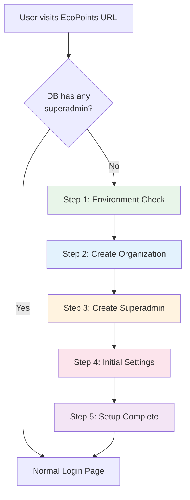

# EcoPoints — First-Run Setup Wizard Proposal

> **Purpose**: Consultation document for team discussion
> **Date**: 2026-03-08
> **Inspired by**: [Snipe-IT](https://snipeitapp.com/) Asset Management Setup Wizard

---

## The Problem

Currently, deploying EcoPoints to a new client requires:

1. Manually running `python seed.py` (which creates test data + hardcoded admins)
2. Knowing the default credentials (`sysadmin / test123`)
3. Manually configuring the organization through the admin panel
4. **No guided onboarding** — the system assumes it's already set up

This means every new deployment needs a developer to seed data and hand over credentials. **There's no self-service setup flow for new clients.**

---

## How Snipe-IT Does It

Snipe-IT is an open-source IT asset management system that handles first-run setup with a **browser-based wizard**. When you navigate to a fresh installation, it automatically detects that no setup has been done and walks you through:


| Step | What Snipe-IT Does | What It Checks |
|------|--------------------|----------------|
| **1. Pre-Flight** | Validates server environment | PHP version, extensions (GD, curl, bcmath), directory permissions (`storage/`, `uploads/`), `.env` file exists, `APP_KEY` is set |
| **2. Database** | Creates/migrates tables | Runs `php artisan migrate`, verifies all tables exist |
| **3. Create Admin** | Form: site name, admin name, email, password | Creates the first superadmin account |
| **4. Done** | Locks the setup wizard permanently | Redirects to login page, `/setup` returns 404 from now on |

**Key design choice**: The setup wizard **locks itself** after completion. You can never accidentally re-run it.

---

## Proposed EcoPoints Adaptation

### Flow



### Step-by-Step Detail

#### Step 1 — Environment Check ✅

Auto-runs on page load, shows a live checklist:

| Check | Pass Criteria |
|-------|---------------|
| Database connection | `SELECT 1` succeeds |
| Tables exist | All 14 tables from the ERD are present |
| Python version | ≥ 3.10 |
| Disk space | > 100 MB available |
| SECRET_KEY | Not the default dev key |

If any check fails → **blocked** with instructions on how to fix. If all pass → "Continue" button appears.

#### Step 2 — Create Organization 🏢

> *"This is the first location that will use EcoPoints."*

| Field | Required | Example |
|-------|:--------:|---------|
| Organization Name | ✅ | Arellano University |
| Full Name | | Arellano University - Pasig Campus |
| Type | ✅ | University / Corporation / HOA |
| City | ✅ | Pasig City |
| Street Address | | Pag-asa St, Caniogan |
| Contact Person | | Admin Officer |
| Contact Email | | admin@arellano.edu.ph |

This creates the [Organization](file:///c:/Users/pc/Documents/Github/server/app/models.py#45-79), default [OrgType](file:///c:/Users/pc/Documents/Github/server/app/models.py#10-24), [City](file:///c:/Users/pc/Documents/Github/server/app/models.py#26-43), and a default "Campus Staff" [CommunityGroup](file:///c:/Users/pc/Documents/Github/server/app/models.py#81-103).

#### Step 3 — Create Superadmin 👤

> *"Create the administrator account for this system."*

| Field | Required | Validation |
|-------|:--------:|------------|
| Full Name | ✅ | |
| Username | ✅ | Unique |
| Email | ✅ | Valid format, unique |
| Password | ✅ | Min 8 chars |
| Confirm Password | ✅ | Must match |

This creates the [Account](file:///c:/Users/pc/Documents/Github/server/app/models.py#105-127) → [User](file:///c:/Users/pc/Documents/Github/server/app/models.py#129-230) (role: superadmin) → [AccessCredential](file:///c:/Users/pc/Documents/Github/server/app/models.py#232-251) chain.

#### Step 4 — Initial Settings ⚙️

> *"Configure basic system defaults."*

| Setting | Default |
|---------|---------|
| System Name | "EcoPoints" |
| Points per bottle (with label) | Based on volume table |
| Default session timeout | 5 minutes |
| Allow public registration | Yes / No |

*(These could map to a future `settings` table or `.env` values)*

#### Step 5 — Setup Complete 🎉

> *"EcoPoints is ready! You can now log in with your admin credentials."*

- Shows a summary of what was created
- "Go to Login" button
- The `/setup` route is **permanently locked** (redirects to `/` from now on)

---

## Technical Approach

### How the Lock Works

The setup wizard availability is determined by a simple DB check:

```
Does at least 1 superadmin user exist?
  → YES: Setup is locked. Redirect /setup → /login
  → NO:  Setup is open. Redirect / → /setup
```

No config file or flag needed — the database state itself is the lock.

### Backend (Flask)

| Endpoint | Purpose |
|----------|---------|
| `GET /api/setup/status` | Returns `{ needsSetup: true/false, checks: [...] }` |
| `POST /api/setup/organization` | Creates the first org + defaults |
| `POST /api/setup/admin` | Creates the superadmin user |
| `POST /api/setup/settings` | Saves initial configuration |

All `/api/setup/*` endpoints reject requests if `needsSetup` is `false` (a superadmin already exists).

### Frontend (Next.js)

| File | Purpose |
|------|---------|
| `app/setup/page.js` | Multi-step wizard component |
| `app/setup/layout.js` | Minimal layout (no sidebar/navbar) |
| Middleware or [layout.js](file:///c:/Users/pc/Documents/Github/client/app/layout.js) | Auto-redirect logic based on setup status |

---

## Scope Options

### Option A — MVP (Recommended to start)

Only Steps 1, 2, 3, and 5. Skip Step 4 (settings). Estimated effort: **2-3 days**.

- Environment check
- Create first organization
- Create superadmin
- Done → Login

### Option B — Full

All 5 steps including settings. Estimated effort: **4-5 days**.

- Everything in Option A
- Plus initial settings configuration
- Plus a future `settings` model/table

### Option C — Full + CLI Fallback

Everything in Option B, plus a `flask setup` CLI command for headless servers (like Snipe-IT's `artisan snipeit:create-admin`). Estimated effort: **5-6 days**.

---

## Discussion Points for Team

1. **Do we need Step 4 (Settings)?** Or is it fine to configure via `.env` / admin panel after setup?

2. **Should the seed script still exist?** It could become a "demo mode" — `flask seed --demo` populates test data, while the setup wizard is for real deployments.

3. **Multi-org initial setup?** Step 2 creates ONE org. Additional orgs are added post-login. Is this okay, or should the wizard allow creating multiple orgs?

4. **Branding**: Should the setup wizard show a customizable logo/name, or always say "EcoPoints"?

5. **Reset/reinstall**: If a client needs to start over, should there be a way to re-trigger the setup wizard? (e.g., `flask reset --confirm` that wipes the DB and re-enables `/setup`)

6. **Timeline**: When do we want this? It's not blocking any current feature work, but it's important for real client deployments.

---

## Visual Reference

For context, here's what Snipe-IT's setup flow looks like conceptually:

```
┌─────────────────────────────────────────────────┐
│  🔧 EcoPoints Setup                    Step 1/4 │
│─────────────────────────────────────────────────│
│                                                  │
│  Pre-Flight Environment Check                    │
│                                                  │
│  ✅ Database connection .............. Connected  │
│  ✅ All 14 tables ................... Created     │
│  ✅ Python version .................. 3.12.1      │
│  ✅ Disk space ...................... 45.2 GB     │
│  ✅ SECRET_KEY ...................... Set          │
│                                                  │
│  All checks passed!                              │
│                                                  │
│                              [ Continue →  ]     │
└─────────────────────────────────────────────────┘
```

```
┌─────────────────────────────────────────────────┐
│  🏢 Create Organization                Step 2/4 │
│─────────────────────────────────────────────────│
│                                                  │
│  Organization Name *    [ Arellano University  ] │
│  Full Name              [ Arellano University  ] │
│                         [ - Pasig Campus       ] │
│  Type *                 [ University        ▼  ] │
│  City *                 [ Pasig City        ▼  ] │
│  Street Address         [ Pag-asa St, Canio   ] │
│  Contact Email          [ admin@arellano.edu  ] │
│                                                  │
│              [ ← Back ]     [ Continue →  ]      │
└─────────────────────────────────────────────────┘
```

```
┌─────────────────────────────────────────────────┐
│  👤 Create Administrator              Step 3/4  │
│─────────────────────────────────────────────────│
│                                                  │
│  Full Name *            [ System Admin         ] │
│  Username *             [ sysadmin             ] │
│  Email *                [ admin@ecopoints.com  ] │
│  Password *             [ ••••••••             ] │
│  Confirm Password *     [ ••••••••             ] │
│                                                  │
│              [ ← Back ]     [ Create & Finish ]  │
└─────────────────────────────────────────────────┘
```

```
┌─────────────────────────────────────────────────┐
│  🎉 Setup Complete!                    Step 4/4 │
│─────────────────────────────────────────────────│
│                                                  │
│  EcoPoints is ready to use!                      │
│                                                  │
│  Organization: Arellano University               │
│  Admin User:   sysadmin (admin@ecopoints.com)    │
│                                                  │
│  ⚠ Save your credentials — this page won't      │
│    be accessible again.                          │
│                                                  │
│                          [ Go to Login →  ]      │
└─────────────────────────────────────────────────┘
```
